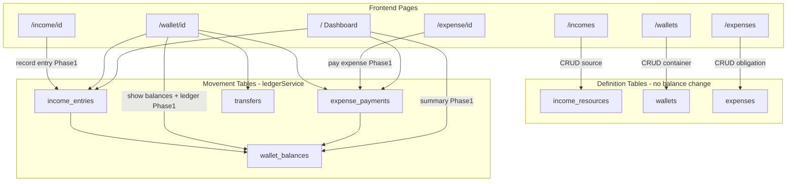

# Detailed Roadmap and Architecture Truth Base

## Current State (baseline for the plan)

Phase 0 is **largely complete** in code but **under-documented** in the plan and ARCHITECTURE.md:

| Area | Status |
|------|--------|
| Ledger schema (`wallet_balances`, `income_entries`, `expense_payments`, `transfers`) | Done in [`schema.ts`](eboom-backend/src/db/schema/schema.ts) |
| `ledgerService` (credit/debit) | Done in [`ledgerService.ts`](eboom-backend/src/services/ledgerService.ts) |
| Definition CRUD (incomes, wallets, expenses) | Done — list/create/edit/delete via canvas + resource routes |
| Income entry API | Partial — exists as `/transactions` routes in [`income.ts`](eboom-backend/src/routes/income.ts); credits wallet; not wrapped in single DB transaction |
| Expense payment API | **Missing** — `expense_payments` table exists, no routes |
| Transfer API | **Missing** — `transfers` table exists, no routes |
| Canvas summary / wallet ledger | **Missing** |
| Frontend money loop UI | **Missing** — list CRUD only; dashboard + detail pages use shadcn demo mock data |
| Docs | [`TRANSACTIONS.md`](TRANSACTIONS.md) exists (minimal); [`ARCHITECTURE.md`](ARCHITECTURE.md) is 85 lines; plan todos still show Phase 0 as pending |

The plan file and ARCHITECTURE.md should be updated to reflect **what is done** vs **what remains**, not restart from scratch.

---

## Deliverable 1: Expand [`.cursor/plans/schema_simplify_phased_roadmap_f4b0ba56.plan.md`](.cursor/plans/schema_simplify_phased_roadmap_f4b0ba56.plan.md)

### Structural changes to the plan file

1. **Add a "Current Implementation Status" section** at the top — mark Phase 0 tasks complete, note partial Phase 1 backend.
2. **Add a "UI ↔ Database Flow Map" section** — one diagram + per-page table (see below).
3. **Replace brief phase bullets with a consistent template per phase:**

```markdown
### Phase N — Title (estimate)
**Goal:** ...
**Prerequisites:** ...
**Status:** done | partial | pending

#### Backend tasks
- [ ] task...

#### API endpoints
| Method | Path | Request body | Response | Tables | Service |

#### Database
| Change | Tables | Migration needed? |

#### Frontend tasks
- [ ] task...

#### Page flow (UI → API → DB)
| Page | User action | API | DB writes/reads |

#### Done when
- ...
```

4. **Update YAML frontmatter todos** — mark completed items (`docs-transactions`, `hide-wishlists`, `phase0-schema`, `phase0-ledger`) as done; split remaining work into granular Phase 1+ todos.

---

### UI ↔ Database Flow Map (to embed in plan + ARCHITECTURE.md)



#### Per-page mapping table (target state after Phase 1)

| Page | Route | Today | Phase 1 target |
|------|-------|-------|----------------|
| **Dashboard** | `/` | Mock shadcn demo | `GET /api/canvases/:id/summary` → total balances, recent movements, income vs expense totals |
| **Incomes list** | `/incomes` | `GET /api/canvases/:id/income-resources/` → `income_resources` | Same + link to detail; optional "last entry" badge |
| **Income detail** | `/income/[id]` | Mock (ignores `id`) | `GET /api/income/resources/:id` + `GET .../transactions` → source metadata + entry history; **RecordIncomeEntryModal** → `POST .../transactions` → `income_entries` + credit `wallet_balances` |
| **Wallets list** | `/wallets` | `GET /api/canvases/:id/wallets/` → `wallets` | Same + optional balance summary per card |
| **Wallet detail** | `/wallet/[id]` | Mock | `GET /api/wallets/:id` (balances embedded) + `GET /api/wallets/:id/ledger` → balances + unified movement history |
| **Expenses list** | `/expenses` | `GET /api/canvases/:id/expenses/` → `expenses` | Same + payment status indicator |
| **Expense detail** | `/expense/[id]` | Mock | `GET /api/expenses/:id` + `GET /api/expenses/:id/payments` → obligation + payment history; **PayExpenseModal** → `POST .../payments` → `expense_payments` + debit `wallet_balances` |

**Key distinction to document clearly:** `NewIncomeModal` / `NewExpenseModal` / `NewWalletModal` create **definitions** (what/where). Movement modals create **entries/payments** (actual money flow).

---

### Phase-by-phase detail (content for the expanded plan)

#### Phase 0 — Schema Foundation — **DONE**

**Completed work:**
- Ledger tables in schema; old asset tables removed
- [`ledgerService.ts`](eboom-backend/src/services/ledgerService.ts) as sole balance mutator
- Wishlists hidden in [`app-sidebar.tsx`](eboom-frontend/src/components/layout/app-sidebar.tsx)
- [`TRANSACTIONS.md`](TRANSACTIONS.md) created; [`ARCHITECTURE.md`](ARCHITECTURE.md) stub created
- Simplified seed in [`001_initialize.sql`](eboom-backend/src/db/seed/sql/001_initialize.sql)

**Remaining Phase 0 doc tasks:**
- Mark todos complete in plan frontmatter
- Note known gap: income POST insert + ledger credit are not in one outer DB transaction

---

#### Phase 1 — Core Money Loop (single currency) — **NEXT**

**Goal:** End-to-end earn → hold → spend with real UI; single-currency only.

##### Backend tasks

| # | Task | Files |
|---|------|-------|
| 1 | Extract `incomeEntryService` — wrap insert + ledger credit in one `db.transaction` | new `services/incomeEntryService.ts`, refactor [`income.ts`](eboom-backend/src/routes/income.ts) |
| 2 | Add `expensePaymentService` — insert payment + debit balance | new `services/expensePaymentService.ts`, extend [`expenses.ts`](eboom-backend/src/routes/expenses.ts) |
| 3 | Add canvas summary endpoint | [`canvas.ts`](eboom-backend/src/routes/canvas.ts) |
| 4 | Add wallet ledger union query | new route or extend [`wallets.ts`](eboom-backend/src/routes/wallets.ts) |
| 5 | Gate ledger on `status: "received"` / `"paid"` (pending entries do not move money) | services + route validation |
| 6 | Optional: alias `/entries` routes alongside `/transactions` for naming clarity | [`income.ts`](eboom-backend/src/routes/income.ts), [`urls.ts`](eboom-frontend/src/api/urls.ts) |

##### API endpoints (Phase 1)

| Method | Path | Body (key fields) | Tables | Notes |
|--------|------|-------------------|--------|-------|
| GET | `/api/income/resources/:id` | — | `income_resources`, category | Exists; wire to UI |
| GET | `/api/income/resources/:id/transactions` | — | `income_entries`, wallets | Exists; rename to "entries" in docs |
| POST | `/api/income/resources/:id/transactions` | `amount`, `destinationWalletId`, `receivedDate`, `status`, `notes` | `income_entries`, `wallet_balances` | Exists; harden with service layer |
| DELETE | `/api/income/transactions/:id` | — | `income_entries`, `wallet_balances` | Exists; reverse credit |
| PUT | `/api/income/transactions/:id` | — | — | Currently 501; **decision:** keep delete+recreate in Phase 1 |
| **POST** | **`/api/expenses/:id/payments`** | `amount`, `sourceWalletId`, `paidDate`, `status`, `notes` | `expense_payments`, `wallet_balances` | **Build** |
| **GET** | **`/api/expenses/:id/payments`** | — | `expense_payments`, wallets | **Build** |
| **DELETE** | **`/api/expenses/payments/:id`** | — | `expense_payments`, `wallet_balances` | **Build** (reverse debit) |
| GET | `/api/wallets/:id` | — | `wallets`, `wallet_balances`, currencies | Exists (balances embedded) |
| **GET** | **`/api/wallets/:id/ledger`** | `?limit=&offset=` | union of entries/payments/transfers | **Build** |
| **GET** | **`/api/canvases/:id/summary`** | — | aggregates across wallets + recent movements | **Build** |

##### Database — no new tables

Use existing: `income_entries`, `expense_payments`, `wallet_balances`. Optional index additions for ledger queries (`wallet_id`, `created_at` on movement tables).

##### Frontend tasks

| # | Task | Files |
|---|------|-------|
| 1 | Add URL constants for payments, ledger, summary | [`urls.ts`](eboom-frontend/src/api/urls.ts) |
| 2 | `RecordIncomeEntryModal` — wallet picker, amount, date, notes | new under `src/views/incomes/component/` |
| 3 | `PayExpenseModal` — wallet picker, amount, date | new under `src/views/expenses/components/` |
| 4 | Rewrite `IncomeDetailPage` — fetch by `id`, show entries table, open entry modal | [`IncomeDetailPage.tsx`](eboom-frontend/src/views/incomes/IncomeDetailPage.tsx) |
| 5 | Rewrite `WalletDetailPage` — balances + ledger table | [`WalletDetailPage.tsx`](eboom-frontend/src/views/wallets/WalletDetailPage.tsx) |
| 6 | Rewrite `ExpenseDetailPage` — payments table + pay modal | [`ExpenseDetailPage.tsx`](eboom-frontend/src/views/expenses/ExpenseDetailPage.tsx) |
| 7 | Rewrite dashboard — summary cards + recent ledger | [`app/(dashboard)/page.tsx`](eboom-frontend/app/(dashboard)/page.tsx) |
| 8 | Replace shadcn demo components (`ChartAreaInteractive`, `SectionCards`, `DataTable` with `data.json`) with domain components | new `src/components/finance/` |
| 9 | Add Dashboard to sidebar nav | [`app-sidebar.tsx`](eboom-frontend/src/components/layout/app-sidebar.tsx) |

**Done when:** User can record income into a wallet, see balance update, pay an expense from that wallet, and see all of this on dashboard + detail pages without mock data.

---

#### Phase 2 — Multi-Currency (2 weeks)

**Goal:** Transfers between wallets; cross-currency expense payment.

##### Backend tasks

- `transferService` — same-currency and cross-currency debit/credit pairs via `ledgerService`
- Atomic cross-currency expense pay: optional internal transfer row + payment row in one transaction
- Exchange rate + fee persisted on `transfers` and `expense_payments`

##### API endpoints

| Method | Path | Purpose |
|--------|------|---------|
| POST | `/api/transfers` | Wallet-to-wallet move (same or cross currency) |
| GET | `/api/canvases/:id/transfers` | List transfers for canvas |
| DELETE | `/api/transfers/:id` | Reverse transfer |
| POST | `/api/expenses/:id/payments` (extend) | Accept cross-currency: `sourceCurrencyId`, `exchangeRate`, `transactionFee` |

##### Database

No new tables. Use existing `transfers` with `exchange_rate`, `transaction_fee`. Consider `currency_exchange_rates` table in Phase 2 or 3 for rate history (defer unless needed).

##### Frontend

- `TransferModal` on wallet detail
- Multi-currency balance chips on wallet detail
- Cross-currency fields on `PayExpenseModal` when wallet currency ≠ expense currency

**Page flow:** Wallet detail → TransferModal → `POST /api/transfers` → debit source `(wallet, currencyA)`, credit dest `(wallet, currencyB)`.

---

#### Phase 3 — Organization and Reports (2 weeks)

**Goal:** Better categorization, payee tracking, recurring templates, reports from ledger.

##### Backend tasks

- Flatten or simplify expense category tree (keep `parent_category_id` optional; UI shows flat list with breadcrumb)
- Add `payee` text field to `expenses` (migration: `payee varchar`)
- Recurring templates table or JSON on definitions generating entries/payments (cron or manual "confirm")
- Reports endpoints: income by category, expense by category, cash flow by period

##### API endpoints

| Method | Path | Purpose |
|--------|------|---------|
| GET | `/api/canvases/:id/reports/income` | Aggregate `income_entries` by category/period |
| GET | `/api/canvases/:id/reports/expenses` | Aggregate `expense_payments` by category/period |
| GET | `/api/canvases/:id/reports/cashflow` | Net movement by month |

##### Database

- Migration: `expenses.payee` column
- Optional: `recurring_templates` table (Phase 3 decision — can start with JSON on `income_resources`/`expenses`)

##### Frontend

- New `/reports` page (replace placeholder or add to Management nav)
- Payee field on expense forms
- Recurring badge + "generate next" action on detail pages

---

#### Phase 4 — Planning and Goals (3 weeks)

**Goal:** Budgets, savings goals, whiteboard — replace ComingSoon placeholders.

##### Database (new tables)

| Table | Purpose |
|-------|---------|
| `budgets` | Canvas-scoped spending limits by category/period |
| `budget_lines` | Category + amount per budget |
| `savings_goals` | Target amount, deadline, linked wallet |
| `whiteboard_items` | Canvas sticky notes / planning cards (position, content JSON) |

##### API endpoints

| Method | Path | Purpose |
|--------|------|---------|
| CRUD | `/api/canvases/:id/budgets` | Budget management |
| GET | `/api/canvases/:id/budgets/:id/progress` | Compare actual payments vs budget |
| CRUD | `/api/canvases/:id/savings-goals` | Goals |
| CRUD | `/api/canvases/:id/whiteboard-items` | Whiteboard |

##### Frontend

- Replace [`/budget-planning`](eboom-frontend/app/(dashboard)/budget-planning/page.tsx) ComingSoon with budget + goals UI
- Replace [`/whiteboard`](eboom-frontend/app/(dashboard)/whiteboard/page.tsx) with draggable board

**Page flow:** Budget page reads `expense_payments` aggregates vs `budget_lines` — no new movement type; planning is derived.

---

#### Phase 5 — Extended Finance (3+ weeks)

**Goal:** Entities, debts, canvas sharing, re-enable wishlists.

##### Database (new tables)

| Table | Purpose |
|-------|---------|
| `entities` | People, shops, companies |
| `entity_types` | Classification |
| `debts` | Loans and credits |
| `debt_payments` | Repayment movements (same ledger pattern as expense payments) |
| `canvas_invitations` | Share canvas with roles |

Existing dormant: `wishlists`, `to_buy_items` — add routes + re-enable sidebar.

##### API + UI

- Entity picker on income/expense/debt forms (`entity_id` FK already on wallets/expenses)
- Debts CRUD + debt payment (debit wallet via `ledgerService`)
- Canvas member invite/accept flows
- Wishlist routes restored to sidebar; link to-buy item → expense conversion

---

#### Phase 6 — Intelligence and Polish

**Goal:** AI insights, notifications, tests, CI, doc sync.

##### Technical approaches

| Area | Approach |
|------|----------|
| AI insights | Read-only aggregation over ledger + budgets; LLM summarizes; store in `ai_financial_insights` when table added |
| Notifications | `notifications` table + email via existing `emailService` |
| Tests | Vitest for services (`ledgerService`, payment services); supertest for movement routes |
| CI | GitHub Actions: lint, type-check, test, migrate check |
| Attachments | Wire `attachments` polymorphic table + Multer upload on movements |

---

## Deliverable 2: Complete [`ARCHITECTURE.md`](ARCHITECTURE.md) as truth base

Expand from 85 lines to a **single authoritative reference**. Keep [`TRANSACTIONS.md`](TRANSACTIONS.md) as the deep-dive for money logic; ARCHITECTURE links to it rather than duplicating all invariants.

### Proposed ARCHITECTURE.md outline

#### 1. Purpose and document map
- This file = system truth; [`TRANSACTIONS.md`](TRANSACTIONS.md) = money movement deep dive; [plan file](.cursor/plans/schema_simplify_phased_roadmap_f4b0ba56.plan.md) = delivery schedule
- Reading order for new developers

#### 2. Product model
- Canvas as tenancy boundary (from [README.md](README.md))
- Three layers: **Definitions** (sources, wallets, obligations) → **Movements** (entries, payments, transfers) → **Derived** (balances, summaries, reports)
- Mermaid diagram (reuse from plan)

#### 3. Technology stack and boundaries

| Layer | Tech | Responsibility |
|-------|------|----------------|
| Browser | Next.js 15, React 19, TanStack Query, Redux (UI only) | Presentation, forms, cache |
| Auth | Supabase JWT | Identity; Express validates |
| API | Express 4, inline routes | HTTP, authz, validation |
| Domain | `services/*` | Business rules, atomic transactions |
| Data | Drizzle ORM, PostgreSQL | Persistence |

**Explicit non-goals:** No Supabase PostgREST; no client-side balance math; no Redux for server data.

#### 4. Request lifecycle (expanded)
Sequence diagram: Browser → auth middleware → `checkCanvasAccess` → service → Drizzle transaction → response (snake_case JSON → frontend camelCase)

#### 5. Frontend architecture
- Thin `app/` routes → fat `src/views/`
- [`urls.ts`](eboom-frontend/src/api/urls.ts) as API contract
- List page template (from CONVENTIONS)
- Page inventory table with **current vs target** data source (honest about mock dashboard)

#### 6. Backend architecture
- Route → service → schema layering (target; note Phase 1 migration from inline route logic)
- [`ledgerService`](eboom-backend/src/services/ledgerService.ts) as **only** balance mutator
- Planned services: `incomeEntryService`, `expensePaymentService`, `transferService`
- Error handling conventions (400 validation, 403 canvas, 409 insufficient funds)

#### 7. Data model reference
- Table groups: identity, canvas, definitions, movements, derived, dormant
- ER-style mermaid for core Phase 0–1 tables
- Column-level notes for movement tables (status fields, exchange fields)

#### 8. UI ↔ Database flow map
- Full per-page table (from Deliverable 1)
- Which modals write to which tables

#### 9. Technical decisions and rationale

Document **why**, not just **what**:

| Decision | Rationale | Alternatives rejected |
|----------|-----------|----------------------|
| Ledger + `wallet_balances` cache | Fast reads; movements are audit trail | Asset inventory model (removed — no route ever created assets) |
| Movements in dedicated tables | Clear semantics per operation | Single polymorphic `transactions` table |
| `ledgerService` singleton mutator | Prevents balance drift | Direct updates in route handlers |
| Income source keeps `currency` varchar | Phase 0 compat; Phase 2 may FK to `currencies` | Immediate FK migration |
| Canvas-scoped lists via `/canvases/:id/...` | Matches UI canvas switcher | Global lists with filter |
| Definition vs movement modals | Separates "what I earn" from "what I received" | Single conflated form |
| Pending status on movements | Forecast without affecting balance | Always immediate ledger |
| Greenfield migration | Simpler than migrating broken asset data | Data migration scripts |

#### 10. Cross-cutting concerns
- Auth: Supabase + `req.appUser`; test mode (`TEST_USER_ID`)
- Multi-tenancy: all finance queries scoped by canvas membership
- Numeric precision: `numeric(20,8)` in DB; string amounts in API to avoid float errors
- Concurrency: row-level balance update via SQL `amount + delta` (future: `SELECT FOR UPDATE`)
- Attachments: deferred; polymorphic `attachments` table ready

#### 11. Deferred features registry

| Feature | Schema | Routes | UI | Returns in |
|---------|--------|--------|-----|------------|
| Wishlists | Yes | Partial | Hidden | Phase 5 |
| Whiteboard | No | No | Placeholder | Phase 4 |
| Budgets | No | No | Placeholder | Phase 4 |
| AI Insights | No | No | Placeholder | Phase 6 |
| Debts/Entities | No | No | No | Phase 5 |
| Attachments | Yes | No | No | Phase 6 |

#### 12. Phase roadmap summary
- One-paragraph per phase + link to detailed plan file
- Current phase indicator: **Phase 1 in progress**

#### 13. Known gaps and tech debt
- Dashboard mock data
- Income POST not in single DB transaction
- `models.ts` uses explicit types workaround
- No tests/CI
- Package naming (`pfm-backend` vs `eboom-frontend`)

---

## Deliverable 3: Minor doc cross-links

Update these only where needed to stay consistent (light touch):

- [`README.md`](README.md) — update Feature Status table: Phase 0 done; Phase 1 in progress; dashboard still mock
- [`CONVENTIONS.md`](CONVENTIONS.md) — add pointer to ARCHITECTURE page-flow section; note new `src/components/finance/` convention when Phase 1 UI lands
- Plan frontmatter — sync todo statuses with reality

---

## Implementation order (this documentation task)

1. Rewrite [`ARCHITECTURE.md`](ARCHITECTURE.md) first — becomes the source for phase detail
2. Expand [`.cursor/plans/schema_simplify_phased_roadmap_f4b0ba56.plan.md`](.cursor/plans/schema_simplify_phased_roadmap_f4b0ba56.plan.md) using ARCHITECTURE content + codebase inventory
3. Update plan YAML todos (mark Phase 0 complete; add Phase 1 granular tasks)
4. Light sync to README Feature Status and CONVENTIONS cross-links

No code changes in this task — documentation only.
