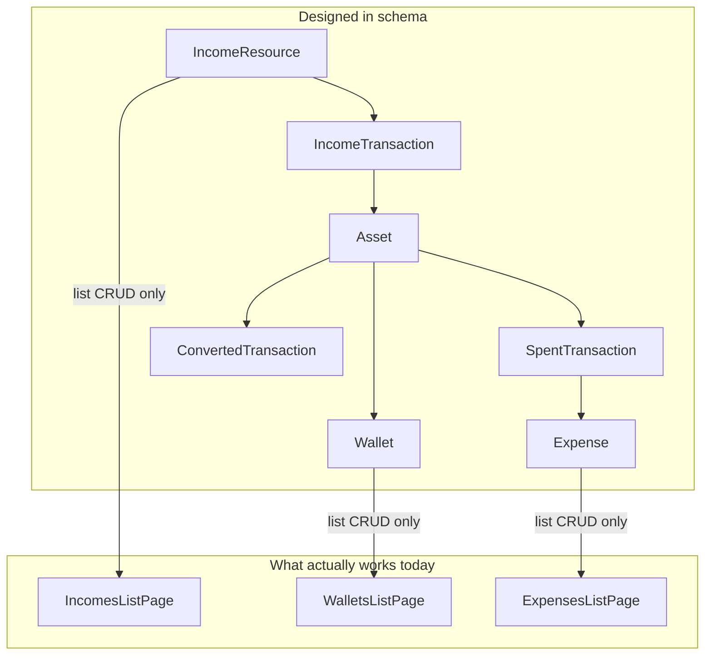
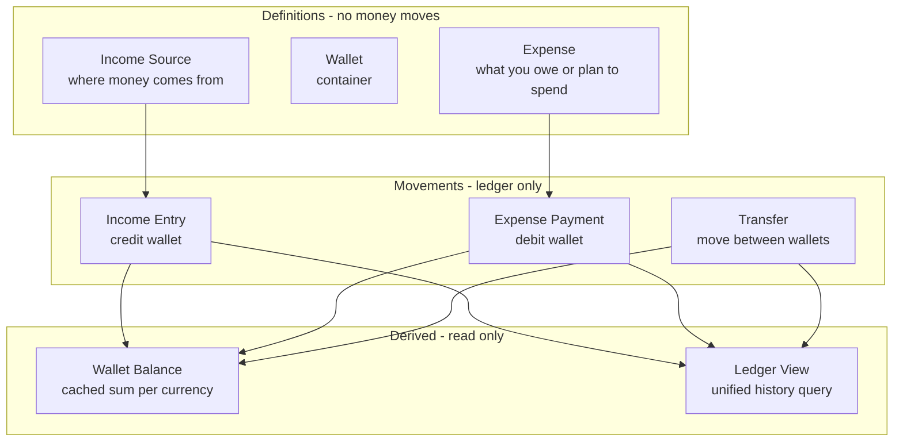
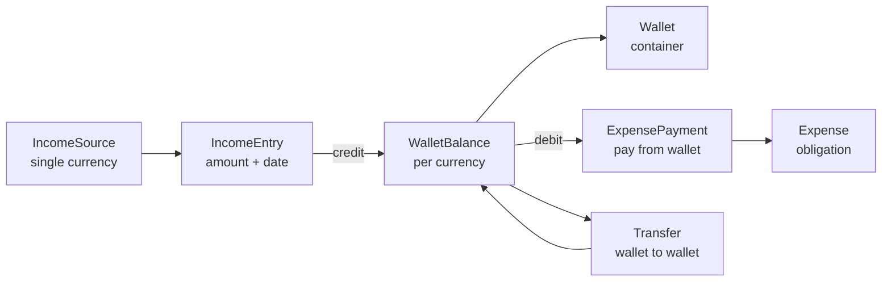

# eBoom Schema Simplification and Phased Roadmap

## Problem Diagnosis

The current [schema.ts](eboom-backend/src/db/schema/schema.ts) has **36 tables** but only **~12 route files**. The intended money flow is modeled but **not connected**:



**Critical bug:** `incomeTransactions` requires `destinationAssetId`, but **no backend route ever inserts into `assets`**. [`spentTransactions`](eboom-backend/src/db/schema/schema.ts) and [`convertedTransactions`](eboom-backend/src/db/schema/schema.ts) have **zero API routes**. Detail pages render **mock data** from [`data.json`](eboom-frontend/src/_mocks/data.json).

Core idea:

> Income (one currency) → credited to a wallet → wallet holds multiple currency balances → debited to pay an expense (possibly via conversion)

That is a **ledger + balances** model, not an asset-inventory model.

---

## Documentation Deliverables (before / alongside Phase 0)

Three docs form the developer map. Update [README.md](README.md) to link all three.

### 1. [ARCHITECTURE.md](ARCHITECTURE.md) (new)

End-to-end application flow from browser to database.

**Proposed sections:**

| Section | Content |
|---------|---------|
| System overview | Mermaid diagram: Browser → Next.js → Express `/api` → Drizzle → PostgreSQL; Supabase Auth side channel |
| Domain concepts | Canvas, Income Source, Income Entry, Wallet, Wallet Balance, Expense, Expense Payment, Transfer — what the user sees vs what is stored |
| Request lifecycle | Auth token → middleware → canvas access check → route handler → service layer → DB |
| UI layer map | Which pages show which concepts; thin `app/` routes → `src/views/`; TanStack Query for data, Redux for UI chrome only |
| Backend layer map | Routes (HTTP), Services (business logic), Schema (persistence) — what stays in backend underneath |
| State ownership | Table: concern → lives in frontend / backend / both |
| Deferred features | Wishlists (hidden), Whiteboard, Budget, AI — schema status and when they return |
| Phase roadmap pointer | Link to phased plan below |

**Key principle to document:** The UI never mutates balances directly. It calls APIs; the backend `ledgerService` applies all money movements atomically.

### 2. [TRANSACTIONS.md](TRANSACTIONS.md) (new, or deep section inside ARCHITECTURE.md)

Dedicated guide for developers on money logic — the main source of complexity.

**Concept layers (keep separate in docs and code):**



**Document each transaction type:**

| Type | User action | DB writes | Balance effect | Phase |
|------|-------------|-----------|----------------|-------|
| **Income entry** | "I received $500 from Salary" | `income_entries` row | Credit `(wallet, USD)` +500 | 1 |
| **Expense payment** | "I paid Rent $400 from Bank" | `expense_payments` row | Debit `(wallet, USD)` −400 | 1 |
| **Wallet transfer (same currency)** | "Move $100 Checking → Savings" | `transfers` row | Debit source, credit dest | 2 |
| **Cross-currency transfer** | "Convert $100 USD → €90 EUR in wallet" | `transfers` + rate/fee fields | Debit USD, credit EUR | 2 |
| **Cross-currency expense pay** | "Pay €50 rent from USD balance" | `transfers` + `expense_payments` (atomic) | Conversion then debit for expense currency | 2 |
| **Recurring (future)** | Scheduled job / user confirm | Generates income entry or expense payment | Same as above | 3 |
| **Debt payment (future)** | "Pay back loan" | `debt_payments` → ledger debit | Same as expense payment pattern | 5 |

**Invariants (must hold after every operation):**

- Every balance change goes through `ledgerService` inside a DB transaction
- `wallet_balances.amount` never updated from route handlers directly
- Income entry currency must match income source currency (Phase 1)
- Expense payment cannot exceed available balance unless overdraft flag added later
- Cross-currency ops store `exchange_rate` and optional `fee` on the movement row for audit
- Canvas access verified before any movement

**What stays in backend underneath (not in UI):**

- Balance arithmetic and concurrency (row-level lock or `SELECT FOR UPDATE` on balance row)
- Atomic multi-step ops (cross-currency pay = transfer + payment in one transaction)
- Validation rules and error messages
- Ledger aggregation for dashboard/reports
- Future: recurring generation, budget rollups, AI summaries

**What UI owns:**

- Collecting user input (amount, wallet, date, notes)
- Displaying balances and history (read-only from API)
- Optimistic UI optional later; Phase 1 uses mutation + refetch

**Code layout after refactor:**

```
eboom-backend/src/
  services/
    ledgerService.ts      # credit, debit, transfer — sole balance mutator
    incomeEntryService.ts # wraps ledger + income_entries insert
    expensePaymentService.ts
    transferService.ts
  routes/
    income.ts             # thin HTTP; delegates to services
    wallets.ts
    expenses.ts
```

Include **worked examples** (pseudocode + sample API payloads) for each transaction type in TRANSACTIONS.md.

### 3. Updates to existing docs

- [CONVENTIONS.md](CONVENTIONS.md): add "Money movements" section pointing to TRANSACTIONS.md; rule "never touch wallet_balances outside ledgerService"
- [README.md](README.md): link ARCHITECTURE.md + TRANSACTIONS.md; mark Wishlists as hidden/deferred

---

## Wishlists — Hidden for Now

**Decision:** Hide from product UI during core refactor. Do not delete schema or routes.

| Action | Detail |
|--------|--------|
| Sidebar | Remove Wishlists section from [`app-sidebar.tsx`](eboom-frontend/src/components/layout/app-sidebar.tsx) |
| Routes | Keep `app/(dashboard)/wishlists/*` and `app/share/*` but no nav entry (direct URL still works for dev) OR add feature flag `NEXT_PUBLIC_WISHLISTS_ENABLED=false` |
| Schema | Keep `wishlists`, `to_buy_items` tables; exclude from Phase 0 migration drops |
| Seed | Optional: skip wishlist seed data to reduce noise |
| Re-enable | Phase 5 alongside extended finance features |

---

## Target Core Model

Keep **Canvas** as the tenancy boundary. Focus visible UI on Incomes, Wallets, Expenses, Dashboard. Reserve sidebar slots for Whiteboard, Budget & Planning, and AI Insights as future phases.



### Proposed core tables (~16 active + 2 dormant wishlist)

| Keep / Add | Replaces / Notes |
|------------|------------------|
| `users`, `user_settings` | Keep |
| `canvases`, `canvas_members` | Keep |
| `currencies` | Keep reference table |
| `income_sources` | Refactor `income_resources`; `currency_id` FK |
| `income_categories` | Keep `income_resource_categories` |
| `income_entries` | **New** — replaces `income_transactions` |
| `wallets`, `wallet_categories` | Keep |
| `wallet_balances` | **New** |
| `expense_categories`, `expenses` | Keep |
| `expense_payments` | **New** — replaces `spent_transactions` |
| `transfers` | **New** — replaces `converted_transactions` |
| `wishlists`, `to_buy_items` | **Dormant** — hidden UI, keep tables |
| `attachments` | Keep |

| Remove / Defer | Reason |
|----------------|--------|
| `assets`, `value_categories` | Wrong abstraction |
| `income_forecasts`, budgets, goals, debts, entities, AI, notifications | Re-add per phase when built |
| `schema_old.ts` | Delete after migration |

---

## Frontend Inventory (visible vs hidden)

| Page | Visibility | Target |
|------|------------|--------|
| Dashboard | Visible | Phase 1: live balances + ledger |
| Incomes / Wallets / Expenses | Visible | Phase 1: full money loop |
| Wishlists | **Hidden** | Phase 5 re-enable |
| Whiteboard / Budget / AI | Visible nav, placeholder | Phases 4–6 |
| Auth + Canvas | Visible | Keep |

---

## Phase 0 — Schema Foundation (1–2 weeks)

**Goal:** Replace broken money model; add docs; hide wishlists.

1. Create **ARCHITECTURE.md** and **TRANSACTIONS.md**
2. Hide wishlists in sidebar (+ optional env flag)
3. Schema migration: add ledger tables; drop assets/conversion tables
4. Implement **ledgerService** — sole balance mutator
5. Delete `schema_old.ts`; update seeds (no wishlist seed optional)

---

## Phase 1 — Core Money Loop (2–3 weeks)

**Goal:** Income → wallet → expense end-to-end (single currency).

### Backend

| Route | Service call |
|-------|--------------|
| `POST /api/income/resources/:id/entries` | `incomeEntryService.record()` → `ledgerService.credit()` |
| `POST /api/expenses/:id/payments` | `expensePaymentService.pay()` → `ledgerService.debit()` |
| `GET /api/wallets/:id/balances` | Read `wallet_balances` |
| `GET /api/wallets/:id/ledger` | Union query on entries/payments/transfers |
| `GET /api/canvases/:id/summary` | Aggregate balances + recent ledger |

### Frontend

- `RecordIncomeEntryModal`, `PayExpenseModal`
- Rewrite detail pages (remove mock data)
- Dashboard wired to summary API

---

## Phase 2 — Multi-Currency (2 weeks)

- `transferService` for wallet↔wallet
- Cross-currency expense pay (atomic transfer + payment)
- Document all three movement types in TRANSACTIONS.md with diagrams

---

## Phase 3 — Organization and Reports (2 weeks)

- Flat categories, payee text, recurring templates
- Reports page from ledger aggregates

---

## Phase 4 — Planning and Goals (3 weeks)

- Budgets, savings goals, whiteboard items
- Replace ComingSoon placeholders

---

## Phase 5 — Extended Finance (3+ weeks)

- Entities, debts, canvas sharing
- **Re-enable Wishlists** in sidebar

---

## Phase 6 — Intelligence and Polish

- AI insights, notifications, tests, CI

---

## Migration Strategy

Greenfield migration; demo seed for income/wallet/expense loop only. Wishlist tables remain but optional seed.

---

## Success Criteria

| Phase | Done when |
|-------|-----------|
| Docs | ARCHITECTURE.md + TRANSACTIONS.md complete; wishlists hidden |
| 0 | Schema + ledgerService landed |
| 1 | Full earn → hold → spend loop with real UI |
| 2 | Multi-currency documented and working |
| 4 | Whiteboard + budgets live |
| 5 | Wishlists visible again |

---

## Recommended First Sprint

1. Write ARCHITECTURE.md + TRANSACTIONS.md
2. Hide wishlists in sidebar
3. Land schema + ledgerService (Phase 0)
4. Ship income entry + expense payment (Phase 1 start)

This keeps the product focused, gives developers a clear map for transaction complexity, and preserves Wishlists and future features without blocking the core loop.
