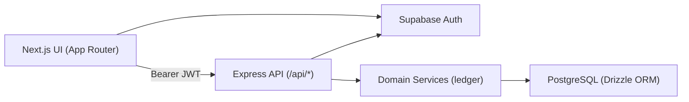

# eBoom Architecture

This document explains the end-to-end flow of eBoom and the boundary between UI responsibilities and backend business logic.

## System Overview

## Core Concepts

- `Canvas`: tenant/workspace boundary for all finance data.
- `IncomeResource`: definition of where income comes from (salary/freelance/etc).
- `IncomeEntry`: an actual income movement credited into a wallet.
- `Wallet`: logical account container (bank/cash/crypto/etc).
- `WalletBalance`: per-wallet per-currency running balance.
- `Expense`: obligation/planned spend.
- `ExpensePayment`: actual payment movement debited from wallet balance.
- `Transfer`: movement between wallets (optionally cross-currency).

## Request Lifecycle

1. UI sends request with `Authorization: Bearer <token>`.
2. Auth middleware validates token via Supabase and attaches `req.appUser`.
3. Route checks canvas membership (`checkCanvasAccess`).
4. Route delegates money mutations to backend service layer.
5. Service applies atomic DB writes and balance updates.
6. API returns normalized payload for UI rendering.

## Frontend Responsibilities

- Collect user intent (forms and interactions).
- Trigger API requests with TanStack Query + mutations.
- Render list/detail/summary views from API responses.
- Keep local UI state in Redux (modals, search, selected canvas).

UI **must not** compute authoritative balances.

## Backend Responsibilities

- Authorization + canvas access checks.
- Input validation and domain constraints.
- Atomic ledger mutations and balance math.
- Persisting entries/payments/transfers and derived balances.
- Aggregated summary endpoints for dashboard/reporting.

Backend is the source of truth for all financial movement logic.

## Data Ownership

| Concern | Owner |
|---|---|
| Auth session | Supabase + frontend token storage |
| UI modals/filters | Frontend (Redux) |
| Money movement rules | Backend services |
| Running balances | Database (`wallet_balances`) |
| Forecasting/planning logic | Backend (future phases) |

## Phase 0 Scope

- Schema foundation for ledger model:
  - `wallet_balances`
  - `income_entries`
  - `expense_payments`
  - `transfers`
- Removal of `assets`-based transaction dependency.
- Wishlists kept in DB but hidden in primary navigation.

## Deferred Areas

- Whiteboard, budgeting, goals, and AI insights remain future phases.
- Wishlists remain available in schema/routes but intentionally hidden from the main product flow during core finance refactor.
