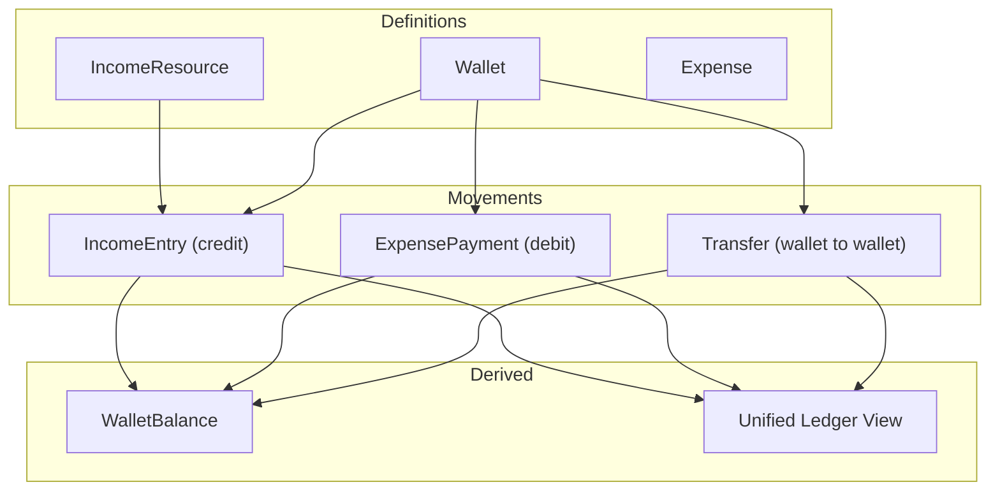

# eBoom Documentation

Product reference, feature catalog, and transaction logic for eBoom.

**Related documentation:**

- [README.md](README.md) — project overview, architecture, and quick start
- [ROADMAP.md](ROADMAP.md) — planned features and build order
- [Setup.md](Setup.md) — installation and troubleshooting
- [CONVENTIONS.md](CONVENTIONS.md) — coding standards for contributors

## Canvas

A **Canvas** is a scoped financial workspace — a project you create and optionally share with others. All financial activity maps to a canvas. For example, one user might have:

- A canvas for freelancing income and expenses
- A canvas for family financial planning
- A canvas for personal budgeting

Users can belong to multiple canvases. Each membership has a role and a base currency. Most data (incomes, wallets, expenses) is canvas-scoped.

Money flows through a ledger: income credits wallets, expenses debit wallets, transfers move funds between wallets.

## Module Status at a Glance

| Module | Backend | Frontend | Status |
|--------|---------|----------|--------|
| Authentication | ✅ | ✅ | **Live** |
| Canvas workspaces | ✅ | ✅ | **Live** |
| Collaboration (members & invites) | ✅ | ✅ | **Live** |
| Incomes + entries | ✅ | ✅ | **Live** |
| Wallets + sub-wallets | ✅ | ✅ | **Live** |
| Expenses + payments | ✅ | ✅ | **Live** |
| Categories (income, expense, wallet) | ✅ | ✅ | **Live** |
| Dashboard | ✅ | ✅ | **Live** |
| Calendar | ✅ | ✅ | **Live** |
| Whiteboard | ✅ | ✅ | **Live** |
| Notifications (overdue) | ✅ | ✅ | **Live** |
| Multi-currency support | ✅ | ✅ | **Live** |
| i18n (EN, DE, FA + RTL) | — | ✅ | **Live** |
| Transfers | ✅ | ✅ | **Live** |
| Wishlists / to-buy items | Schema only | Placeholder | **Not built** |
| Budget & planning | ✅ | ✅ | **Live** |
| AI insights | ❌ | Placeholder | **Not built** |
| Debts, loans, entities, assets | Schema/roadmap | ❌ | **Not built** |

## Environment Variables

### Backend (`eboom-backend/.env`)

Copy from [`.env.sample`](eboom-backend/.env.sample).

| Variable | Purpose |
|----------|---------|
| `PORT` | API port (default `4000`) |
| `DATABASE_URL` | PostgreSQL connection string |
| `JWT_SECRET` | Secret for signing access and refresh tokens |
| `JWT_ACCESS_EXPIRES_IN` | Access token lifetime (default `1h`) |
| `JWT_REFRESH_EXPIRES_IN` | Refresh token lifetime (default `7d`) |
| `APP_URL` | Frontend URL (used in email links) |
| `EMAIL_HOST`, `EMAIL_PORT`, `EMAIL_USER`, `EMAIL_PASS`, `EMAIL_FROM` | SMTP for verification and password reset |
| `DEFAULT_GUEST_USER_ID` | User ID for public wishlist routes (when implemented) |
| `TEST_USER_ID` | **Dev only** — bypasses auth when set |
| `SKIP_EMAIL_VERIFICATION` | **Dev only** — set to `1` to skip email verification on signup/login |
| `NOTIFICATION_EMAIL_ENABLED` | Set to `0` to disable overdue email job |
| `NOTIFICATION_EMAIL_INTERVAL_MS` | Job interval (default 1h) |

### Frontend (`eboom-frontend/.env`)

Copy from [`.env.example`](eboom-frontend/.env.example).

| Variable | Purpose |
|----------|---------|
| `NEXT_PUBLIC_BASE_URL` | Backend API base URL (e.g. `http://localhost:4000`) |
| `NEXT_PUBLIC_TEST_MODE` | **Dev only** — set to `true` to bypass frontend auth (requires backend `TEST_USER_ID`) |

Never commit `.env` files. Remove or disable `TEST_USER_ID`, `SKIP_EMAIL_VERIFICATION`, and `NEXT_PUBLIC_TEST_MODE` in production.

## Development Commands

### Backend (`eboom-backend/`)

| Script | Description |
|--------|-------------|
| `npm run dev` | Start dev server with nodemon |
| `npm run build` | Compile TypeScript to `dist/` |
| `npm start` | Run compiled server |
| `npm run type-check` | TypeScript check without emit |
| `npm run db:migrate` | Apply database migrations |
| `npm run db:seed` | Seed database (also: `db:seed:safe`, `db:seed:hybrid`, `db:seed:specific`) |
| `npm run db:studio` | Open Drizzle Studio |
| `npm run db:reset` | Reset database |

### Frontend (`eboom-frontend/`)

| Script | Description |
|--------|-------------|
| `npm run dev` | Start Next.js dev server |
| `npm run build` | Production build |
| `npm start` | Run production server |
| `npm run lint` | Run ESLint |

## API Overview

All routes are mounted under `/api`. Authentication uses `Authorization: Bearer <token>` except for public auth routes.

**Health check:** `GET /health` returns `{ status: 'ok' }`. `GET /` returns `{ ok: true, service: 'pfm-backend' }`.

| Route group | Path prefix | Auth |
|-------------|-------------|------|
| Auth | `/api/auth/*` | Public (signup, login, refresh, verify, reset) |
| Canvases | `/api/canvases/*` | Required |
| Canvas members | `/api/canvases/:canvasId/members/*` | Required |
| Canvas invitations | `/api/canvas-invitations/*` | Required |
| Canvas roles | `/api/roles/canvas/*` | Required |
| Whiteboard | `/api/canvases/:canvasId/whiteboard/*` | Required |
| Calendar | `/api/calendar/:canvasId` | Required |
| Notifications | `/api/notifications/*` | Required |
| Currency | `/api/currency/*` | Required |
| Income | `/api/income/*`, `/api/income/categories` | Required |
| Wallets | `/api/wallets/*`, `/api/wallet/categories` | Required |
| Expenses | `/api/expenses/*`, `/api/expense/categories` | Required |
| Transfers | `/api/transfers/*`, `/api/canvases/:canvasId/transfers`, `/api/wallets/:walletId/transfers` | Required |

Route registration lives in [`eboom-backend/src/routes/index.ts`](eboom-backend/src/routes/index.ts). Frontend URL constants are in [`eboom-frontend/src/api/urls.ts`](eboom-frontend/src/api/urls.ts).

## Current Features

### 1. Authentication & User Account

**Routes:** `/login`, `/signup`, `/forgot-password`, `/reset-password`, `/verify-email`, `/confirm-email`

| Feature | Details |
|---------|---------|
| Sign up / log in | Email + password, bcrypt hashing |
| JWT sessions | Access + refresh tokens stored in localStorage |
| Email verification | SMTP via Nodemailer; skippable in dev (`SKIP_EMAIL_VERIFICATION`) |
| Password reset | Token-based reset flow |
| Profile | User info, profile photo URL update |
| Route protection | `AuthProvider` redirects unauthenticated users to `/login` |
| Rate limiting | Applied on auth endpoints |

### 2. Canvas (Workspace) System

The core tenancy model. Each canvas is an isolated financial workspace.

| Feature | Details |
|---------|---------|
| Create / edit / delete canvas | Name, description, base currency |
| Canvas switcher | Sidebar dropdown; active canvas persisted in localStorage |
| Multi-canvas membership | Users can belong to many canvases |
| Canvas-scoped data | Incomes, wallets, expenses all scoped to active canvas |

### 3. Collaboration & Permissions

**Route:** `/members` (visible only with `canManageMembers` permission)

| Feature | Details |
|---------|---------|
| Invite by email | Pending → accepted / declined / cancelled / expired |
| Role-based access | **Collaborator**, **Modifier**, **Visitor** (seeded roles) |
| Permissions | `view`, `edit`, `manage_members`, `manage_canvas` |
| Member management | Update roles, remove members, leave canvas |
| Invitation inbox | Sent/received lists; accept/decline/cancel |

### 4. Incomes

**Routes:** `/incomes`, `/income/[id]`

| Feature | Details |
|---------|---------|
| Income resources | Recurring or one-off income definitions |
| Income entries | Actual receipts into a wallet |
| Categories | CRUD + seeded catalog |
| Multi-currency | Per-income currency |
| Recurrence | JSON recurrence patterns |
| Transaction status | pending / completed / failed / cancelled |
| Detail view | Summary cards, entries table/chart |
| Ledger integration | Entries credit destination wallet via `ledgerService` |

### 5. Wallets

**Routes:** `/wallets`, `/wallet/[id]`

| Feature | Details |
|---------|---------|
| Wallet CRUD | Bank accounts, crypto, safes, etc. |
| Sub-wallets | One balance per currency per wallet |
| Categories | CRUD + seeded catalog |
| Unified transactions | Income entries + expense payments + transfers on wallet detail |
| Wallet transfers | Create, edit, delete; same or cross-currency with rate/fee |
| Summary cards | Received, pending incoming, paid, due outgoing |
| Balance tracking | Canonical balances in `sub_wallets` table |

### 6. Wallet Transfers

**Routes:** `/transactions`, `/wallet/[id]` (transfers tab)

| Feature | Details |
|---------|---------|
| Transfer CRUD | Move funds between sub-wallets (same or different currency) |
| Exchange rate & fees | Recorded on each transfer |
| Canvas transactions page | Unified list of income entries, expense payments, and transfers |
| Wallet detail | Transfers table + create/edit modal |
| Ledger integration | Debits source wallet, credits destination wallet via `transferService` |
| Calendar & whiteboard | Transfers appear on calendar and as flow edges on the whiteboard |

### 7. Expenses

**Routes:** `/expenses`, `/expense/[id]`

| Feature | Details |
|---------|---------|
| Expense CRUD | Recurring or one-off obligations |
| Expense payments | Actual payments from a wallet |
| Categories | CRUD + seeded catalog |
| Multi-currency | Per-expense currency |
| Recurrence | JSON recurrence patterns |
| Transaction status | pending / completed / failed / cancelled |
| Detail view | Summary cards, payments table/chart |
| Ledger integration | Payments debit source wallet |

### 8. Dashboard

**Route:** `/`

| Feature | Details |
|---------|---------|
| Canvas summary API | `GET /api/canvases/:canvasId/summary` |
| Assets section | Per-currency breakdown, top wallets, entity counts |
| Cash flow chart | Income vs expenses over time (Recharts) |
| Yearly heatmap | Activity intensity by day |
| Recent activity | Clickable list linking to income, expense, and transfer detail |
| Empty state | Shown when canvas has no data |

### 9. Calendar

**Route:** `/calendar`

| Feature | Details |
|---------|---------|
| FullCalendar integration | Month/week/day views |
| Event sources | Income entries, expense payments, transfers, recurrence expansion |
| Due dates | Visual timeline of upcoming and past financial events |

### 10. Whiteboard

**Route:** `/whiteboard`

| Feature | Details |
|---------|---------|
| Visual money-flow graph | React Flow (@xyflow/react) |
| Node types | Income → wallet → expense relationships; transfer flow edges |
| Auto-layout | Dagre layout engine |
| Persistence | Node positions + viewport saved per canvas |
| Inline CRUD | Create/edit from the graph |
| Side panel | Summary details for selected nodes |

### 11. Notifications

| Feature | Details |
|---------|---------|
| Overdue detection | Unpaid expense payments, unreceived income entries |
| In-app panel | Header notifications panel |
| Email digests | Scheduled job (`NOTIFICATION_EMAIL_ENABLED`) |
| Cross-canvas | Aggregated across all user canvases |

### 12. Platform & UX

| Feature | Details |
|---------|---------|
| Internationalization | English, German, Persian (RTL) |
| Theming | Light/dark via next-themes |
| Search | Header search (Redux-driven) |
| List pattern | Infinite scroll grids + floating add button across incomes/wallets/expenses |
| Shared UI | shadcn/ui component library |
| Dev test mode | `TEST_USER_ID` + `NEXT_PUBLIC_TEST_MODE` bypass auth |

### 13. Database Schema (25 tables)

**Active domains:** users, user_settings, canvases, canvas_members, canvas_invitations, roles, currencies, wallets, sub_wallets, wallet_categories, incomes, income_entries, income_categories, expenses, expense_payments, expense_categories, transfers, budgets, budget_lines, savings_goals, recurrence_patterns, attachments, notifications, whiteboard_viewports, whiteboard_node_positions

**Dormant (no API/UI):** `wishlists`, `to_buy_items`

### 14. Placeholder / Upcoming (sidebar "Soon")

| Route | Label |
|-------|-------|
| `/wish-list` | Wish List |
| `/ai-insights` | AI Insights |

These render `ComingSoonPlaceholder` only — no backend yet.

For planned features and build order, see [ROADMAP.md](ROADMAP.md).

## Transaction Logic

This section explains how to implement money movement in eBoom without ambiguity.

### Model Layers

### Canonical Operations

| Operation | Effect |
|---|---|
| Income entry | Credit wallet balance |
| Expense payment | Debit wallet balance |
| Transfer | Debit source wallet, credit destination wallet |

All balance mutations must go through `ledgerService`.

### Invariants

- Never mutate `wallet_balances` directly from route handlers.
- Every movement must be canvas-authorized.
- Amounts must be non-negative.
- Debits must fail on insufficient funds unless explicitly allowed.
- Cross-currency operations must persist exchange context (`exchange_rate`, optional fee).

### Backend Flow Contract

1. Validate user and input.
2. Validate canvas membership and wallet ownership scope.
3. Persist movement row (`income_entries`, `expense_payments`, or `transfers`).
4. Apply balance mutation through `ledgerService`.
5. Return movement payload.

### UI Flow Contract

- UI submits intent (`amount`, `wallet`, `date`, `notes`).
- UI never computes final balances locally.
- UI refreshes authoritative balances and ledger from API after mutation.

### Example: Income Entry

Input:
- resource: Salary
- destination wallet: Checking
- amount: 500

Writes:
- insert into `income_entries`
- `ledgerService.creditWalletBalance(checking, currency, 500)`

Output:
- updated wallet balance and entry record

### Example: Expense Payment

Input:
- expense: Rent
- source wallet: Checking
- amount: 400

Writes:
- insert into `expense_payments`
- `ledgerService.debitWalletBalance(checking, currency, 400)`

Output:
- updated wallet balance and payment record

### Example: Transfer

Input:
- source wallet: Checking USD
- destination wallet: Savings USD
- amount: 100

Writes:
- insert into `transfers`
- debit source by 100, credit destination by 100

Output:
- both balances updated atomically
