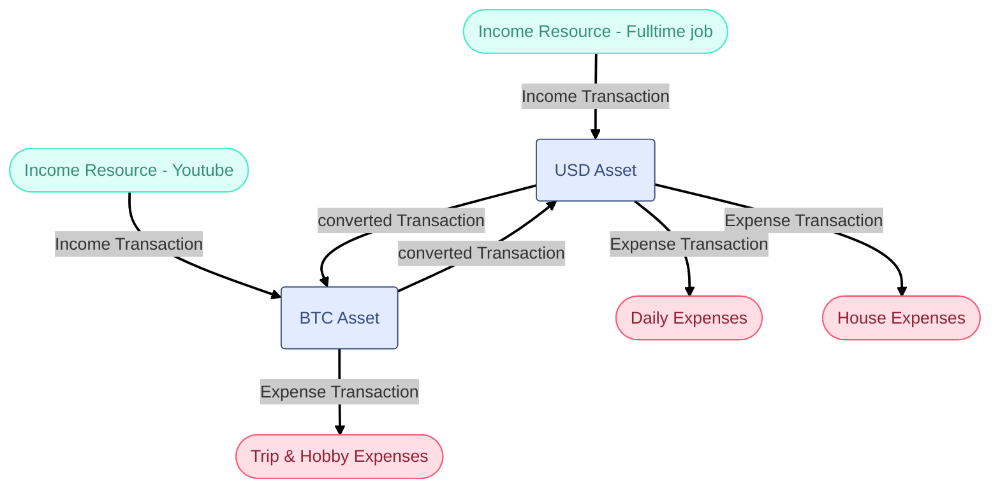

This project is created to make a personal finance management platform (PFM). 
The PFM platform is web base, the database is postgres, I also use the Supabase to have the Postgres database, Authentication and the REST API for the database tables. 

The project users are personal and individual people or families or maybe small businesses. 

We have a concept of "Canvas" which is a finance project that someone create and can add people to it. all the user activities will map to a canvas. for example user A has a canvas for the freelancing job financial management, one canvas for the family financial planning and one for the individual financial planning. 

The project features is:
- multi currency support
- Manage income resources, type of income resource, the forecasting or estimating our much income will receive in next month or current year. (multi currency income, currency or crypto currency)
- manage assets and money in the wallets. wallets may be the bank accounts, crypto wallets, the safe or a place which people put their money or assets there. assets may be gold, car, land, apartment, house, or any other thing that can bought to others. 
- manage expenses, with categories in multi level (like tree graph). 
- manage Debiting and Crediting with people
- defining people, shops, companies to map the income, expense, debiting and crediting to it's related entity
- manage loans and their repayments deadlines and amounts. 
- Budgeting 
- financial planning (for week, month, year, long time periods)
- To Buy list and plan to buy them (like a todo list with priority and due date)
- having reports about incomes, assets, expenses, loans, budgeting 
- The Ai that can guide me in financial planning and reviewing the financial part of the life

As the money or asset transactions can by multi currency, the platform should handle the data related to the asset and money converts ( for example, convert rate, convert fee, which currency or asset converted to another currency or asset ). also the Payment of the job in the income part may have currency converts.  

## Conceptual framework

