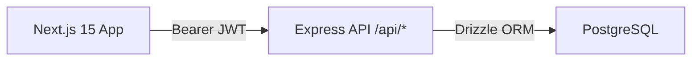

# eBoom

Personal finance management (PFM) for individuals, families, and small businesses.

eBoom is a web-based platform backed by PostgreSQL. Authentication is handled internally by the Express API using JWT tokens and bcrypt password hashing. All application data is accessed through a custom Express API with Drizzle ORM.

## What is eBoom?

eBoom helps people track income, wallet balances, expenses, debts, budgets, and financial plans across multiple currencies. Users can be individuals, families, or small businesses managing their finances in one place.

For the canvas model, module status, feature map, and transaction logic, see [`docs/00-overview.md`](docs/00-overview.md).

## Architecture


```mermaid
flowchart LR
  Browser["Next.js 15 App"]
  ExpressAPI["Express API /api/*"]
  Postgres["PostgreSQL"]
  Browser -->|"Bearer JWT"| ExpressAPI
  ExpressAPI -->|"Drizzle ORM"| Postgres
```

| Layer | Technology |
|-------|------------|
| Frontend | Next.js 15 (App Router), React 19, Tailwind CSS 4, shadcn/ui, TanStack Query, Redux Toolkit, Axios |
| Backend | Express 4, TypeScript, Drizzle ORM, Multer, Nodemailer, jsonwebtoken, bcryptjs |
| Database | PostgreSQL |
| Auth | Internal JWT (signed by Express, validated by auth middleware) |
| Tooling | Drizzle Studio, ESLint (frontend) |

Docker Compose is available for production-style deployments. There is no CI pipeline or automated test suite yet.

## Repository Structure

```
eboom/
├── README.md           # Project overview (this file)
├── ROADMAP.md          # Planned features and build order
├── CONVENTIONS.md      # Coding standards for contributors
├── Setup.md            # Detailed installation and troubleshooting guide
├── docs/               # Engineering docs (00 overview + module guides)
├── docker-compose.yml  # Production stack (PostgreSQL + backend + frontend)
├── .env.example        # Optional overrides for Docker / production
├── eboom-backend/      # Express API + database layer (package name: pfm-backend)
└── eboom-frontend/     # Next.js web application
```

## Quick Start

**Prerequisites:** Node.js 18+, PostgreSQL.

```bash
# Backend
cd eboom-backend
cp .env.sample .env   # fill in DATABASE_URL, JWT_SECRET, etc.
npm install
npm run db:migrate
npm run db:seed
npm run dev           # http://localhost:4000

# Frontend (separate terminal)
cd eboom-frontend
cp .env.example .env  # set NEXT_PUBLIC_BASE_URL=http://localhost:4000
npm install
npm run dev           # http://localhost:3000
```

For PostgreSQL setup, seeding options, test mode, and troubleshooting, see [Setup.md](Setup.md).

For coding patterns when adding features, see [CONVENTIONS.md](CONVENTIONS.md).

## Environment Variables

### Backend (`eboom-backend/.env`)

Copy from [`.env.sample`](eboom-backend/.env.sample).

| Variable | Purpose |
|----------|---------|
| `PORT` | API port (default `4000`) |
| `DATABASE_URL` | PostgreSQL connection string |
| `JWT_SECRET` | Secret for signing access and refresh tokens |
| `JWT_ACCESS_EXPIRES_IN` | Access token lifetime (default `1h`) |
| `JWT_REFRESH_EXPIRES_IN` | Refresh token lifetime (default `7d`) |
| `APP_URL` | Frontend URL (used in email links) |
| `EMAIL_HOST`, `EMAIL_PORT`, `EMAIL_USER`, `EMAIL_PASS`, `EMAIL_FROM` | SMTP for verification and password reset |
| `DEFAULT_GUEST_USER_ID` | User ID for public wishlist routes (when implemented) |
| `TEST_USER_ID` | **Dev only** — bypasses auth when set |
| `SKIP_EMAIL_VERIFICATION` | **Dev only** — set to `1` to skip email verification on signup/login |
| `NOTIFICATION_EMAIL_ENABLED` | Set to `0` to disable overdue email job |
| `NOTIFICATION_EMAIL_INTERVAL_MS` | Job interval (default 1h) |
| `OPENAI_API_KEY` | OpenAI API key for AI Insights generation |
| `OPENAI_MODEL` | OpenAI model (default `gpt-4o-mini`) |

### Frontend (`eboom-frontend/.env`)

Copy from [`.env.example`](eboom-frontend/.env.example).

| Variable | Purpose |
|----------|---------|
| `NEXT_PUBLIC_BASE_URL` | Backend API base URL (e.g. `http://localhost:4000`) |
| `NEXT_PUBLIC_TEST_MODE` | **Dev only** — set to `true` to bypass frontend auth (requires backend `TEST_USER_ID`) |
## Docker

Run the full stack (PostgreSQL, backend, frontend) with one command:

```bash
docker compose up -d --build
```

Then open http://localhost:3000.

- **Backend API:** http://localhost:4000
- **Health check:** http://localhost:4000/health

On startup, the backend waits for PostgreSQL (via compose healthcheck), applies the database schema (`drizzle-kit push`), then starts the API.

**Production:** copy [`.env.example`](.env.example) to `.env` and set a strong `JWT_SECRET`, `POSTGRES_PASSWORD`, `NEXT_PUBLIC_BASE_URL`, and `APP_URL`, then rebuild. Configure SMTP in `.env` if you need email verification or password reset.

### Seed (Optional)

Load demo data after the stack is running:

```bash
docker compose exec backend node dist/db/seed/seed.js
```

## Related Documentation

- [`docs/`](docs/README.md) — engineering docs; start with [`docs/00-overview.md`](docs/00-overview.md) for canvas model, module status, and transaction logic
- [ROADMAP.md](ROADMAP.md) — planned features, tiers, and recommended build order
- [Setup.md](Setup.md) — full installation, database configuration, seeding, test mode, and troubleshooting
- [CONVENTIONS.md](CONVENTIONS.md) — repository layout, naming, frontend/backend patterns, and feature checklist

## Known Gaps

- Wishlist API not registered in `routes/index.ts` (schema exists, UI is placeholder)
- No debts, loans, entities, or asset tracking beyond wallets (see [ROADMAP.md](ROADMAP.md))
- No automated tests or CI/CD pipeline
- No LICENSE or CONTRIBUTING guide
- No OAuth / social login
- No bank sync or payment processor integration
- No live FX rate feeds (currencies are seeded statically)
- Package naming inconsistency: backend is `pfm-backend`, frontend is `eboom-frontend`
- Role auth middleware is a stub
