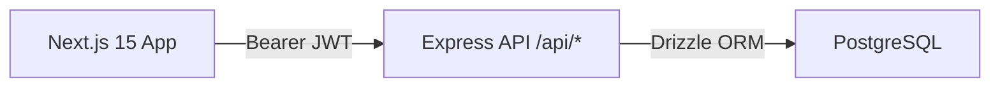

# eBoom

Personal finance management (PFM) for individuals, families, and small businesses.

eBoom is a web-based platform backed by PostgreSQL. Authentication is handled internally by the Express API using JWT tokens and bcrypt password hashing. All application data is accessed through a custom Express API with Drizzle ORM.

## What is eBoom?

eBoom helps people track income, wallet balances, expenses, debts, budgets, and financial plans across multiple currencies. Users can be individuals, families, or small businesses managing their finances in one place.

### Canvas

A **Canvas** is a scoped financial workspace — a project you create and optionally share with others. All financial activity maps to a canvas. For example, one user might have:

- A canvas for freelancing income and expenses
- A canvas for family financial planning
- A canvas for personal budgeting

Users can belong to multiple canvases. Each membership has a role and a base currency. Most data (incomes, wallets, expenses) is canvas-scoped.

## Feature Status

| Area | Status |
|------|--------|
| Auth (signup, login, email verify, password reset) | Implemented |
| Canvas CRUD + switcher | Implemented |
| Incomes (resources, transactions, categories) | Implemented |
| Wallets + balances | Implemented |
| Expenses + hierarchical categories | Implemented |
| Wishlists + to-buy items + public share links | Implemented (temporarily hidden from main navigation in Phase 0) |
| Dashboard | Partial (mock data in `eboom-frontend/src/_mocks/data.json`) |
| Whiteboard, Budget & Planning, AI Insights | Placeholder pages |
| Debts, loans, budgets, financial plans, entities, AI tables, forecasts, currency conversions | Schema only (36 tables; ~12 route files) |

See [Roadmap](#roadmap) for the full planned feature set.

## Architecture


```mermaid
flowchart LR
  Browser["Next.js 15 App"]
  ExpressAPI["Express API /api/*"]
  Postgres["PostgreSQL"]
  Browser -->|"Bearer JWT"| ExpressAPI
  ExpressAPI -->|"Drizzle ORM"| Postgres
```

| Layer | Technology |
|-------|------------|
| Frontend | Next.js 15 (App Router), React 19, Tailwind CSS 4, shadcn/ui, TanStack Query, Redux Toolkit, Axios |
| Backend | Express 4, TypeScript, Drizzle ORM, Multer, Nodemailer, jsonwebtoken, bcryptjs |
| Database | PostgreSQL |
| Auth | Internal JWT (signed by Express, validated by auth middleware) |
| Tooling | Drizzle Studio, ESLint (frontend) |

There is no Docker setup, CI pipeline, or automated test suite yet.

## Repository Structure

```
eboom/
├── README.md           # Project overview (this file)
├── CONVENTIONS.md      # Coding standards for contributors
├── Setup.md            # Detailed installation and troubleshooting guide
├── eboom-backend/      # Express API + database layer (package name: pfm-backend)
└── eboom-frontend/     # Next.js web application
```

## Quick Start

**Prerequisites:** Node.js 18+, PostgreSQL.

```bash
# Backend
cd eboom-backend
cp .env.sample .env   # fill in DATABASE_URL, JWT_SECRET, etc.
npm install
npm run db:migrate
npm run db:seed
npm run dev           # http://localhost:4000

# Frontend (separate terminal)
cd eboom-frontend
cp .env.example .env  # set NEXT_PUBLIC_BASE_URL=http://localhost:4000
npm install
npm run dev           # http://localhost:3000
```

For PostgreSQL setup, seeding options, test mode, and troubleshooting, see [Setup.md](Setup.md).

For coding patterns when adding features, see [CONVENTIONS.md](CONVENTIONS.md).

## Environment Variables

### Backend (`eboom-backend/.env`)

Copy from [`.env.sample`](eboom-backend/.env.sample).

| Variable | Purpose |
|----------|---------|
| `PORT` | API port (default `4000`) |
| `DATABASE_URL` | PostgreSQL connection string |
| `JWT_SECRET` | Secret for signing access and refresh tokens |
| `JWT_ACCESS_EXPIRES_IN` | Access token lifetime (default `1h`) |
| `JWT_REFRESH_EXPIRES_IN` | Refresh token lifetime (default `7d`) |
| `APP_URL` | Frontend URL (used in email links) |
| `EMAIL_HOST`, `EMAIL_PORT`, `EMAIL_USER`, `EMAIL_PASS`, `EMAIL_FROM` | SMTP for verification and password reset |
| `DEFAULT_GUEST_USER_ID` | User ID for public wishlist routes |
| `TEST_USER_ID` | **Dev only** — bypasses auth when set |
| `SKIP_EMAIL_VERIFICATION` | **Dev only** — set to `1` to skip email verification on signup/login |

### Frontend (`eboom-frontend/.env`)

Copy from [`.env.example`](eboom-frontend/.env.example).

| Variable | Purpose |
|----------|---------|
| `NEXT_PUBLIC_BASE_URL` | Backend API base URL (e.g. `http://localhost:4000`) |
| `NEXT_PUBLIC_TEST_MODE` | **Dev only** — set to `true` to bypass frontend auth (requires backend `TEST_USER_ID`) |

Never commit `.env` files. Remove or disable `TEST_USER_ID`, `SKIP_EMAIL_VERIFICATION`, and `NEXT_PUBLIC_TEST_MODE` in production.

## Development Commands

### Backend (`eboom-backend/`)

| Script | Description |
|--------|-------------|
| `npm run dev` | Start dev server with nodemon |
| `npm run build` | Compile TypeScript to `dist/` |
| `npm start` | Run compiled server |
| `npm run type-check` | TypeScript check without emit |
| `npm run db:migrate` | Apply database migrations |
| `npm run db:seed` | Seed database (also: `db:seed:safe`, `db:seed:hybrid`, `db:seed:specific`) |
| `npm run db:studio` | Open Drizzle Studio |
| `npm run db:reset` | Reset database |

### Frontend (`eboom-frontend/`)

| Script | Description |
|--------|-------------|
| `npm run dev` | Start Next.js dev server |
| `npm run build` | Production build |
| `npm start` | Run production server |
| `npm run lint` | Run ESLint |

## API Overview

All routes are mounted under `/api`. Authentication uses `Authorization: Bearer <token>` except for public auth and wishlist routes.

**Health check:** `GET /` returns `{ ok: true, service: 'pfm-backend' }`.

| Route group | Path prefix | Auth |
|-------------|-------------|------|
| Auth | `/api/auth/*` | Public (signup, login, refresh, verify, reset) |
| Canvases | `/api/canvases/*` | Required |
| Canvas-scoped lists | `/api/canvases/:canvasId/{expenses\|income-resources\|wallets}` | Required |
| Currency | `/api/currency` | Required |
| Income | `/api/income/*` | Required |
| Wallets | `/api/wallets/*`, `/api/wallet/categories` | Required |
| Expenses | `/api/expenses/*`, `/api/expense/categories` | Required |
| Wishlists | `/api/wishlists/*`, `/api/to-buy-items/*` | Required |
| Public wishlists | `/api/public/wishlists/*`, `/api/public/to-buy-items/*` | Guest auth |

Route registration lives in [`eboom-backend/src/routes/index.ts`](eboom-backend/src/routes/index.ts). Frontend URL constants are in [`eboom-frontend/src/api/urls.ts`](eboom-frontend/src/api/urls.ts).

## Roadmap

The following features are planned or partially modeled in the database schema. Items marked **implemented** above are usable today; the rest are on the roadmap.

### Income

- Multi-currency income (fiat and crypto)
- Income resource types and categories
- Forecasting / estimating income for next month or current year

### Assets & Wallets

- Wallets: bank accounts, crypto wallets, safes, or any place money/assets are stored
- Assets: gold, vehicles, real estate, or anything with resale value

### Expenses

- Multi-level expense categories (tree structure)
- Multi-currency spending

### Debts & Credits

- Debiting and crediting with people
- Loan management with repayment deadlines and amounts

### Entities

- People, shops, and companies linked to income, expenses, debts, and credits

### Planning

- Budgeting
- Financial planning (weekly, monthly, yearly, long-term)
- To-buy lists with priority and due dates (**implemented** as wishlists)

### Reports & AI

- Reports on incomes, assets, expenses, loans, and budgets
- AI-guided financial planning and life-finance review

### Multi-Currency Conversions

Transactions may span currencies and asset types. The platform will track conversion rates, fees, and source/target currency or asset — including income payments that involve currency conversion.

## Related Documentation

- [Setup.md](Setup.md) — full installation, database configuration, seeding, test mode, and troubleshooting
- [CONVENTIONS.md](CONVENTIONS.md) — repository layout, naming, frontend/backend patterns, and feature checklist
- [ARCHITECTURE.md](ARCHITECTURE.md) — system architecture and app flow
- [TRANSACTIONS.md](TRANSACTIONS.md) — transaction logic and ledger invariants

## Known Gaps

- No automated tests, CI/CD, or Docker/devcontainer setup
- No LICENSE or CONTRIBUTING guide
- Package naming inconsistency: backend is `pfm-backend`, frontend is `eboom-frontend`
- Dashboard uses mock data, not live API aggregation
- Several schema tables (debts, budgets, financial plans, entities, AI) have no API or UI yet
