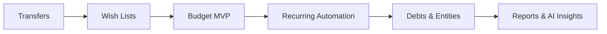
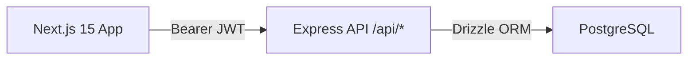

# eBoom

Personal finance management (PFM) for individuals, families, and small businesses.

eBoom is a web-based platform backed by PostgreSQL. Authentication is handled internally by the Express API using JWT tokens and bcrypt password hashing. All application data is accessed through a custom Express API with Drizzle ORM.

## What is eBoom?

eBoom helps people track income, wallet balances, expenses, debts, budgets, and financial plans across multiple currencies. Users can be individuals, families, or small businesses managing their finances in one place.

### Canvas

A **Canvas** is a scoped financial workspace — a project you create and optionally share with others. All financial activity maps to a canvas. For example, one user might have:

- A canvas for freelancing income and expenses
- A canvas for family financial planning
- A canvas for personal budgeting

Users can belong to multiple canvases. Each membership has a role and a base currency. Most data (incomes, wallets, expenses) is canvas-scoped.

Money flows through a ledger: income credits wallets, expenses debit wallets.

## Module Status at a Glance

| Module | Backend | Frontend | Status |
|--------|---------|----------|--------|
| Authentication | ✅ | ✅ | **Live** |
| Canvas workspaces | ✅ | ✅ | **Live** |
| Collaboration (members & invites) | ✅ | ✅ | **Live** |
| Incomes + entries | ✅ | ✅ | **Live** |
| Wallets + sub-wallets | ✅ | ✅ | **Live** |
| Expenses + payments | ✅ | ✅ | **Live** |
| Categories (income, expense, wallet) | ✅ | ✅ | **Live** |
| Dashboard | ✅ | ✅ | **Live** |
| Calendar | ✅ | ✅ | **Live** |
| Whiteboard | ✅ | ✅ | **Live** |
| Notifications (overdue) | ✅ | ✅ | **Live** |
| Multi-currency support | ✅ | ✅ | **Live** |
| i18n (EN, DE, FA + RTL) | — | ✅ | **Live** |
| Transfers | Schema only | ❌ | **Not built** |
| Wishlists / to-buy items | Schema only | Placeholder | **Not built** |
| Budget & planning | ❌ | Placeholder | **Not built** |
| AI insights | ❌ | Placeholder | **Not built** |
| Debts, loans, entities, assets | Schema/roadmap | ❌ | **Not built** |

## Current Features

### 1. Authentication & User Account

**Routes:** `/login`, `/signup`, `/forgot-password`, `/reset-password`, `/verify-email`, `/confirm-email`

| Feature | Details |
|---------|---------|
| Sign up / log in | Email + password, bcrypt hashing |
| JWT sessions | Access + refresh tokens stored in localStorage |
| Email verification | SMTP via Nodemailer; skippable in dev (`SKIP_EMAIL_VERIFICATION`) |
| Password reset | Token-based reset flow |
| Profile | User info, profile photo URL update |
| Route protection | `AuthProvider` redirects unauthenticated users to `/login` |
| Rate limiting | Applied on auth endpoints |

### 2. Canvas (Workspace) System

The core tenancy model. Each canvas is an isolated financial workspace.

| Feature | Details |
|---------|---------|
| Create / edit / delete canvas | Name, description, base currency |
| Canvas switcher | Sidebar dropdown; active canvas persisted in localStorage |
| Multi-canvas membership | Users can belong to many canvases |
| Canvas-scoped data | Incomes, wallets, expenses all scoped to active canvas |

### 3. Collaboration & Permissions

**Route:** `/members` (visible only with `canManageMembers` permission)

| Feature | Details |
|---------|---------|
| Invite by email | Pending → accepted / declined / cancelled / expired |
| Role-based access | **Collaborator**, **Modifier**, **Visitor** (seeded roles) |
| Permissions | `view`, `edit`, `manage_members`, `manage_canvas` |
| Member management | Update roles, remove members, leave canvas |
| Invitation inbox | Sent/received lists; accept/decline/cancel |

### 4. Incomes

**Routes:** `/incomes`, `/income/[id]`

| Feature | Details |
|---------|---------|
| Income resources | Recurring or one-off income definitions |
| Income entries | Actual receipts into a wallet |
| Categories | CRUD + seeded catalog |
| Multi-currency | Per-income currency |
| Recurrence | JSON recurrence patterns |
| Transaction status | pending / completed / failed / cancelled |
| Detail view | Summary cards, entries table/chart |
| Ledger integration | Entries credit destination wallet via `ledgerService` |

### 5. Wallets

**Routes:** `/wallets`, `/wallet/[id]`

| Feature | Details |
|---------|---------|
| Wallet CRUD | Bank accounts, crypto, safes, etc. |
| Sub-wallets | One balance per currency per wallet |
| Categories | CRUD + seeded catalog |
| Unified transactions | Income entries + expense payments on wallet detail |
| Summary cards | Received, pending incoming, paid, due outgoing |
| Balance tracking | Canonical balances in `sub_wallets` table |

### 6. Expenses

**Routes:** `/expenses`, `/expense/[id]`

| Feature | Details |
|---------|---------|
| Expense CRUD | Recurring or one-off obligations |
| Expense payments | Actual payments from a wallet |
| Categories | CRUD + seeded catalog |
| Multi-currency | Per-expense currency |
| Recurrence | JSON recurrence patterns |
| Transaction status | pending / completed / failed / cancelled |
| Detail view | Summary cards, payments table/chart |
| Ledger integration | Payments debit source wallet |

### 7. Dashboard

**Route:** `/`

| Feature | Details |
|---------|---------|
| Canvas summary API | `GET /api/canvases/:canvasId/summary` |
| Assets section | Per-currency breakdown, top wallets, entity counts |
| Cash flow chart | Income vs expenses over time (Recharts) |
| Yearly heatmap | Activity intensity by day |
| Recent activity | Clickable list linking to income/expense detail |
| Empty state | Shown when canvas has no data |

### 8. Calendar

**Route:** `/calendar`

| Feature | Details |
|---------|---------|
| FullCalendar integration | Month/week/day views |
| Event sources | Income entries, expense payments, recurrence expansion |
| Due dates | Visual timeline of upcoming and past financial events |

### 9. Whiteboard

**Route:** `/whiteboard`

| Feature | Details |
|---------|---------|
| Visual money-flow graph | React Flow (@xyflow/react) |
| Node types | Income → wallet → expense relationships |
| Auto-layout | Dagre layout engine |
| Persistence | Node positions + viewport saved per canvas |
| Inline CRUD | Create/edit from the graph |
| Side panel | Summary details for selected nodes |

### 10. Notifications

| Feature | Details |
|---------|---------|
| Overdue detection | Unpaid expense payments, unreceived income entries |
| In-app panel | Header notifications panel |
| Email digests | Scheduled job (`NOTIFICATION_EMAIL_ENABLED`) |
| Cross-canvas | Aggregated across all user canvases |

### 11. Platform & UX

| Feature | Details |
|---------|---------|
| Internationalization | English, German, Persian (RTL) |
| Theming | Light/dark via next-themes |
| Search | Header search (Redux-driven) |
| List pattern | Infinite scroll grids + floating add button across incomes/wallets/expenses |
| Shared UI | shadcn/ui component library |
| Dev test mode | `TEST_USER_ID` + `NEXT_PUBLIC_TEST_MODE` bypass auth |

### 12. Database Schema (24 tables)

**Active domains:** users, user_settings, canvases, canvas_members, canvas_invitations, roles, currencies, wallets, sub_wallets, wallet_categories, incomes, income_entries, income_categories, expenses, expense_payments, expense_categories, recurrence_patterns, attachments, notifications, whiteboard_viewports, whiteboard_node_positions

**Dormant (no API/UI):** `transfers`, `wishlists`, `to_buy_items`

### 13. Placeholder / Upcoming (sidebar "Soon")

| Route | Label |
|-------|-------|
| `/budget-planning` | Budget & Planning |
| `/wish-list` | Wish List |
| `/ai-insights` | AI Insights |

These render `ComingSoonPlaceholder` only — no backend yet.

## Suggested New Features

Grouped by impact and how well they fit what we already have.

### Tier 1 — Finish What We Started (high ROI, low risk)

These reuse existing schema, patterns, and UI conventions.

#### 1. Wallet Transfers

We already have a `transfers` table and ledger invariants in [TRANSACTIONS.md](TRANSACTIONS.md). This completes the money movement triangle: income → wallet → expense → **transfer between wallets**.

- Transfer between sub-wallets (same or different currency with rate/fee fields)
- UI on wallet detail + whiteboard edge type
- Unblocks multi-account cash management

#### 2. Wish Lists / To-Buy Items

Schema exists; sidebar already teases it. Re-enable routes and build the UI.

- Priority, due date, estimated cost, link to expense when purchased
- Public share links (guest auth already documented in env vars)
- Natural bridge to budget planning

#### 3. Budget & Planning (MVP)

Placeholder page exists; users expect this in a PFM app.

- Monthly category budgets vs actual spend (reuse expense categories + payments)
- Simple "remaining budget" bars on dashboard
- Alerts when approaching limits (extend notification service)

#### 4. Recurring Transaction Automation

Recurrence patterns exist in schema and calendar expands them — but users likely still record entries manually.

- Auto-generate pending income entries / expense payments on schedule
- "Mark as received/paid" one-click from calendar or notifications
- Reduces daily friction significantly

### Tier 2 — Differentiators (medium effort, strong product value)

#### 5. Debts & Credits (IOU tracking)

On the roadmap; fits canvas collaboration (family/shared debts).

- Person-linked debts: who owes whom, due dates, partial repayments
- Tie to wallets when repaid
- Calendar + notification integration for due dates

#### 6. Entities (people, shops, companies)

Central contact/vendor model referenced in roadmap.

- Link incomes, expenses, debts to entities
- "Spending by vendor" reports
- Member suggestions when inviting (partially exists for canvas invites)

#### 7. Non-Liquid Assets

Gold, vehicles, real estate, etc.

- Asset registry with estimated value + currency
- Optional link to wallets when sold
- Dashboard "net worth" = wallet balances + asset values

#### 8. Reports & Exports

Rich dashboard data but limited export/report surfaces.

- Monthly/yearly PDF or CSV export
- Category breakdown charts
- Cash flow forecast from recurring patterns (schema already supports recurrence)

#### 9. Enhanced Whiteboard

Already a standout feature — extend it.

- Transfer nodes/edges
- Budget target nodes
- Snapshot/share read-only whiteboard link for collaborators

### Tier 3 — Platform & Growth (longer term)

#### 10. AI Insights (make the placeholder real)

Start narrow, not generic "financial advisor."

- "Unusual spending this month" anomaly detection from expense history
- Recurring bill detection from payment patterns
- Natural language Q&A over canvas summary data
- Budget recommendations from historical averages

#### 11. Multi-Currency Conversions

Transfers table has rate/fee fields; currencies are seeded.

- Manual or API-sourced FX rates (e.g. exchangerate.host)
- Converted "total net worth in base currency" on dashboard
- Cross-currency transfer with recorded rate

#### 12. Bank / Card Import (optional integration)

Manual ledger is fine for MVP; import is a major upgrade.

- CSV/OFX import mapped to wallets and categories
- Rule-based auto-categorization
- Keeps ledger model; no Plaid dependency required initially

#### 13. Mobile-Friendly PWA

Next.js app is web-first.

- PWA install + offline read of last synced canvas summary
- Quick "log expense" action from home screen

#### 14. Audit Log & Activity History

Important for shared canvases.

- Who changed what, when (income edited, payment deleted)
- Complements existing roles/permissions

### Tier 4 — Engineering Foundations (enables everything else)

| Item | Why |
|------|-----|
| Automated tests (ledger, auth, canvas access) | Protect money invariants |
| CI pipeline | Catch regressions on PRs |
| Monorepo workspace scripts | Run frontend + backend together |
| Feature flags | Ship wishlist/budget behind flags instead of "Soon" badges |

### Recommended Build Order


```mermaid
flowchart LR
  A[Transfers] --> B[Wish Lists]
  B --> C[Budget MVP]
  C --> D[Recurring Automation]
  D --> E[Debts & Entities]
  E --> F[Reports & AI Insights]
```

1. **Transfers** — completes core ledger
2. **Wish lists** — schema ready, marketing-ready feature
3. **Budget MVP** — fills the biggest "Soon" gap
4. **Recurring automation** — daily usability win
5. **Debts + entities** — collaboration depth
6. **AI insights** — start with rules/stats, add LLM later

## Architecture


```mermaid
flowchart LR
  Browser["Next.js 15 App"]
  ExpressAPI["Express API /api/*"]
  Postgres["PostgreSQL"]
  Browser -->|"Bearer JWT"| ExpressAPI
  ExpressAPI -->|"Drizzle ORM"| Postgres
```

| Layer | Technology |
|-------|------------|
| Frontend | Next.js 15 (App Router), React 19, Tailwind CSS 4, shadcn/ui, TanStack Query, Redux Toolkit, Axios |
| Backend | Express 4, TypeScript, Drizzle ORM, Multer, Nodemailer, jsonwebtoken, bcryptjs |
| Database | PostgreSQL |
| Auth | Internal JWT (signed by Express, validated by auth middleware) |
| Tooling | Drizzle Studio, ESLint (frontend) |

There is no Docker setup, CI pipeline, or automated test suite yet.

## Repository Structure

```
eboom/
├── README.md           # Project overview (this file)
├── CONVENTIONS.md      # Coding standards for contributors
├── Setup.md            # Detailed installation and troubleshooting guide
├── TRANSACTIONS.md     # Transaction logic and ledger invariants
├── eboom-backend/      # Express API + database layer (package name: pfm-backend)
└── eboom-frontend/     # Next.js web application
```

## Quick Start

**Prerequisites:** Node.js 18+, PostgreSQL.

```bash
# Backend
cd eboom-backend
cp .env.sample .env   # fill in DATABASE_URL, JWT_SECRET, etc.
npm install
npm run db:migrate
npm run db:seed
npm run dev           # http://localhost:4000

# Frontend (separate terminal)
cd eboom-frontend
cp .env.example .env  # set NEXT_PUBLIC_BASE_URL=http://localhost:4000
npm install
npm run dev           # http://localhost:3000
```

For PostgreSQL setup, seeding options, test mode, and troubleshooting, see [Setup.md](Setup.md).

For coding patterns when adding features, see [CONVENTIONS.md](CONVENTIONS.md).

## Environment Variables

### Backend (`eboom-backend/.env`)

Copy from [`.env.sample`](eboom-backend/.env.sample).

| Variable | Purpose |
|----------|---------|
| `PORT` | API port (default `4000`) |
| `DATABASE_URL` | PostgreSQL connection string |
| `JWT_SECRET` | Secret for signing access and refresh tokens |
| `JWT_ACCESS_EXPIRES_IN` | Access token lifetime (default `1h`) |
| `JWT_REFRESH_EXPIRES_IN` | Refresh token lifetime (default `7d`) |
| `APP_URL` | Frontend URL (used in email links) |
| `EMAIL_HOST`, `EMAIL_PORT`, `EMAIL_USER`, `EMAIL_PASS`, `EMAIL_FROM` | SMTP for verification and password reset |
| `DEFAULT_GUEST_USER_ID` | User ID for public wishlist routes (when implemented) |
| `TEST_USER_ID` | **Dev only** — bypasses auth when set |
| `SKIP_EMAIL_VERIFICATION` | **Dev only** — set to `1` to skip email verification on signup/login |
| `NOTIFICATION_EMAIL_ENABLED` | Set to `0` to disable overdue email job |
| `NOTIFICATION_EMAIL_INTERVAL_MS` | Job interval (default 1h) |

### Frontend (`eboom-frontend/.env`)

Copy from [`.env.example`](eboom-frontend/.env.example).

| Variable | Purpose |
|----------|---------|
| `NEXT_PUBLIC_BASE_URL` | Backend API base URL (e.g. `http://localhost:4000`) |
| `NEXT_PUBLIC_TEST_MODE` | **Dev only** — set to `true` to bypass frontend auth (requires backend `TEST_USER_ID`) |

Never commit `.env` files. Remove or disable `TEST_USER_ID`, `SKIP_EMAIL_VERIFICATION`, and `NEXT_PUBLIC_TEST_MODE` in production.

## Development Commands

### Backend (`eboom-backend/`)

| Script | Description |
|--------|-------------|
| `npm run dev` | Start dev server with nodemon |
| `npm run build` | Compile TypeScript to `dist/` |
| `npm start` | Run compiled server |
| `npm run type-check` | TypeScript check without emit |
| `npm run db:migrate` | Apply database migrations |
| `npm run db:seed` | Seed database (also: `db:seed:safe`, `db:seed:hybrid`, `db:seed:specific`) |
| `npm run db:studio` | Open Drizzle Studio |
| `npm run db:reset` | Reset database |

### Frontend (`eboom-frontend/`)

| Script | Description |
|--------|-------------|
| `npm run dev` | Start Next.js dev server |
| `npm run build` | Production build |
| `npm start` | Run production server |
| `npm run lint` | Run ESLint |

## API Overview

All routes are mounted under `/api`. Authentication uses `Authorization: Bearer <token>` except for public auth routes.

**Health check:** `GET /` returns `{ ok: true, service: 'pfm-backend' }`.

| Route group | Path prefix | Auth |
|-------------|-------------|------|
| Auth | `/api/auth/*` | Public (signup, login, refresh, verify, reset) |
| Canvases | `/api/canvases/*` | Required |
| Canvas members | `/api/canvases/:canvasId/members/*` | Required |
| Canvas invitations | `/api/canvas-invitations/*` | Required |
| Canvas roles | `/api/roles/canvas/*` | Required |
| Whiteboard | `/api/canvases/:canvasId/whiteboard/*` | Required |
| Calendar | `/api/calendar/:canvasId` | Required |
| Notifications | `/api/notifications/*` | Required |
| Currency | `/api/currency/*` | Required |
| Income | `/api/income/*`, `/api/income/categories` | Required |
| Wallets | `/api/wallets/*`, `/api/wallet/categories` | Required |
| Expenses | `/api/expenses/*`, `/api/expense/categories` | Required |

Route registration lives in [`eboom-backend/src/routes/index.ts`](eboom-backend/src/routes/index.ts). Frontend URL constants are in [`eboom-frontend/src/api/urls.ts`](eboom-frontend/src/api/urls.ts).

## Related Documentation

- [Setup.md](Setup.md) — full installation, database configuration, seeding, test mode, and troubleshooting
- [CONVENTIONS.md](CONVENTIONS.md) — repository layout, naming, frontend/backend patterns, and feature checklist
- [TRANSACTIONS.md](TRANSACTIONS.md) — transaction logic and ledger invariants

## Known Gaps

- No wallet-to-wallet **transfers** (schema exists, no routes)
- Wishlist API not registered in `routes/index.ts` (schema exists, UI is placeholder)
- No debts, loans, budgets, entities, or asset tracking beyond wallets
- No automated tests, CI/CD, or Docker/devcontainer setup
- No LICENSE or CONTRIBUTING guide
- No OAuth / social login
- No bank sync or payment processor integration
- No live FX rate feeds (currencies are seeded statically)
- Package naming inconsistency: backend is `pfm-backend`, frontend is `eboom-frontend`
- Role auth middleware is a stub
