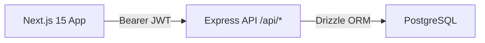

# eBoom

Personal finance management (PFM) for individuals, families, and small businesses.

eBoom is a web-based platform backed by PostgreSQL. Authentication is handled internally by the Express API using JWT tokens and bcrypt password hashing. All application data is accessed through a custom Express API with Drizzle ORM.

## What is eBoom?

eBoom helps people track income, wallet balances, expenses, debts, budgets, and financial plans across multiple currencies. Users can be individuals, families, or small businesses managing their finances in one place.

For the canvas model, module status, feature map, and transaction logic, see [`docs/00-overview.md`](docs/00-overview.md).

## Architecture


```mermaid
flowchart LR
  Browser["Next.js 15 App"]
  ExpressAPI["Express API /api/*"]
  Postgres["PostgreSQL"]
  Browser -->|"Bearer JWT"| ExpressAPI
  ExpressAPI -->|"Drizzle ORM"| Postgres
```

| Layer | Technology |
|-------|------------|
| Frontend | Next.js 15 (App Router), React 19, Tailwind CSS 4, shadcn/ui, TanStack Query, Redux Toolkit, Axios |
| Backend | Express 4, TypeScript, Drizzle ORM, Multer, Nodemailer, jsonwebtoken, bcryptjs |
| Database | PostgreSQL |
| Auth | Internal JWT (signed by Express, validated by auth middleware) |
| Tooling | Drizzle Studio, ESLint (frontend) |

Docker Compose is available for production-style deployments. There is no CI pipeline or automated test suite yet.

## Repository Structure

```
eboom/
├── README.md           # Project overview (this file)
├── ROADMAP.md          # Planned features and build order
├── CONVENTIONS.md      # Coding standards for contributors
├── Setup.md            # Detailed installation and troubleshooting guide
├── docs/               # Engineering docs (00 overview + module guides)
├── docker-compose.yml      # Base stack (PostgreSQL + backend + frontend + docs)
├── docker-compose.prod.yml # Production overlay (Caddy reverse proxy + TLS)
├── deploy/Caddyfile        # Reverse proxy / TLS configuration
├── .env.example            # Single configuration file for the whole stack
├── eboom-backend/      # Express API + database layer (package name: pfm-backend)
└── eboom-frontend/     # Next.js web application
```

## Quick Start

**Prerequisites:** Node.js 18+, PostgreSQL.

```bash
# Backend
cd eboom-backend
cp .env.sample .env   # fill in DATABASE_URL, JWT_SECRET, etc.
npm install
npm run db:migrate
npm run db:seed
npm run dev           # http://localhost:4000

# Frontend (separate terminal)
cd eboom-frontend
cp .env.example .env  # set NEXT_PUBLIC_BASE_URL=http://localhost:4000
npm install
npm run dev           # http://localhost:3000
```

For PostgreSQL setup, seeding options, test mode, and troubleshooting, see [Setup.md](Setup.md).

For coding patterns when adding features, see [CONVENTIONS.md](CONVENTIONS.md).

## Configuration

**Running with Docker (recommended):** everything is configured by **one file** — the root `.env`, created from [`.env.example`](.env.example). It feeds `docker-compose.yml`, `docker-compose.prod.yml`, `deploy/Caddyfile`, the backend container, and the frontend/docs build args. There is nothing else to edit.

```bash
cp .env.example .env
```

Every variable is documented inline in [`.env.example`](.env.example) — sections, defaults, and notes on what each one affects.

**Running without Docker (`npm run dev`):** each app reads its own file instead — [`eboom-backend/.env.sample`](eboom-backend/.env.sample) and [`eboom-frontend/.env.example`](eboom-frontend/.env.example). The root `.env` is not used in that mode.

## Docker

Run the full stack (PostgreSQL, backend, frontend) with one command:

```bash
docker compose up -d --build
```

Then open http://localhost:3000.

- **Backend API:** http://localhost:4000
- **Health check:** http://localhost:4000/health

On startup, the backend waits for PostgreSQL (via compose healthcheck), applies the database schema (`drizzle-kit push`), then starts the API.

## Running in Production

`docker-compose.prod.yml` overlays the base stack with a [Caddy](https://caddyserver.com/) reverse proxy: it terminates TLS on ports 80/443, fetches and renews Let's Encrypt certificates automatically, and stops the backend/frontend/docs containers from publishing any host ports.

```
Internet ──▶ Caddy :80/:443 ──┬─▶ frontend:3000   (APP_DOMAIN)
                              ├─▶ backend:4000    (API_DOMAIN)
                              └─▶ docs:80         (DOCS_DOMAIN)
                                  postgres:5432   (internal only)
```

**Prerequisites:** a Linux server with Docker Engine and the Compose v2 plugin, and three DNS records you control.

### 1. Point DNS at the server

Create A records for `APP_DOMAIN`, `API_DOMAIN`, and `DOCS_DOMAIN`, all pointing at the server's public IP. Do this **before** starting the stack — Caddy validates the domains over HTTP on first boot and will fail if they don't resolve yet.

```bash
dig +short eboom.example.com api.eboom.example.com docs.eboom.example.com
```

### 2. Open the firewall

Allow SSH **before** enabling `ufw` — enabling it without an SSH rule locks you out of the server:

```bash
sudo ufw allow 22/tcp    # SSH — do this first
sudo ufw allow 80/tcp    # HTTP (ACME challenge + redirect to HTTPS)
sudo ufw allow 443/tcp   # HTTPS
sudo ufw allow 443/udp   # HTTP/3 (QUIC), which Caddy also serves on 443
sudo ufw enable
sudo ufw status verbose  # confirm the rules above are active
```

Postgres never publishes a port, and under the prod overlay neither do the app containers — only Caddy binds 80/443. Docker's iptables rules can bypass `ufw` for any port that *is* published, so don't add published ports back to the app services in the overlay.

### 3. Configure `.env`

```bash
git clone <repo-url> eboom && cd eboom
cp .env.example .env
```

Edit `.env` and set, at minimum:

```bash
JWT_SECRET=<openssl rand -base64 48>
POSTGRES_PASSWORD=<strong random password>

APP_DOMAIN=eboom.example.com
API_DOMAIN=api.eboom.example.com
DOCS_DOMAIN=docs.eboom.example.com
ACME_EMAIL=you@example.com

# These must match the domains above, with https://
APP_URL=https://eboom.example.com
NEXT_PUBLIC_BASE_URL=https://api.eboom.example.com

SKIP_EMAIL_VERIFICATION=0
# ...and the EMAIL_* block, otherwise nobody can verify their signup
```

Make sure `TEST_USER_ID` stays commented out — it bypasses authentication entirely.

```bash
chmod 600 .env
```

### 4. Build and start

```bash
docker compose -f docker-compose.yml -f docker-compose.prod.yml up -d --build
```

The backend applies the database schema on startup, then serves the API. Caddy requests certificates for all three domains on first boot; that can take up to a minute.

### 5. Verify

```bash
docker compose -f docker-compose.yml -f docker-compose.prod.yml ps       # all services Up
docker compose -f docker-compose.yml -f docker-compose.prod.yml logs -f caddy   # certificate issuance

curl -I https://eboom.example.com            # 200, valid certificate
curl    https://api.eboom.example.com/health # backend health check
curl -I https://docs.eboom.example.com       # 200
```

Then sign up in the browser and confirm the verification email arrives.

### Day-2 operations

Because the compose commands are long, export the flags once per shell:

```bash
alias dcp='docker compose -f docker-compose.yml -f docker-compose.prod.yml'
```

| Task | Command |
|------|---------|
| Deploy an update | `git pull && dcp up -d --build` |
| Tail logs | `dcp logs -f backend` |
| Restart one service | `dcp restart backend` |
| Stop the stack | `dcp down` (add `-v` to also delete the database volume) |
| Back up the database | `dcp exec -T postgres pg_dump -U eboom eboom \| gzip > backup-$(date +%F).sql.gz` |
| Restore a backup | `gunzip -c backup.sql.gz \| dcp exec -T postgres psql -U eboom eboom` |
| Load demo data | `dcp exec backend node dist/db/seed/seed.js` |

Application data lives in the `postgres_data` volume and certificates in `caddy_data`; both survive `down`/`up`. Only `down -v` destroys them.

After changing any `NEXT_PUBLIC_*` value in `.env`, redeploy with `--build` — a plain restart will keep serving the old bundle.

## Related Documentation

- [`docs/`](docs/README.md) — engineering docs; start with [`docs/00-overview.md`](docs/00-overview.md) for canvas model, module status, and transaction logic
- [ROADMAP.md](ROADMAP.md) — planned features, tiers, and recommended build order
- [Setup.md](Setup.md) — full installation, database configuration, seeding, test mode, and troubleshooting
- [CONVENTIONS.md](CONVENTIONS.md) — repository layout, naming, frontend/backend patterns, and feature checklist

## Known Gaps

- Wishlist API not registered in `routes/index.ts` (schema exists, UI is placeholder)
- No debts, loans, entities, or asset tracking beyond wallets (see [ROADMAP.md](ROADMAP.md))
- No automated tests or CI/CD pipeline
- No LICENSE or CONTRIBUTING guide
- No OAuth / social login
- No bank sync or payment processor integration
- No live FX rate feeds (currencies are seeded statically)
- Package naming inconsistency: backend is `pfm-backend`, frontend is `eboom-frontend`
- Role auth middleware is a stub
