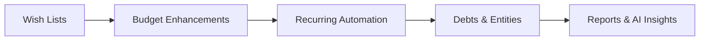

# Roadmap

Planned features grouped by impact and how well they fit what we already have.

**Related documentation:**

- [README.md](README.md) — project overview, current features, and quick start
- [DOC.md](DOC.md) — feature catalog and ledger invariants for money movement

## Tier 1 — Finish What We Started (high ROI, low risk)

These reuse existing schema, patterns, and UI conventions.

### 1. Wish Lists / To-Buy Items

Schema exists; sidebar already teases it. Re-enable routes and build the UI.

- Priority, due date, estimated cost, link to expense when purchased
- Public share links (guest auth already documented in env vars)
- Natural bridge to budget planning

### 2. Budget & Planning (enhancements)

Budget MVP is live. Remaining work:

- Deeper dashboard integration (remaining budget bars, limit alerts)
- Alerts when approaching limits (extend notification service)

### 3. Recurring Transaction Automation

Recurrence patterns exist in schema and calendar expands them — but users likely still record entries manually.

- Auto-generate pending income entries / expense payments on schedule
- "Mark as received/paid" one-click from calendar or notifications
- Reduces daily friction significantly

## Tier 2 — Differentiators (medium effort, strong product value)

### 4. Debts & Credits (IOU tracking)

Fits canvas collaboration (family/shared debts).

- Person-linked debts: who owes whom, due dates, partial repayments
- Tie to wallets when repaid
- Calendar + notification integration for due dates

### 5. Entities (people, shops, companies)

Central contact/vendor model.

- Link incomes, expenses, debts to entities
- "Spending by vendor" reports
- Member suggestions when inviting (partially exists for canvas invites)

### 6. Non-Liquid Assets

Gold, vehicles, real estate, etc.

- Asset registry with estimated value + currency
- Optional link to wallets when sold
- Dashboard "net worth" = wallet balances + asset values

### 7. Reports & Exports

Rich dashboard data but limited export/report surfaces.

- Monthly/yearly PDF or CSV export
- Category breakdown charts
- Cash flow forecast from recurring patterns (schema already supports recurrence)

### 8. Enhanced Whiteboard

Already a standout feature — extend it.

- Budget target nodes
- Snapshot/share read-only whiteboard link for collaborators

## Tier 3 — Platform & Growth (longer term)

### 9. AI Insights (make the placeholder real)

Start narrow, not generic "financial advisor."

- "Unusual spending this month" anomaly detection from expense history
- Recurring bill detection from payment patterns
- Natural language Q&A over canvas summary data
- Budget recommendations from historical averages

### 10. Multi-Currency Conversions

Transfers support recorded exchange rates; live FX feeds are not integrated yet.

- Manual or API-sourced FX rates (e.g. exchangerate.host)
- Converted "total net worth in base currency" on dashboard

### 11. Bank / Card Import (optional integration)

Manual ledger is fine for MVP; import is a major upgrade.

- CSV/OFX import mapped to wallets and categories
- Rule-based auto-categorization
- Keeps ledger model; no Plaid dependency required initially

### 12. Mobile-Friendly PWA

Next.js app is web-first.

- PWA install + offline read of last synced canvas summary
- Quick "log expense" action from home screen

### 13. Audit Log & Activity History

Important for shared canvases.

- Who changed what, when (income edited, payment deleted)
- Complements existing roles/permissions

## Tier 4 — Engineering Foundations (enables everything else)

| Item | Why |
|------|-----|
| Automated tests (ledger, auth, canvas access) | Protect money invariants |
| CI pipeline | Catch regressions on PRs |
| Monorepo workspace scripts | Run frontend + backend together |
| Feature flags | Ship wishlist/budget behind flags instead of "Soon" badges |

## Recommended Build Order

1. **Wish lists** — schema ready, marketing-ready feature
2. **Budget enhancements** — deepen the live budget module
3. **Recurring automation** — daily usability win
4. **Debts + entities** — collaboration depth
5. **AI insights** — start with rules/stats, add LLM later
