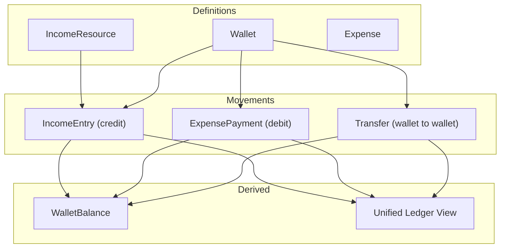

# Transaction Logic Guide

This guide explains how to implement money movement in eBoom without ambiguity.

## Model Layers

## Canonical Operations

| Operation | Effect |
|---|---|
| Income entry | Credit wallet balance |
| Expense payment | Debit wallet balance |
| Transfer | Debit source wallet, credit destination wallet |

All balance mutations must go through `ledgerService`.

## Invariants

- Never mutate `wallet_balances` directly from route handlers.
- Every movement must be canvas-authorized.
- Amounts must be non-negative.
- Debits must fail on insufficient funds unless explicitly allowed.
- Cross-currency operations must persist exchange context (`exchange_rate`, optional fee).

## Backend Flow Contract

1. Validate user and input.
2. Validate canvas membership and wallet ownership scope.
3. Persist movement row (`income_entries`, `expense_payments`, or `transfers`).
4. Apply balance mutation through `ledgerService`.
5. Return movement payload.

## UI Flow Contract

- UI submits intent (`amount`, `wallet`, `date`, `notes`).
- UI never computes final balances locally.
- UI refreshes authoritative balances and ledger from API after mutation.

## Example: Income Entry

Input:
- resource: Salary
- destination wallet: Checking
- amount: 500

Writes:
- insert into `income_entries`
- `ledgerService.creditWalletBalance(checking, currency, 500)`

Output:
- updated wallet balance and entry record

## Example: Expense Payment

Input:
- expense: Rent
- source wallet: Checking
- amount: 400

Writes:
- insert into `expense_payments`
- `ledgerService.debitWalletBalance(checking, currency, 400)`

Output:
- updated wallet balance and payment record

## Example: Transfer

Input:
- source wallet: Checking USD
- destination wallet: Savings USD
- amount: 100

Writes:
- insert into `transfers`
- debit source by 100, credit destination by 100

Output:
- both balances updated atomically
