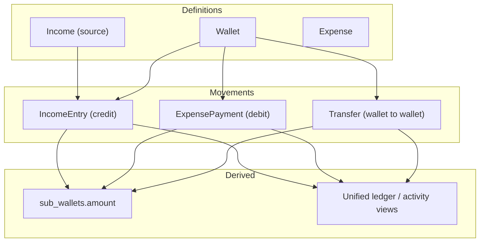

# 00 — Overview

Quick product and money-flow reference for eBoom. Read this first for orientation; dive into the numbered module docs for implementation detail.

**Related:** [docs index](./README.md) · [README.md](../README.md) · [Setup.md](../Setup.md) · [CONVENTIONS.md](../CONVENTIONS.md) · [ROADMAP.md](../ROADMAP.md)

---

## Canvas

A **Canvas** is a scoped financial workspace — a project you create and optionally share with others. All financial activity maps to a canvas. For example, one user might have:

- A canvas for freelancing income and expenses
- A canvas for family financial planning
- A canvas for personal budgeting

Users can belong to multiple canvases. Each membership has a role and a base currency. Most data (incomes, wallets, expenses) is canvas-scoped.

Money flows through a ledger: income credits wallets, expenses debit wallets, transfers move funds between wallets.

Deep dive: [Canvas & Collaboration](./05-canvas-collaboration.md).

---

## Module Status at a Glance

| Module | Backend | Frontend | Status |
|--------|---------|----------|--------|
| Authentication | ✅ | ✅ | **Live** |
| Canvas workspaces | ✅ | ✅ | **Live** |
| Collaboration (members & invites) | ✅ | ✅ | **Live** |
| Incomes + entries | ✅ | ✅ | **Live** |
| Wallets + sub-wallets | ✅ | ✅ | **Live** |
| Expenses + payments | ✅ | ✅ | **Live** |
| Categories (income, expense, wallet) | ✅ | ✅ | **Live** |
| Transfers | ✅ | ✅ | **Live** |
| Dashboard | ✅ | ✅ | **Live** |
| Calendar | ✅ | ✅ | **Live** |
| Whiteboard | ✅ | ✅ | **Live** |
| Budget & planning (budgets + goals) | ✅ | ✅ | **Live** |
| Notifications (overdue + digests) | ✅ | ✅ | **Live** |
| AI insights (profile, generate, chat) | ✅ | ✅ | **Live** (gated on LLM API key) |
| Multi-currency support | ✅ | ✅ | **Live** |
| i18n (EN, DE, FA + RTL) | — | ✅ | **Live** |
| Wishlists / to-buy items | Schema only | Placeholder | **Not built** |
| Debts, loans, entities, assets | Schema/roadmap | ❌ | **Not built** |

For planned work, see [ROADMAP.md](../ROADMAP.md).

---

## Feature Map

| Area | Routes (UI) | Doc |
|------|-------------|-----|
| Auth & profile | `/login`, `/signup`, `/forgot-password`, … | [04 — Authentication](./04-authentication.md) |
| Canvas & members | sidebar switcher, `/manage-canvas` | [05 — Canvas & Collaboration](./05-canvas-collaboration.md) |
| Wallets | `/wallets`, `/wallet/[id]` | [06 — Wallets](./06-wallets.md) |
| Incomes | `/incomes`, `/income/[id]` | [07 — Incomes](./07-incomes.md) |
| Expenses | `/expenses`, `/expense/[id]` | [08 — Expenses](./08-expenses.md) |
| Transfers | `/transactions`, wallet transfer UI | [09 — Transfers](./09-transfers.md) |
| Dashboard | `/` | [10 — Dashboard](./10-dashboard.md) |
| Calendar | `/calendar` | [11 — Calendar](./11-calendar.md) |
| Whiteboard | `/whiteboard` | [12 — Whiteboard](./12-whiteboard.md) |
| Budgets & goals | planning UI | [13 — Budgets & Goals](./13-budgets-goals.md) |
| Notifications | header bell | [14 — Notifications](./14-notifications.md) |
| AI Insights | `/ai-insights` | [15 — AI Insights](./15-ai-insights.md) |
| Wish List | `/wish-list` | Placeholder only (`ComingSoonPlaceholder`) |

Architecture and stack: [01 — Architecture](./01-architecture.md). Backend/frontend plumbing: [02](./02-backend-core.md) / [03](./03-frontend-core.md).

---

## Schema Snapshot

**Active domains:** users, user_settings, canvases, canvas_members, canvas_invitations, roles, currencies, wallets, sub_wallets, wallet_categories, incomes, income_entries, income_categories, expenses, expense_payments, expense_categories, transfers, budgets, budget_lines, savings_goals, recurrence_patterns, attachments, notifications, whiteboard_viewports, whiteboard_node_positions, ai_insight_profiles, ai_financial_insights, ai_chat_messages

**Dormant or roadmap-only (limited/no product surface):** `wishlists`, `to_buy_items`, and asset-related tables (`assets`, `asset_volumes`, `price_points`, `asset_categories`) without a full product UI.

Canonical definition: [`eboom-backend/src/db/schema/schema.ts`](../eboom-backend/src/db/schema/schema.ts).

---

## Transaction Logic

How money movement works in eBoom without ambiguity. Module docs for [Wallets](./06-wallets.md), [Incomes](./07-incomes.md), [Expenses](./08-expenses.md), and [Transfers](./09-transfers.md) expand each path with code references.

### Model layers

### Canonical operations

| Operation | Effect |
|---|---|
| Income entry | Credit destination `sub_wallet` |
| Expense payment | Debit source `sub_wallet` |
| Transfer | Debit source `sub_wallet`, credit destination `sub_wallet` |

All balance mutations must go through `ledgerService` (`creditWalletBalance` / `debitWalletBalance`). Transfers go through `transferService`, which uses the ledger.

### Invariants

- Never mutate `sub_wallets` directly from route handlers.
- Every movement must be canvas-authorized.
- Amounts must be non-negative.
- Debits must fail on insufficient funds unless explicitly allowed.
- Cross-currency operations must persist exchange context (`exchange_rate`, optional fee).

### Backend flow contract

1. Validate user and input.
2. Validate canvas membership and wallet ownership scope.
3. Persist movement row (`income_entries`, `expense_payments`, or `transfers`).
4. Apply balance mutation through `ledgerService` (via `transferService` for transfers).
5. Return movement payload.

### UI flow contract

- UI submits intent (`amount`, `wallet`, `date`, `notes`).
- UI never computes final balances locally.
- UI refreshes authoritative balances and activity from the API after mutation.

### Examples

**Income entry** — resource “Salary”, destination Checking, amount 500 → insert `income_entries` + `ledgerService.creditWalletBalance(...)`.

**Expense payment** — expense “Rent”, source Checking, amount 400 → insert `expense_payments` + `ledgerService.debitWalletBalance(...)`.

**Transfer** — Checking USD → Savings USD, amount 100 → insert `transfers` + debit source / credit destination atomically.
