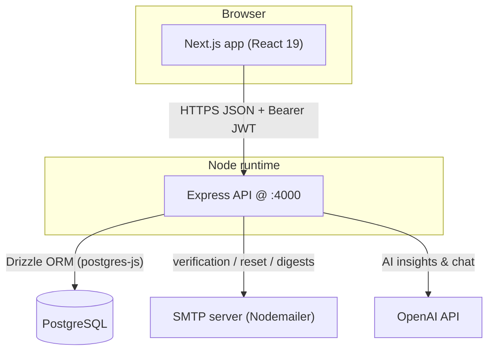
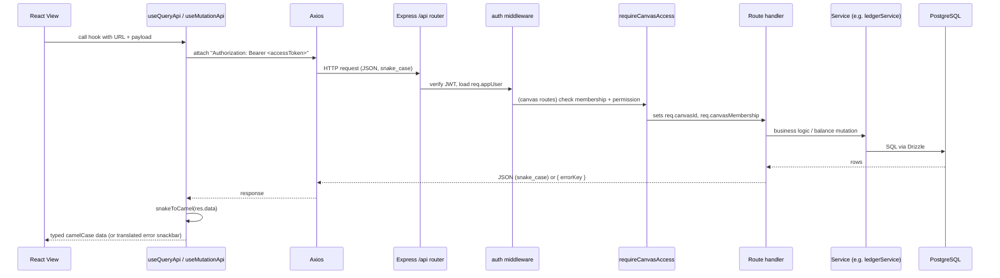
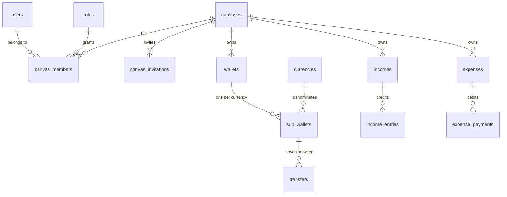

# 01 — Architecture & Dependencies

This doc gives you the map of the whole system before you dive into any single module. After reading it you should understand the two services, how a request flows end to end, the shape of the data model, and which third-party libraries matter (and why).

---

## 1. Two services, one repo

eBoom is a monorepo with two independently-deployable Node apps. There is **no shared build tooling** — each package has its own `package.json`, `tsconfig.json`, and `Dockerfile`.

```
eboom/
├── eboom-backend/     # Express REST API + PostgreSQL/Drizzle  (package name: pfm-backend)
├── eboom-frontend/    # Next.js 15 App Router web client       (package name: eboom-frontend)
├── docker-compose.yml # Full stack: postgres + backend + frontend
├── DOC.md             # Product/feature reference & money-flow rules
├── CONVENTIONS.md     # Coding standards
└── docs/              # <-- you are here (engineering onboarding docs)
```

The only compile-time coupling between the two: the **frontend imports database types from the backend** via a TypeScript path alias (`@backend/*` → `../eboom-backend/src/*`). There is no shared npm package; the backend is the single source of truth for entity types, and the frontend reads them directly.



| Concern | Frontend | Backend |
|---------|----------|---------|
| Port (dev) | `3000` | `4000` |
| Language | TypeScript / React 19 | TypeScript / Node |
| Entry point | `app/layout.tsx` (App Router) | [`src/app.ts`](../eboom-backend/src/app.ts) |
| Talks to DB? | No — only via API | Yes — Drizzle ORM |
| Holds secrets? | No (`NEXT_PUBLIC_*` only) | Yes (`JWT_SECRET`, DB URL, SMTP, OpenAI) |

---

## 2. The request lifecycle (the single most important diagram)

Every authenticated, canvas-scoped API call follows the same path. Understanding this sequence explains ~80% of the backend.



Key transitions to remember:

- **Auth first, always.** `auth` middleware runs before any canvas logic and attaches `req.appUser`. See [Backend Core §Middleware](./02-backend-core.md#3-middleware).
- **Canvas access second.** `requireCanvasAccess(permission)` confirms the user is a member with the needed permission, then sets `req.canvasId` and `req.canvasMembership`.
- **Case flips at the boundary.** The DB and JSON use `snake_case`; the frontend converts to `camelCase` on the way in (`snakeToCamel`) and back to `snake_case` when needed. See [Frontend Core §Data layer](./03-frontend-core.md).
- **401 triggers a silent token refresh.** The frontend data layer transparently retries once with a refreshed access token before giving up and signing the user out.

---

## 3. The core domain model

Everything hangs off two anchors: **`users`** (identity) and **`canvases`** (tenancy). A `canvas_members` join table connects them with a role.



- A **Canvas** is the isolation boundary. Almost every financial table has a `canvas_id` foreign key.
- A **Wallet** is a container (bank account, crypto wallet, safe). Its actual balances live in **`sub_wallets`** — one row per currency, so a single wallet can hold USD, EUR, and BTC balances simultaneously.
- **Money movements** are modeled as three record types that mutate `sub_wallets`: `income_entries` (credit), `expense_payments` (debit), and `transfers` (debit source + credit destination). The rules for these live in [`DOC.md` → Transaction Logic](../DOC.md#transaction-logic).

The full schema (25+ tables including budgets, savings goals, whiteboard positions, AI insight profiles, attachments, notifications) is defined in one file: [`eboom-backend/src/db/schema/schema.ts`](../eboom-backend/src/db/schema/schema.ts). Inferred TypeScript types are exported from [`models.ts`](../eboom-backend/src/db/schema/models.ts). See [Backend Core §Data layer](./02-backend-core.md#5-data-layer) for details.

---

## 4. Tech stack & why

### Backend (`eboom-backend/package.json`)

| Dependency | Role | Why it's here |
|------------|------|---------------|
| `express` ^4 | HTTP framework | Minimal, well-understood; routes are plain handlers (no controller layer). |
| `drizzle-orm` + `postgres` | Data access | Type-safe SQL with inferred types shared to the frontend. `postgres` (postgres-js) is the driver, pooled at `max: 10`. |
| `drizzle-kit` | Migrations / studio | `db:migrate`, `db:push`, `db:studio`. |
| `jsonwebtoken` | Auth tokens | Signs/verifies access + refresh JWTs. See [Auth](./04-authentication.md). |
| `bcryptjs` | Password hashing | 12 salt rounds in [`jwtService`](../eboom-backend/src/services/jwtService.ts). |
| `nodemailer` | Email | Verification, password reset, overdue/budget digests. |
| `express-rate-limit` | Abuse protection | Applied to auth endpoints. |
| `helmet`, `cors`, `morgan` | HTTP hardening / logging | Standard Express middleware wired in [`app.ts`](../eboom-backend/src/app.ts). |
| `openai` | AI features | Powers AI Insights + chat (feature module). |
| `uuid` | Tokens | Random verification/reset tokens. |
| `zod` / `joi` | Validation | `zod` used in some validation; `joi` is installed but **not wired** — don't build on it. |

> ⚠️ Naming quirk: the backend's `package.json` name is **`pfm-backend`** (its earlier "Personal Finance Management" name), even though the product and folder are "eboom". This shows up in `GET /` returning `{ service: 'pfm-backend' }`.

### Frontend (`eboom-frontend/package.json`)

| Dependency | Role | Why it's here |
|------------|------|---------------|
| `next` 15 (App Router) + `react` 19 | Framework | Server/client component model, route groups. |
| `@tanstack/react-query` | Server state | Caching, refetching, and mutations. **All API data flows through this**, never Redux. |
| `axios` | HTTP client | Wrapped by `useQueryApi` / `useMutationApi`. |
| `@reduxjs/toolkit` + `react-redux` + `redux-persist` | UI state | Modals, search text, selected canvas — **not** server data, **not** auth tokens. |
| `tailwindcss` 4 + `shadcn/ui` (Radix primitives) | UI | Design system; primitives live in `components/ui/`. |
| `i18next` + `react-i18next` | i18n | EN/DE/FA with RTL. Backend error keys map to the `errors` namespace. |
| `notistack` | Snackbars | Centralized success/error toasts via `src/lib/notify.ts`. |
| `react-hook-form` + `@hookform/resolvers` + `zod` | Forms | Form state and validation. |
| `recharts`, `d3` | Charts | Dashboard cash flow, heatmaps, asset valuation. |
| `@fullcalendar/*` | Calendar | Calendar module. |
| `@xyflow/react` + `@dagrejs/dagre` | Whiteboard | Money-flow graph with auto-layout. |
| `next-themes` | Theming | Light/dark mode. |
| `@bprogress/next` | Nav progress | Top loading bar between routes. |

> ⚠️ A few libraries are legacy/duplicative and should **not** be extended: `sonner` and `react-toastify` (prefer `notistack`), and the store's `redux-persist` whitelist references an `auth` reducer that does not exist (auth lives in React context, not Redux). See [`CONVENTIONS.md` → Known Inconsistencies](../CONVENTIONS.md).

---

## 5. Environments & configuration

Secrets and config are supplied via `.env` files (never committed). Copy the samples:

- Backend: [`eboom-backend/.env.sample`](../eboom-backend/.env.sample)
- Frontend: [`eboom-frontend/.env.example`](../eboom-frontend/.env.example)

The variables that shape core behavior:

| Variable | Service | Effect |
|----------|---------|--------|
| `DATABASE_URL` | backend | Postgres connection (required). |
| `JWT_SECRET` | backend | Signs access + refresh tokens (required — the app throws on boot without it). |
| `JWT_ACCESS_EXPIRES_IN` / `JWT_REFRESH_EXPIRES_IN` | backend | Token lifetimes (default `1h` / `7d`). |
| `SKIP_EMAIL_VERIFICATION` | backend | **Dev** — auto-verify new users, skip verification emails. |
| `TEST_USER_ID` | backend | **Dev** — bypass auth entirely, treat every request as this user. |
| `NEXT_PUBLIC_BASE_URL` | frontend | Backend API base URL. |
| `NEXT_PUBLIC_TEST_MODE` | frontend | **Dev** — bypass frontend auth (pairs with backend `TEST_USER_ID`). |

The dev bypass flags are important to understand early because they change how auth behaves in local development — they're covered in detail in [Authentication §Dev bypass](./04-authentication.md#7-dev-bypass-modes).

---

## 6. What to read next

- **[02 — Backend Core](./02-backend-core.md)** — how the API is assembled: bootstrap, routing, middleware, errors, DB.
- **[03 — Frontend Core](./03-frontend-core.md)** — how the client is assembled: providers, data hooks, state, i18n.
- **[04 — Authentication](./04-authentication.md)** — the first full feature, tying both cores together.
