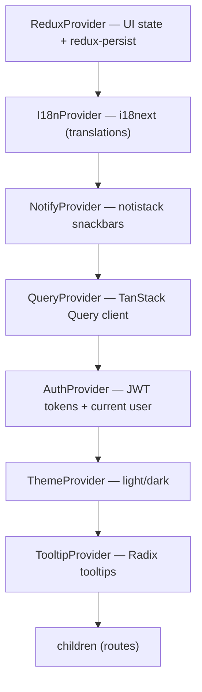

# 03 — Frontend Core

The frontend is a Next.js 15 App Router app. The philosophy is **thin pages, fat views**: files in `app/` are tiny route shells that render a "view" from `src/views/`, where the real logic lives. This doc covers the plumbing shared by every feature: the App Router layout, the provider stack, the data layer (Axios + TanStack Query), state management (Redux), i18n, and notifications.

Source roots: [`eboom-frontend/app/`](../eboom-frontend/app/) (routes) and [`eboom-frontend/src/`](../eboom-frontend/src/) (everything else).

```
eboom-frontend/
├── app/                      # Next.js App Router — route files only
│   ├── layout.tsx            # Root layout: the provider stack
│   ├── (auth)/               # Route group: login/signup/reset/verify
│   ├── (dashboard)/          # Route group: the authenticated app
│   └── (marketing)/          # Route group: public landing page
├── components/ui/            # shadcn/ui primitives (no feature logic)
├── src/
│   ├── api/                  # Axios + TanStack Query wrappers, URL constants
│   ├── components/           # App-specific shared components + providers
│   ├── redux/                # UI state (slices, store, persistence)
│   ├── hooks/                # Reusable hooks (canvas, lists, notifications)
│   ├── i18n/                 # i18next setup, formatters, language config
│   ├── lib/                  # notify (snackbars), site metadata
│   ├── types/                # Shared TS types
│   └── views/                # Feature UIs (pages, detail views, modals)
└── utils/env.ts              # Safe access to NEXT_PUBLIC_* env vars
```

---

## 1. App Router structure & route groups

Routes are organized with **route groups** (parenthesized folders that don't affect the URL) so each area gets its own layout:

| Group | URL examples | Layout | Purpose |
|-------|--------------|--------|---------|
| `(marketing)` | `/` | [`app/(marketing)/layout.tsx`](../eboom-frontend/app/(marketing)/layout.tsx) | Public landing page. |
| `(auth)` | `/login`, `/signup`, `/reset-password`, `/verify-email` | [`app/(auth)/layout.tsx`](../eboom-frontend/app/(auth)/layout.tsx) | Auth forms in a centered dark "AuthShell". |
| `(dashboard)` | `/dashboard`, `/wallets`, `/expenses`, `/calendar`, ... | [`app/(dashboard)/layout.tsx`](../eboom-frontend/app/(dashboard)/layout.tsx) | The authenticated app: sidebar + header + canvas gate. |

**Thin page** example — the entire `(dashboard)/layout.tsx` just delegates to a view provider:

```1:10:eboom-frontend/app/(dashboard)/layout.tsx
import LayoutProvider from "@/src/components/LayoutProvider"

export default function Page({ children }: { children: React.ReactNode }) {
  return (
        <LayoutProvider>
          {children}
        </LayoutProvider>   
  )
}
```

[`LayoutProvider`](../eboom-frontend/src/components/LayoutProvider.tsx) assembles the app chrome: the `AppSidebar`, `SiteHeader`, a top navigation progress bar, and — importantly — wraps children in `CanvasRequiredGate`, which forces the user to pick/create a canvas before any canvas-scoped page renders. It also flips the sidebar side for RTL languages via `useTextDirection()`.

---

## 2. The provider stack — `app/layout.tsx`

The root layout wraps the app in a specific, deliberate order of providers. Order matters — inner providers can depend on outer ones.

```44:57:eboom-frontend/app/layout.tsx
        <ReduxProvider>
          <I18nProvider>
            <NotifyProvider>
              <QueryProvider>
                <AuthProvider>
                  <ThemeProvider attribute="class" defaultTheme="system" enableSystem>
                    <TooltipProvider>
                      {children}
                    </TooltipProvider>
                  </ThemeProvider>
                </AuthProvider>
              </QueryProvider>
            </NotifyProvider>
          </I18nProvider>
        </ReduxProvider>
```



| Provider | File | Responsibility |
|----------|------|----------------|
| `ReduxProvider` | [`src/redux/ReduxProvider.tsx`](../eboom-frontend/src/redux/ReduxProvider.tsx) | Redux store + `PersistGate` (rehydrate persisted UI state). |
| `I18nProvider` | [`src/i18n/I18nProvider.tsx`](../eboom-frontend/src/i18n/I18nProvider.tsx) | Initializes i18next; must be above anything that translates. |
| `NotifyProvider` | [`src/components/NotifyProvider.tsx`](../eboom-frontend/src/components/NotifyProvider.tsx) | notistack `SnackbarProvider`; enables `notify*` helpers. |
| `QueryProvider` | [`src/components/QueryProvider.tsx`](../eboom-frontend/src/components/QueryProvider.tsx) | Creates the `QueryClient` (default `retry: 1`) + devtools in dev. |
| `AuthProvider` | [`src/components/AuthProvider.tsx`](../eboom-frontend/src/components/AuthProvider.tsx) | Auth context — tokens, current user, login/refresh/signout, route guards. Depends on Query (uses `useQueryApi`) and Notify. See [Authentication](./04-authentication.md). |
| `ThemeProvider` | `components/theme-provider.tsx` | `next-themes` class-based dark mode. |
| `TooltipProvider` | `components/ui/tooltip.tsx` | Radix tooltip context. |

---

## 3. The data layer — Axios + TanStack Query

This is the heart of the frontend. **No component talks to Axios directly.** Instead, all reads go through `useQueryApi` and all writes through `useMutationApi`. These two hooks bundle: URL resolution, auth headers, silent token refresh, case conversion, error translation, and cache invalidation.

Files in [`src/api/`](../eboom-frontend/src/api/):

| File | Role |
|------|------|
| [`urls.ts`](../eboom-frontend/src/api/urls.ts) | `API_ROUTES` — every endpoint path as a constant or `(id) => path` builder. |
| [`useQuery.ts`](../eboom-frontend/src/api/useQuery.ts) | `useQueryApi<T>` — GET/read wrapper over TanStack `useQuery`. |
| [`useMutation.ts`](../eboom-frontend/src/api/useMutation.ts) | `useMutationApi` — POST/PUT/PATCH/DELETE wrapper over TanStack `useMutation`. |
| [`resolveApiUrl.ts`](../eboom-frontend/src/api/resolveApiUrl.ts) | Prefix relative paths with `NEXT_PUBLIC_BASE_URL`. |
| [`utils.ts`](../eboom-frontend/src/api/utils.ts) | `snakeToCamel` / `camelToSnake` deep converters. |
| [`useApiRespond.tsx`](../eboom-frontend/src/api/useApiRespond.tsx) | Bridges API responses to `notify*` snackbars. |
| [`buildUrlWithParams.ts`](../eboom-frontend/src/api/buildUrlWithParams.ts) | Append a query string, skipping empty values. |

### URLs — one source of truth

Paths are never hardcoded in views. They live in [`urls.ts`](../eboom-frontend/src/api/urls.ts) as constants or builder functions:

```23:28:eboom-frontend/src/api/urls.ts
  CANVASES_LIST: '/api/canvases/',
  CANVASES_CREATE: '/api/canvases/',
  CANVASES_GET: (canvasId: number) => `/api/canvases/${canvasId}/`,
  CANVASES_UPDATE: (canvasId: number) => `/api/canvases/${canvasId}/`,
  CANVASES_DELETE: (canvasId: number) => `/api/canvases/${canvasId}/`,
```

`resolveApiUrl` turns those relative paths into absolute ones:

```1:5:eboom-frontend/src/api/resolveApiUrl.ts
import { env } from "@/utils/env";

export function resolveApiUrl(url: string): string {
  return url.startsWith("http") ? url : `${env("NEXT_PUBLIC_BASE_URL")}${url}`;
}
```

### Reading data — `useQueryApi`

`useQueryApi<T>(url, options)` wraps TanStack Query. Under the hood it:

1. Pulls tokens from `AuthContext` (or from `options.auth` when the provider isn't available yet, e.g. inside `AuthProvider` itself).
2. Builds the final URL (`resolveApiUrl` + any `urlParams`).
3. Sends the request with `Authorization: Bearer <accessToken>` when a token exists.
4. **On the way back, deep-converts the response to camelCase** with `snakeToCamel`.
5. **On `401`, transparently refreshes** the access token and retries once; if refresh fails on a `401/403`, it signs the user out.

```90:114:eboom-frontend/src/api/useQuery.ts
      const res = await axios(config);
      return snakeToCamel(res.data) as T;
    } catch (err) {
      const axiosErr = err as AxiosError;
      const status = axiosErr.response?.status;

      if (status === 401 && hasToken && refreshToken && refreshFn) {
        const newToken = await refreshFn();

        if (newToken) {
          const retryRes = await axios({
            ...config,
            headers: {
              ...requestHeaders,
              Authorization: `Bearer ${newToken}`,
            },
          });
          return snakeToCamel(retryRes.data) as T;
        }
      }

      if ((status === 401 || status === 403) && authContext) {
        authContext.signOut();
      }
      throw err;
    }
```

Typical usage in a hook:

```typescript
const { data, isLoading } = useQueryApi<Expense[]>(
  API_ROUTES.CANVASES_EXPENSES_LIST(canvasId),
  { queryKey: ["expenses", canvasId], enabled: !!canvasId }
);
```

### Writing data — `useMutationApi`

`useMutationApi<TVariables, T>(url, options)` wraps TanStack `useMutation` and adds a lot of ergonomics:

- **Method** defaults to `post`; can be `put`/`patch`/`delete`/`get` or a function of the payload.
- **`url` can be a function** of the payload (for dynamic IDs).
- **Body mapping**: `mapPayload` transforms the variables before sending; `delete`/`get` send no body by default.
- **Same 401 → refresh → retry** behavior as reads.
- **Success snackbars**: pass `successKey` (an i18n key under the `success` namespace) and it notifies automatically on mutating methods.
- **Error surfacing**: parses the backend's `{ errorKey, errors }` body into `fieldError` (per-field, translated) and `generalError`, and shows a global error snackbar.
- **Cache invalidation**: by default invalidates all queries on success (`invalidateQueries: true`).

```168:184:eboom-frontend/src/api/useMutation.ts
      if (data?.errors) {
        setFieldError(translateFieldErrors(data.errors));
      }
      if (data?.errorKey) {
        setGeneralError({
          message: translateNotifyKey(data.errorKey, "errors", data.params),
          key: toI18nKey(data.errorKey, "errors"),
        });
      } else if (data?.message) {
        setGeneralError({ message: data.message });
      }

      handleError(axiosErr);
      onErrorCallback?.(axiosErr);
      throw axiosErr;
```

Typical usage in a form:

```typescript
const { mutateAsync, fieldError } = useMutationApi(
  API_ROUTES.CANVASES_EXPENSES_CREATE(canvasId),
  { method: "post", successKey: "success.expense.created" }
);
```

### Case conversion — the boundary rule

The DB and API JSON are `snake_case`; React code is `camelCase`. [`utils.ts`](../eboom-frontend/src/api/utils.ts) does the deep, recursive conversion in both directions. Reads are auto-converted to camelCase by the hooks; request bodies are mixed today (some routes expect snake_case like `first_name`) — match the existing route you're calling.

---

## 4. State management — Redux (UI only)

There are **three** distinct places state lives, and mixing them up is the most common mistake:

| State kind | Where it lives | Examples |
|------------|----------------|----------|
| Server/API data | **TanStack Query** | Lists, details, currencies, user profile |
| UI chrome | **Redux** | Modal open/close, search text, selected canvas ID |
| Auth tokens + user | **React context** (`AuthProvider`) + `localStorage` | `accessToken`, `refreshToken`, current user |

Redux is configured in [`src/redux/store.ts`](../eboom-frontend/src/redux/store.ts). Slices are small and per-feature: `canvasSlice`, `searchSlice`, `incomeSlice`, `expenseSlice`, `walletSlice`, `assetSlice`.

```36:53:eboom-frontend/src/redux/store.ts
const rootReducer = combineReducers({
    canvas: canvasReducer,
    search: searchReducer,
    income: incomeReducer,
    expense: expenseReducer,
    wallet: walletReducer,
    asset: assetReducer,
});

const persistedReducer = persistReducer(persistConfig, rootReducer);

const store = configureStore({
    reducer: persistedReducer,
    middleware: getDefaultMiddleware =>
        getDefaultMiddleware({
            serializableCheck: false
        })
});
```

Use the typed hooks `useAppDispatch` / `useAppSelector` (exported from `store.ts`) rather than the raw react-redux hooks.

**Persistence** ([`storage.ts`](../eboom-frontend/src/redux/storage.ts)) uses `redux-persist` with an SSR-safe noop storage on the server and `localStorage` in the browser.

> ⚠️ Two known quirks: the `persistConfig.whitelist` is `['auth']`, but **there is no `auth` reducer** — auth is intentionally in context, not Redux. So nothing is actually persisted through this whitelist today. Do **not** add auth to Redux to "fix" it. (The migrate function's language normalization is dormant for the same reason.)

---

## 5. Errors and notifications

The backend returns `errorKey`s; the frontend translates them into user-visible snackbars. The bridge is [`src/lib/notify.ts`](../eboom-frontend/src/lib/notify.ts) on top of notistack.

- `notifyError(key, params)` / `notifySuccess(key, params)` — enqueue a translated snackbar.
- `translateNotifyKey(key, namespace, params)` — strips the `errors.`/`success.` prefix and looks up the i18n string, falling back to `errors.common.unknown`.
- `errorKeyFromStatus(status)` — maps bare HTTP statuses (401/403/404/5xx) to common keys when the body has no `errorKey`.

```23:39:eboom-frontend/src/lib/notify.ts
export function translateNotifyKey(
  key: string,
  namespace: "errors" | "success",
  params?: NotifyParams
): string {
  const path = toI18nKey(key, namespace);
  const translated = i18n.t(path, {
    ns: namespace,
    ...(params ?? {}),
    defaultValue: "",
  });
  if (translated && translated !== path) return translated;
  return i18n.t("common.unknown", {
    ns: "errors",
    defaultValue: key,
  });
}
```

The mutation hook wires this automatically via [`useApiRespond`](../eboom-frontend/src/api/useApiRespond.tsx): success → `notifySuccess(successKey)`, failure → `notifyError(errorKey ?? fromStatus)`. So in most CRUD code you only supply a `successKey` and let errors handle themselves.

> Toast policy: use `notistack` via `notify*`. `sonner`, `react-toastify`, and the old `useToast` are legacy — don't add new usages.

---

## 6. Internationalization (i18n)

- **Stack**: `i18next` + `react-i18next`, configured in [`src/i18n/index.ts`](../eboom-frontend/src/i18n/index.ts) and mounted by `I18nProvider`.
- **Translations**: JSON files under [`public/locales/{lng}/`](../eboom-frontend/public/locales/), one file per namespace (`common`, `errors`, `success`, `auth`, `expenses`, ...). Supported: English, German, Persian (RTL).
- **Backend keys map here**: an `errorKey` like `errors.expense.notFound` becomes `t("expense.notFound", { ns: "errors" })`.
- **Formatting**: use `formatMoney` / `formatAmount` from [`src/i18n/formatters.ts`](../eboom-frontend/src/i18n/formatters.ts) instead of raw `Intl.NumberFormat`.
- **Direction**: `useTextDirection()` sets `document.documentElement.dir` for RTL and flips the sidebar side.
- **Language preference** persists in `localStorage` under the key from [`languages.ts`](../eboom-frontend/src/i18n/languages.ts); it's cleared on sign-out.

Never hardcode user-facing strings in JSX — always `const { t } = useTranslation("<ns>")`.

---

## 7. Environment access — `utils/env.ts`

Next.js only inlines `NEXT_PUBLIC_*` variables when referenced **literally**, so [`utils/env.ts`](../eboom-frontend/utils/env.ts) maintains a static map and exposes a single `env(key)` accessor. It also checks a runtime `window.__env` object first, which allows injecting config at container start without a rebuild.

```13:30:eboom-frontend/utils/env.ts
export function env(key: keyof TProcessEnv | string): string {
  if (!key.length) {
    throw new Error('No env key provided');
  }

  if (typeof window !== 'undefined' && window.__env?.[key] !== undefined) {
    const injected = window.__env[key];
    return injected === '' ? '' : (injected || '');
  }

  const value = publicEnv[key as keyof TProcessEnv] ?? process.env[key];

  if (value === undefined || value === null) {
    return '';
  }

  return value === '' ? '' : value;
}
```

---

## 8. Shared UI & building a feature page

- **Primitives**: shadcn/ui components live in [`components/ui/`](../eboom-frontend/components/ui/) — buttons, dialogs, fields, tables, plus layout primitives (`Stack`, `Grid`, `Container`) and `Typography`. Prefer these over raw `div`s with repeated Tailwind classes.
- **App components**: reusable, app-specific pieces in [`src/components/`](../eboom-frontend/src/components/) — e.g. `GridCard`, `FloatingAddButton`, `ConfirmDeleteDialog`, `RecurrencePatternPicker`, the `data-table/` set, and the `canvas/` switcher.
- **List pages** follow a template (infinite scroll + `GridCard` + `FloatingAddButton` + a Redux slice for modal state). Reference `src/views/expenses/ExpensesListPage.tsx`.

To add a feature UI: add its paths to `urls.ts`, build a view under `src/views/<feature>/` (list, detail, modals), add a thin page in `app/(dashboard)/<route>/page.tsx`, wire data with `useQueryApi`/`useMutationApi`, and (if needed) a small Redux slice for modal/search state.

---

Next: **[04 — Authentication](./04-authentication.md)** — the first full feature, showing both cores working together.
