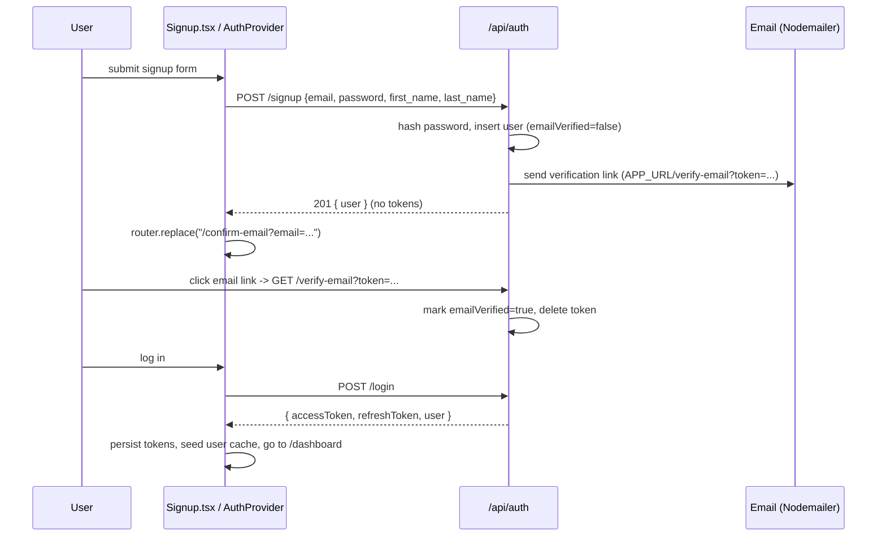
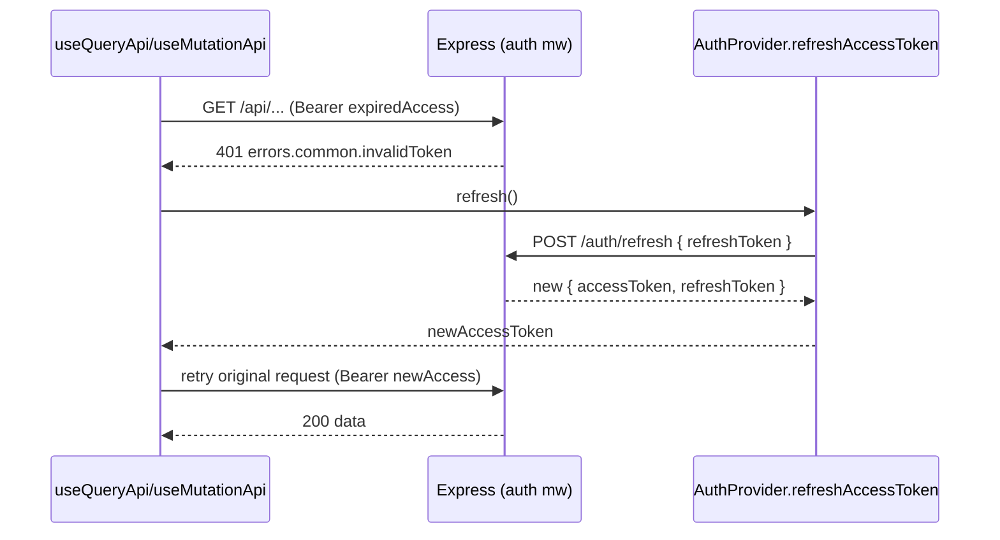

# 04 — Authentication

Authentication is the first full feature to read because it exercises both cores end to end: the backend's auth routes + JWT service + email service, and the frontend's `AuthProvider` + data layer + route groups. eBoom uses **internal, self-issued JWTs** (no OAuth, no third-party identity provider). The Express API signs the tokens; its own `auth` middleware validates them.

**Read [Backend Core](./02-backend-core.md) and [Frontend Core](./03-frontend-core.md) first** — this doc assumes you know the request lifecycle, error keys, and `useMutationApi`.

---

## 1. Feature map

| Capability | Backend | Frontend |
|------------|---------|----------|
| Sign up | `POST /api/auth/signup` | `Signup.tsx` |
| Log in | `POST /api/auth/login` | `Login.tsx` |
| Token refresh | `POST /api/auth/refresh` | `AuthProvider` (silent) |
| Log out | `POST /api/auth/logout` | `AuthProvider.signOut()` (client clears tokens) |
| Email verification | `GET /api/auth/verify-email` + `POST /api/auth/resend-verification` | `VerifyEmail.tsx`, `ConfirmEmail.tsx` |
| Forgot password | `POST /api/auth/forgot-password` | `ForgotPassword.tsx` |
| Reset password | `POST /api/auth/reset-password` | `ResetPassword.tsx` |
| Current user | `GET /api/auth/user-info` | `AuthProvider` user query |
| Change profile photo | `POST /api/auth/change-photo` | Profile view |

Backend routes: [`eboom-backend/src/routes/auth.ts`](../eboom-backend/src/routes/auth.ts) — the **only** router mounted without the `auth` middleware.
Frontend views: [`eboom-frontend/src/views/authentication/`](../eboom-frontend/src/views/authentication/) rendered via the `(auth)` route group.
Frontend brain: [`eboom-frontend/src/components/AuthProvider.tsx`](../eboom-frontend/src/components/AuthProvider.tsx).
URL constants: the `AUTH` block of [`urls.ts`](../eboom-frontend/src/api/urls.ts).

```5:13:eboom-frontend/src/api/urls.ts
  AUTH_REFRESH: "/api/auth/refresh/",
  AUTH_LOGIN: "/api/auth/login/",
  AUTH_SIGNUP: "/api/auth/signup/",
  AUTH_VERIFY_EMAIL: "/api/auth/verify-email",
  AUTH_RESEND_VERIFICATION: "/api/auth/resend-verification",
  AUTH_FORGOT_PASSWORD: "/api/auth/forgot-password/",
  AUTH_RESET_PASSWORD: "/api/auth/reset-password/",
  USERS_GET_ME: "/api/auth/user-info/",
  USERS_UPDATE_PROFILE_IMAGE: "/api/auth/change-photo/",
```

> Note: auth routes use **trailing slashes** (`/api/auth/login/`). This is a quirk specific to this group — most other routes don't. Follow `urls.ts` per route group.

---

## 2. The token model — `jwtService`

All crypto lives in [`services/jwtService.ts`](../eboom-backend/src/services/jwtService.ts). There are two token types:

| Token | Payload | Default lifetime | Purpose |
|-------|---------|------------------|---------|
| **Access** | `{ sub: userId, email, type: "access" }` | `1h` (`JWT_ACCESS_EXPIRES_IN`) | Sent on every API call as `Authorization: Bearer`. |
| **Refresh** | `{ sub: userId, type: "refresh" }` | `7d` (`JWT_REFRESH_EXPIRES_IN`) | Exchanged for a fresh token pair when the access token expires. |

Both are signed with the single `JWT_SECRET`. The service throws on boot if `JWT_SECRET` is missing.

- Passwords are hashed with **bcrypt, 12 salt rounds** (`hashPassword` / `verifyPassword`).
- `signTokenPair(userId, email)` returns `{ accessToken, refreshToken, expiresIn }`.
- **Verification checks the `type` field**, so a refresh token cannot be used as an access token and vice versa:

```87:102:eboom-backend/src/services/jwtService.ts
export function verifyAccessToken(token: string): AccessTokenPayload {
  const payload = parseTokenPayload<AccessTokenPayload>(jwt.verify(token, JWT_SECRET!));
  if (payload.type !== "access") {
    throw new jwt.JsonWebTokenError("Invalid token type");
  }
  return payload;
}

export function verifyRefreshToken(token: string): RefreshTokenPayload {
  const payload = parseTokenPayload<RefreshTokenPayload>(jwt.verify(token, JWT_SECRET!));
  if (payload.type !== "refresh") {
    throw new jwt.JsonWebTokenError("Invalid token type");
  }
  return payload;
}
```

> The JWT is **stateless** — the backend does not store or track issued tokens. "Logout" is purely client-side (clear the tokens). There is no server-side revocation list, so a stolen token is valid until it expires.

---

## 3. Backend flows — `routes/auth.ts`

Every handler is rate-limited (§6) and returns error keys (never English) on failure.

### Signup — `POST /signup`

1. Requires `email`, `password`, `first_name`, `last_name` (request body is **snake_case** here). Missing → `errors.validation.failed`.
2. Password must be ≥ 8 chars → else `errors.auth.passwordTooShort`.
3. Email is lowercased; duplicate → `errors.auth.emailExists`.
4. Hash the password, insert the user.
5. If email verification is **not** skipped, generate a UUID verification token (24h TTL) and email a verification link.
6. Respond `201`. If verification is skipped (dev), the response **also includes a token pair** so the user is logged in immediately; otherwise it returns just the user and a "check your email" message.

```101:143:eboom-backend/src/routes/auth.ts
    const [appUser] = await db
      .insert(users)
      .values({
        email: normalizedEmail,
        firstName: first_name,
        lastName: last_name,
        age,
        photoUrl: photo_url,
        emailVerified: shouldSkipEmailVerification(),
        passwordHash,
        createdBy: null,
        createdAt: new Date(),
      })
      .returning();

    if (!shouldSkipEmailVerification()) {
      const verificationToken = uuidv4();
      verificationTokens.set(verificationToken, {
        userId: appUser.id,
        email: appUser.email,
        expiresAt: new Date(Date.now() + 24 * 60 * 60 * 1000),
      });

      try {
        await sendVerificationEmail(appUser.email, verificationToken);
      } catch (emailError) {
        console.error("Failed to send verification email:", emailError);
      }
    }
```

### Login — `POST /login`

1. Requires `email` + `password`.
2. Look up the user; missing user **or** wrong password → `errors.auth.invalidCredentials` (401) — deliberately the same key so you can't probe which emails exist.
3. If verification is enforced and the user isn't verified → `errors.auth.emailNotVerified` (403).
4. Return `{ ...tokens, user }`.

### Refresh — `POST /refresh`

Takes `{ refreshToken }`, verifies it, reloads the user, and returns a **brand-new token pair**. Any failure → `errors.common.invalidToken` (401). This endpoint is called by the frontend automatically (§5), not usually by a user action. It requires **no** access token (`hasToken: false` on the frontend hook).

### Email verification — `GET /verify-email` & `POST /resend-verification`

- `verify-email?token=...` looks the token up in the in-memory `verificationTokens` map, checks expiry, sets `emailVerified = true`, and deletes the token.
- `resend-verification` issues a fresh token (or, for an already-verified user, returns `errors.auth.alreadyVerified`). To avoid account enumeration, an unknown email returns a **generic success message**.

### Forgot / reset password — `POST /forgot-password` & `POST /reset-password`

- `forgot-password` always responds with the same generic message whether or not the email exists; if it exists, it stores a UUID reset token (1h TTL) and emails a reset link.
- `reset-password` validates `{ token, newPassword }` (≥ 8 chars), checks the token map + expiry (`errors.auth.resetTokenInvalid` / `resetTokenExpired`), hashes and stores the new password, then deletes the token.

### Authenticated endpoints — `/user-info`, `/change-photo`, `/logout`

These three re-apply `authMiddleware` locally (they're inside the otherwise-public auth router). `user-info` returns the current `req.appUser` shaped by `formatUserResponse` (which strips `passwordHash`). `logout` just returns a success message — the client clears tokens.

> ⚠️ **Reset & verification tokens are stored in-memory** in `Map`s on the backend, with a periodic cleanup `setInterval`. They are **lost on server restart** and **do not work across multiple backend instances**. This is a known limitation — see [`CONVENTIONS.md`](../CONVENTIONS.md). JWTs themselves are unaffected (they're stateless).

```64:79:eboom-backend/src/routes/auth.ts
const resetTokens = new Map<string, TokenData>();
const verificationTokens = new Map<string, TokenData>();

setInterval(() => {
  const now = new Date();
  for (const [token, data] of resetTokens.entries()) {
    if (data.expiresAt < now) {
      resetTokens.delete(token);
    }
  }
  for (const [token, data] of verificationTokens.entries()) {
    if (data.expiresAt < now) {
      verificationTokens.delete(token);
    }
  }
}, 60 * 60 * 1000);
```

---

## 4. Email delivery — `emailService`

Verification and reset links are sent through [`services/emailService.ts`](../eboom-backend/src/services/emailService.ts), a Nodemailer transport configured from `EMAIL_*` env vars. Links point at the frontend using `APP_URL`:

```79:98:eboom-backend/src/services/emailService.ts
export const sendVerificationEmail = async (email: string, token: string): Promise<void> => {
  const verificationUrl = `${APP_URL}/verify-email?token=${token}`;

  await sendEmail({
    to: email,
    subject: "Verify your email — Eboom",
    html: renderVerificationEmail(verificationUrl),
    text: renderVerificationEmailText(verificationUrl),
  });
};

export const sendPasswordResetEmail = async (email: string, token: string): Promise<void> => {
  const resetUrl = `${APP_URL}/reset-password?token=${token}`;

  await sendEmail({
```

HTML templates live in [`services/emailTemplates/`](../eboom-backend/src/services/emailTemplates/). If `EMAIL_USER`/`EMAIL_PASS` aren't set, `sendEmail` throws — which is why local dev usually sets `SKIP_EMAIL_VERIFICATION=1` (§7).

---

## 5. Frontend brain — `AuthProvider`

[`AuthProvider`](../eboom-frontend/src/components/AuthProvider.tsx) is a React context provider that owns the entire client-side auth story. It's mounted in the root layout (inside `QueryProvider`, so it can use `useQueryApi`). Every component reads auth via `useAuthContext()`.

### What it holds

- `accessToken` / `refreshToken` — initialized from `localStorage`, kept in React state.
- `user` — fetched from `GET /user-info` via `useQueryApi` (only `enabled` once authenticated), cached under the `["user"]` query key.
- `login`, `signup`, `signOut`, `refreshAccessToken` — actions.
- `isLoginPending`, `isSignupPending`, `userLoading` — status flags.

Tokens live in `localStorage` (keys `accessToken`, `refreshToken`). `signOut` clears them plus `canvasId` and the language preference, and drops the cached user.

### Login / signup

`login` calls the login mutation (with `hasToken: false`), and on success **persists the token pair and seeds the user cache** so the app has the user immediately without a second round-trip:

```186:197:eboom-frontend/src/components/AuthProvider.tsx
  const login = useCallback(
    async ({ email, password }: { email: string; password: string }) => {
      const res = (await loginMutation({ email, password })) as AuthResponse;
      if (res?.accessToken && res?.refreshToken) {
        applyTokens(res.accessToken, res.refreshToken);
        seedUserCache(res.user);
        return res;
      }
      return null;
    },
    [loginMutation, applyTokens, seedUserCache]
  );
```

`signup` maps `firstName`/`lastName` to the backend's `first_name`/`last_name`, and only logs the user in if the response includes tokens **and** the user is already verified (i.e. dev skip mode); otherwise it routes to the confirm-email screen.

### Silent refresh

`refreshAccessToken` exchanges the refresh token for a new pair; if it fails, it signs the user out. This function is passed down into the data-layer hooks so **any** `401` anywhere in the app triggers a single transparent retry (see [Frontend Core §3](./03-frontend-core.md#3-the-data-layer--axios--tanstack-query)).

```170:184:eboom-frontend/src/components/AuthProvider.tsx
  const refreshAccessToken = useCallback(async (): Promise<string | null> => {
    if (!refreshToken) return null;
    try {
      const res = (await refreshMutation({ refreshToken })) as AuthResponse;
      if (res?.accessToken && res?.refreshToken) {
        applyTokens(res.accessToken, res.refreshToken);
        seedUserCache(res.user);
        return res.accessToken;
      }
      return null;
    } catch {
      signOut();
      return null;
    }
  }, [refreshToken, refreshMutation, applyTokens, seedUserCache, signOut]);
```

### Route protection

`AuthProvider` runs an effect on every navigation that enforces the access rules purely on the client (there is no Next.js middleware):

- **Authenticated user on a guest-only route** (`/login`, `/signup`, `/forgot-password`, `/reset-password`) → redirect to `/dashboard` (or `/confirm-email` if unverified).
- **Authenticated but unverified user on a non-public route** → redirect to `/confirm-email`.
- **Unauthenticated user on a non-public route** → save the intended path to `localStorage` (`redirectAfterLogin`) and push to `/login`.

```263:288:eboom-frontend/src/components/AuthProvider.tsx
    if (isAuthenticated && isGuestOnlyRoute) {
      if (user?.emailVerified === false) {
        router.replace("/confirm-email");
      } else if (user?.emailVerified || !userLoading) {
        router.replace("/dashboard");
      }
      return;
    }

    if (
      isAuthenticated &&
      user?.emailVerified === false &&
      !isPublic
    ) {
      router.replace("/confirm-email");
      return;
    }

    if (!isAuthenticated && !isPublic) {
      if (hasWindow) {
        localStorage.setItem("redirectAfterLogin", pathname);
      }
      router.push("/login");
    }
```

The public route allowlist is `/`, `/login`, `/signup`, `/forgot-password`, `/reset-password`, `/verify-email`, `/confirm-email`.

---

## 6. Rate limiting

The auth surface is guarded by three [`express-rate-limit`](../eboom-backend/src/middleware/rateLimiter.ts) instances applied per-route in `auth.ts`:

| Limiter | Window | Max | Applied to |
|---------|--------|-----|------------|
| `authRateLimiter` | 15 min | 40 | signup, login, refresh |
| `passwordResetRateLimiter` | 1 hour | 40 | forgot-password, reset-password |
| `emailVerificationRateLimiter` | 1 hour | 40 | verify-email, resend-verification |

These return plain rate-limit messages (not error keys) when tripped.

---

## 7. Dev bypass modes

Two paired flags make local development frictionless by short-circuiting auth. **Never enable either in production.**

| Flag | Side | Effect |
|------|------|--------|
| `TEST_USER_ID` | backend | The `auth` middleware skips token checks entirely and treats every request as this user (see [Backend Core §3](./02-backend-core.md#3-middleware)). Logs a loud warning on boot. |
| `NEXT_PUBLIC_TEST_MODE=true` | frontend | `AuthProvider` uses mock tokens so the client believes it's authenticated. |
| `SKIP_EMAIL_VERIFICATION` | backend | Signups are auto-verified and no verification email is sent; signup returns tokens immediately. |

In test mode the frontend substitutes mock tokens rather than reading real ones:

```62:73:eboom-frontend/src/components/AuthProvider.tsx
function getStoredToken(key: string): string | null {
  if (!hasWindow) return null;

  if (isTestMode) {
    const stored = window.localStorage.getItem(key);
    if (!stored) {
      return key === "accessToken" ? MOCK_ACCESS_TOKEN : MOCK_REFRESH_TOKEN;
    }
    return stored;
  }

  return window.localStorage.getItem(key);
}
```

For the two bypasses to work together, set both `TEST_USER_ID` (backend) and `NEXT_PUBLIC_TEST_MODE=true` (frontend) so the mock token the client sends is ignored by a backend that isn't checking tokens anyway.

---

## 8. End-to-end sequences

### Signup → verify → first login (production mode)



### Authenticated request with expired access token



If the refresh itself returns 401/403, the user is signed out and redirected to `/login`.

---

## 9. Security notes & known limitations

- **Stateless JWTs**: no server-side revocation. Shortening `JWT_ACCESS_EXPIRES_IN` reduces the window of a leaked access token.
- **Tokens in `localStorage`**: convenient but readable by any XSS on the page. There is no httpOnly-cookie option today.
- **In-memory reset/verification tokens**: lost on restart, not multi-instance safe (§3).
- **CORS is fully open** in `app.ts` (`cors()` with no options) — tighten for production.
- **No OAuth / social login**, no MFA.
- **Account enumeration is mitigated** on forgot-password / resend-verification (generic responses) but login distinguishes 401 (bad credentials) vs 403 (unverified).

---

## 10. Where to look when...

| You want to... | Go to |
|----------------|-------|
| Add a new auth endpoint | [`routes/auth.ts`](../eboom-backend/src/routes/auth.ts) + a constant in [`urls.ts`](../eboom-frontend/src/api/urls.ts) |
| Change token lifetimes / hashing | [`services/jwtService.ts`](../eboom-backend/src/services/jwtService.ts) + `.env` |
| Change what "current user" returns | `formatUserResponse` in [`routes/auth.ts`](../eboom-backend/src/routes/auth.ts) |
| Change redirect/guard rules | the effect in [`AuthProvider.tsx`](../eboom-frontend/src/components/AuthProvider.tsx) |
| Style the auth screens | [`views/authentication/`](../eboom-frontend/src/views/authentication/) + `(auth)/layout.tsx` |
| Edit verification/reset emails | [`services/emailTemplates/`](../eboom-backend/src/services/emailTemplates/) |

---

This completes the **core + authentication** set. The next modules to document (step by step) build directly on everything here: **Canvas & Collaboration** (the tenancy model), then the financial modules — **Wallets**, **Incomes**, **Expenses**, **Transfers** — followed by **Dashboard**, **Calendar**, **Whiteboard**, **Budgets & Goals**, **Notifications**, and **AI Insights**.
