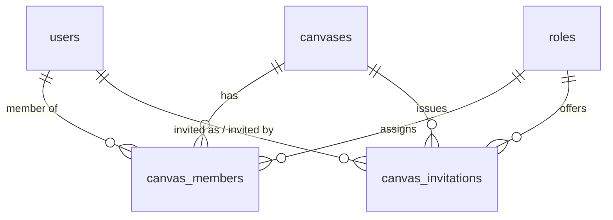
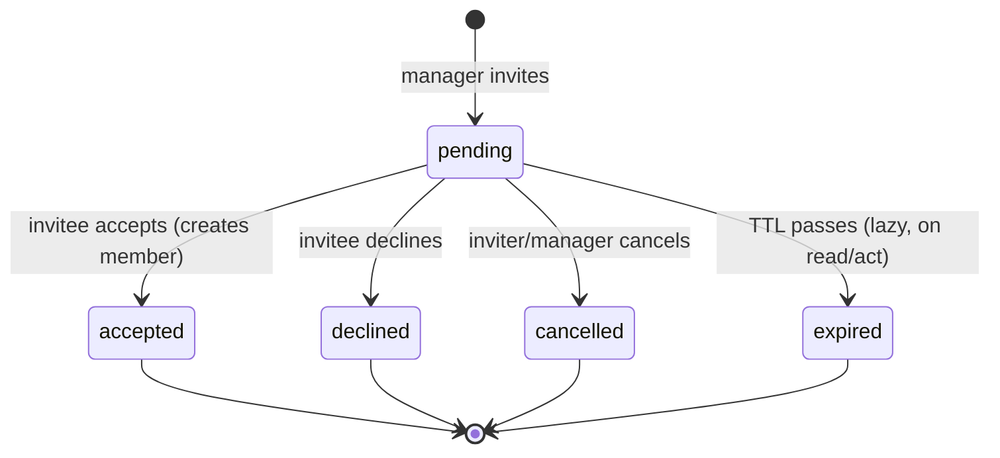
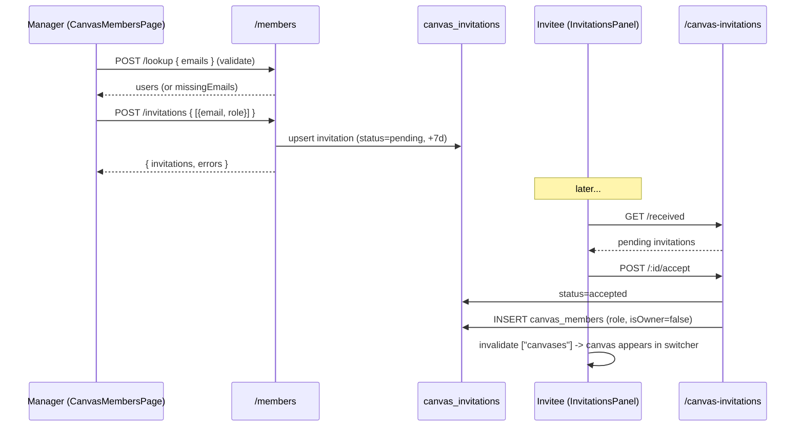

# 05 — Canvas & Collaboration

The **Canvas** is eBoom's tenancy model — the isolation boundary that every financial record hangs off. Collaboration (members, roles, invitations) is layered directly on top of it. This is the module to understand before any financial module, because "which canvas?" and "am I allowed?" are the first two questions every other feature asks.

**Prerequisites:** [Backend Core](./02-backend-core.md) (especially `requireCanvasAccess` and `canvasAccessService`) and [Frontend Core](./03-frontend-core.md) (data layer + Redux). [Authentication](./04-authentication.md) establishes *who* the user is; this doc establishes *where* they work and *what* they can do there.

---

## 1. Concepts

| Concept | Meaning |
|---------|---------|
| **Canvas** | A scoped financial workspace (e.g. "Personal", "Freelance", "Family"). All wallets/incomes/expenses/etc. belong to exactly one canvas. |
| **Membership** | A `(canvas, user)` link with a role and an `isOwner` flag. A user can belong to many canvases. |
| **Role** | A named permission bundle. Seeded system roles: **Collaborator**, **Modifier**, **Visitor**. |
| **Permission** | One of `view`, `edit`, `manage_members`, `manage_canvas`. Owners implicitly have all four. |
| **Invitation** | A pending request for an existing user to join a canvas with a given role. Lifecycle: `pending → accepted / declined / cancelled / expired`. |
| **Active canvas** | The one currently selected in the UI. Persisted client-side; drives every canvas-scoped query. |



The relevant tables (defined in [`schema.ts`](../eboom-backend/src/db/schema/schema.ts)):

- **`canvases`** — `name`, `description`, `photoUrl` (see §7 — it stores an emoji+color icon, not a real URL), `canvasType`, `isArchived`, audit columns.
- **`canvas_members`** — `canvasId`, `userId`, `roleId` (nullable), `isOwner`. **Unique on `(canvasId, userId)`** — one membership per user per canvas.
- **`roles`** — `name` (unique), `permissions` (JSON blob of booleans), `isSystemRole`.
- **`canvas_invitations`** — `canvasId`, `inviteeUserId`, `inviteeEmail`, `roleId`, `invitedBy`, `status` (enum), `expiresAt`, `respondedAt`. **Unique on `(canvasId, inviteeUserId)`** — one invitation record per user per canvas (reused/reset on re-invite).

---

## 2. API surface

Three routers make up the module. Note the mounting differences in [`routes/index.ts`](../eboom-backend/src/routes/index.ts):

| Router | Mount | File |
|--------|-------|------|
| Canvas CRUD + summary/transactions | `/api/canvases` | [`routes/canvas.ts`](../eboom-backend/src/routes/canvas.ts) |
| Members + invites-for-a-canvas | `/api/canvases/:canvasId/members` | [`routes/canvas-members.ts`](../eboom-backend/src/routes/canvas-members.ts) |
| Invitation inbox (per-user) | `/api/canvas-invitations` | [`routes/canvas-invitations.ts`](../eboom-backend/src/routes/canvas-invitations.ts) |
| Role catalog | `/api/roles/canvas` | [`routes/canvas-roles.ts`](../eboom-backend/src/routes/canvas-roles.ts) |

All are mounted behind the `auth` middleware. The distinction that matters:

- **`/canvases/:canvasId/members/*`** routes are about managing *a specific canvas's* people — they use `requireCanvasAccess(...)` because they operate inside a canvas.
- **`/canvas-invitations/*`** routes are about *the current user's* invitation inbox (sent + received) across all canvases — they **don't** use `requireCanvasAccess`; they authorize per-invitation instead (you must be the invitee, inviter, or a manager).

| Method & path | Permission | Purpose |
|---------------|-----------|---------|
| `GET /canvases` | member (implicit) | List canvases the user belongs to (with computed permissions). |
| `POST /canvases` | any auth user | Create a canvas; caller becomes owner. |
| `GET /canvases/:id` | `view` | Canvas details + caller's membership. |
| `PUT /canvases/:id` | `manage_canvas` | Update name/description/type/icon/archive. |
| `DELETE /canvases/:id` | `manage_canvas` | **Soft delete** (sets `isArchived = true`). |
| `GET /canvases/:id/summary` | `view` | Dashboard aggregation (see Dashboard module). |
| `GET /canvases/:id/transactions` | `view` | Unified/paginated ledger (see Transactions). |
| `GET /canvases/:id/members` | `view` | List members. |
| `GET /canvases/:id/members/invitations` | `view` | Pending invitations for this canvas. |
| `GET /canvases/:id/members/suggestions` | `manage_members` | Suggested invitees (people from your other canvases). |
| `POST /canvases/:id/members/lookup` | `manage_members` | Resolve emails → users before inviting. |
| `POST /canvases/:id/members/invitations` | `manage_members` | Batch-invite by email+role. |
| `PATCH /canvases/:id/members/:memberId` | `manage_members` | Change a member's role. |
| `DELETE /canvases/:id/members/:memberId` | `manage_members` | Remove a member. |
| `POST /canvases/:id/members/leave` | `view` | Leave the canvas (non-owners only). |
| `GET /canvas-invitations/sent` | auth | Invitations the user sent. |
| `GET /canvas-invitations/received` | auth | Invitations the user received. |
| `POST /canvas-invitations/:id/accept` | invitee | Accept → become a member. |
| `POST /canvas-invitations/:id/decline` | invitee | Decline. |
| `DELETE /canvas-invitations/:id` | inviter or manager | Cancel a pending invite. |
| `GET /roles/canvas` | auth | The three system roles + their permissions. |

---

## 3. Canvas lifecycle (backend)

### Listing — `GET /canvases`

Joins `canvas_members → canvases → roles` for the current user, filters out archived canvases, and — crucially — **computes each canvas's permissions inline** so the frontend receives everything it needs to gate the UI in one call:

```39:53:eboom-backend/src/routes/canvas.ts
    const userCanvases = memberships.map((m) => {
      const rolePermissions =
        m.role?.permissions && typeof m.role.permissions === "object"
          ? (m.role.permissions as Record<string, boolean>)
          : {};
      const permissions = computePermissions(m.member.isOwner ?? false, rolePermissions);
      return {
        ...m.canvas,
        isOwner: m.member.isOwner,
        roleId: m.member.roleId,
        roleName: m.role?.name ?? null,
        permissions,
      };
    });
```

`computePermissions` (from [`canvasAccessService`](../eboom-backend/src/services/canvasAccessService.ts)) returns all-true for owners; otherwise reads the role's `permissions` JSON. This is the same function `requireCanvasAccess` uses, so **list permissions and enforcement can never drift**.

### Creating — `POST /canvases`

1. Requires `name` (else `errors.validation.nameRequired`).
2. If a `baseCurrencyId` is supplied, it's validated and written to the user's `user_settings.defaultCurrencyId` (canvases don't store a base currency column themselves — the base currency is a *user preference* set at creation time).
3. Insert the canvas, then **insert the creator as an owner member** (`isOwner: true`, no role needed):

```112:118:eboom-backend/src/routes/canvas.ts
    await db.insert(canvasMembers).values({
      canvasId: newCanvas.id,
      userId: user.id,
      isOwner: true,
    });

    res.status(201).json({ canvas: newCanvas });
```

### Updating & deleting

- `PUT` uses **partial updates** — only fields present in the body are changed (`...(name !== undefined && { name })`), guarded by `manage_canvas`.
- `DELETE` is a **soft delete**: it flips `isArchived = true` rather than removing rows, so historical financial data referencing the canvas stays intact. Archived canvases simply stop appearing in `GET /canvases`.

---

## 4. Membership & invitations (backend)

This is the collaboration engine. Two routers cooperate: `canvas-members` (manager side) and `canvas-invitations` (invitee side).

### Inviting — `POST /members/invitations/`

Accepts a batch: `{ invitations: [{ email, role }] }`. It processes each entry independently, collecting successes and per-email errors so one bad address doesn't sink the whole request. For each invite it:

1. Normalizes the email and role name (`normalizeRoleName` maps `collaborator` → `Collaborator`, etc.).
2. Rejects unknown users, self-invites, and existing members.
3. Resolves the role name → `roleId`.
4. **Reuses the unique `(canvasId, inviteeUserId)` row**: if a non-pending invitation exists, it's reset to `pending` with a fresh 7-day expiry; a still-pending one is rejected; otherwise a new row is inserted.

```314:341:eboom-backend/src/routes/canvas-members.ts
      if (existingInvite) {
        if (existingInvite.status === "pending") {
          errors.push({ email, error: "Invitation already pending" });
          continue;
        }

        const [updated] = await db
          .update(canvasInvitations)
          .set({
            roleId,
            invitedBy: user.id,
            inviteeEmail: invitee.email,
            status: "pending",
            expiresAt,
            respondedAt: null,
            lastModifiedAt: new Date(),
          })
          .where(eq(canvasInvitations.id, existingInvite.id))
          .returning();
```

The response shape is `{ invitations: created, errors }` (HTTP 201), or a `member.inviteFailed` error if *nothing* succeeded. Invitations are **in-app only** — there's no invite email; the invitee sees them in their inbox (§6). Only users who **already have an eBoom account** can be invited (unknown emails error out).

> **Suggestions & lookup** help the manager UI: `GET /suggestions/` returns up to 30 people from the manager's *other* canvases who aren't already members or pending here; `POST /lookup/` resolves a list of emails to users (and reports `missingEmails`) so the invite form can validate before submitting.

### Managing members

- `PATCH /members/:memberId/` changes a role (`manage_members`). **Owners can't be re-roled** (`member.insufficientPermissions`).
- `DELETE /members/:memberId/` removes a member (`manage_members`). **Owners can't be removed.**
- `POST /members/leave/` lets a non-owner remove *themselves* (`view` is enough since you're acting on your own membership). **Owners can't leave** — they'd orphan the canvas.

### The invitee side — `canvas-invitations.ts`

Invitations expire lazily. There's no cron; instead `markExpiredIfNeeded` flips a pending-but-past-expiry invitation to `expired` whenever it's read or acted upon:

```27:37:eboom-backend/src/routes/canvas-invitations.ts
async function markExpiredIfNeeded(invitation: typeof canvasInvitations.$inferSelect) {
  if (invitation.status === "pending" && isExpired(invitation.expiresAt)) {
    const [updated] = await db
      .update(canvasInvitations)
      .set({ status: "expired", lastModifiedAt: new Date() })
      .where(eq(canvasInvitations.id, invitation.id))
      .returning();
    return updated;
  }
  return invitation;
}
```

**Accepting** performs the join safely: it re-checks the invitation belongs to the caller, is still pending and unexpired, the canvas exists and isn't archived, and the user isn't already a member — then inserts a `canvas_members` row (with the invited role, `isOwner: false`) and marks the invitation `accepted`. **Decline** and **cancel** just transition status. Cancel authorization allows either the inviter or a canvas manager:

```263:271:eboom-backend/src/routes/canvas-invitations.ts
    const isInviter = invitation.invitedBy === user.id;
    const membership = await getCanvasMembership(invitation.canvasId, user.id);
    const canManage =
      membership &&
      (membership.isOwner || membership.permissions.manage_members);

    if (!isInviter && !canManage) {
      return sendError(res, ErrorKeys.member.insufficientPermissions, 403);
    }
```

### Roles — `canvas-roles.ts`

A thin read-only endpoint returning the three system roles and their permission JSON, used to populate role pickers. (This is the one router still returning a legacy `{ error: "..." }` string on failure — a known mid-migration exception.)



---

## 5. Frontend: selecting & managing the active canvas

### `useCanvas` — the active-canvas brain

[`src/hooks/useCanvas.ts`](../eboom-frontend/src/hooks/useCanvas.ts) is the hub. It:

- Fetches the canvas list (`useQueryApi`, key `["canvases"]`).
- Reads/writes the **selected canvas id** in Redux (`canvasSlice`) **and** mirrors it to `localStorage("canvasId")`.
- Exposes `selectCanvas`, `createCanvas`, and the active canvas object.

The selected id lives in **Redux for reactivity** and **localStorage for persistence across reloads**. On mount, if nothing is selected it hydrates from localStorage, else falls back to the first canvas:

```71:84:eboom-frontend/src/hooks/useCanvas.ts
    useEffect(() => {
        if (canvasId !== undefined) return;

        const stored = getStoredCanvasId();
        if (stored !== null) {
            dispatch(updateCanvas(stored));
            return;
        }

        const firstId = data?.canvases?.[0]?.id;
        if (typeof firstId === "number") {
            selectCanvas(firstId);
        }
    }, [canvasId, data?.canvases, dispatch, selectCanvas]);
```

**Switching canvases invalidates all queries except the canvas list**, so every canvas-scoped view refetches for the newly selected tenant:

```46:54:eboom-frontend/src/hooks/useCanvas.ts
    const selectCanvas = useCallback((nextCanvasId: number) => {
        dispatch(updateCanvas(nextCanvasId));
        if (hasWindow) {
            window.localStorage.setItem("canvasId", nextCanvasId.toString());
        }
        queryClient.invalidateQueries({
            predicate: (query) => query.queryKey[0] !== "canvases",
        });
    }, [dispatch, queryClient]);
```

> This is why every canvas-scoped query key includes the canvas id (e.g. `["canvas-members", canvasId]`) — so the cache is correctly partitioned per tenant.

### `canvasSlice` — UI state only

[`canvasSlice.ts`](../eboom-frontend/src/redux/canvasSlice.ts) holds just two things: the selected `canvasId` and the create/edit **modal** state (`open`, `mode`, `editingItem`). No server data. This matches the Frontend Core rule — Redux is UI chrome, TanStack Query is server state.

### `useCanvasPermissions` — the UI gate

[`useCanvasPermissions`](../eboom-frontend/src/hooks/useCanvasPermissions.ts) derives the active canvas's permissions (converting the backend's snake_case `manage_members`/`manage_canvas` into camelCase `manageMembers`/`manageCanvas`) and exposes convenient booleans: `canView`, `canEdit`, `canManageMembers`, `canManageCanvas`, `isOwner`, `isVisitor`. **This is the frontend mirror of `requireCanvasAccess`** — but it only hides UI; the backend is the real enforcer. `isReady` guards against acting before permissions have loaded.

### `CanvasRequiredGate` — no canvas, no app

Wrapped around the dashboard content by `LayoutProvider`, [`CanvasRequiredGate`](../eboom-frontend/src/components/canvas/CanvasRequiredGate.tsx) blocks canvas-scoped pages until a canvas is selected: it shows a spinner while loading, an "create your first canvas" empty state when there are none, and otherwise renders children. A small allowlist (`/wish-list`) is exempt.

### `CanvasSwitcher` — the sidebar dropdown

[`CanvasSwitcher`](../eboom-frontend/src/components/canvas/CanvasSwitcher.tsx) is the primary entry point. It groups canvases into **Owned** vs **Joined**, shows each canvas's emoji icon, and offers inline edit/delete (gated by `manageCanvas`), "Leave canvas" (non-owners), and "Add new". Selecting an item calls `selectCanvas`; deletion uses `ConfirmDeleteDialog` + the soft-delete endpoint; leaving uses `ConfirmLeaveCanvasDialog` and then re-selects a remaining canvas.

---

## 6. Frontend: collaboration UI

### Members page — `/manage-canvas`

The route [`app/(dashboard)/manage-canvas/page.tsx`](../eboom-frontend/app/(dashboard)/manage-canvas/page.tsx) renders [`CanvasMembersPage`](../eboom-frontend/src/views/canvas-members/CanvasMembersPage.tsx). The **sidebar only shows this entry when `canManageMembers` is true** (see `app-sidebar.tsx`), and the page itself further gates its actions on permission booleans.

It composes several pieces, all fed by [`useCanvasMembers`](../eboom-frontend/src/hooks/useCanvasMembers.ts):

- `CanvasDetailsHeader` — canvas name/icon/type.
- `MembersTable` — members with inline role selects (`onRoleChange` → `updateMemberRole`) and remove buttons.
- `PendingInvitationsTable` — collapsible list of pending invites with cancel.
- `InviteMembersModal` — email entry with `lookupUsers` validation + `suggestions`, submitting a batch to `sendInvitations`.
- `ConfirmRemoveMemberDialog` — confirmation before removal.

`useCanvasMembers` bundles every members query and mutation for a canvas and centralizes cache invalidation via a shared `invalidate()` that refreshes members, pending invitations, suggestions, the canvas list, and the invitation inbox — keeping every surface consistent after any change.

### Invitation inbox

[`useCanvasInvitations`](../eboom-frontend/src/hooks/useCanvasInvitations.ts) powers the personal inbox (sent + received), used by the [`CanvasInvitationsPanel`](../eboom-frontend/src/components/layout/CanvasInvitationsPanel.tsx) opened from the user menu (`nav-user.tsx`). It filters out cancelled invitations, computes a `pendingReceivedCount` (for a badge), and exposes accept/decline/cancel. Each entry renders as an [`InvitationCard`](../eboom-frontend/src/views/canvas-invitations/InvitationCard.tsx) with role chip, status badge, and context-appropriate actions (accept/decline for received, cancel for sent). Accepting immediately invalidates `["canvases"]` so the newly joined canvas appears in the switcher.

---

## 7. The canvas icon trick

Canvases don't have a real image uploader. The `photoUrl` column is **repurposed to store a JSON `{ emoji, color }`** icon config. [`canvasUtils.ts`](../eboom-frontend/src/components/canvas/canvasUtils.ts) serializes/parses it, with a graceful fallback to a default if the value isn't valid JSON:

```30:39:eboom-frontend/src/components/canvas/canvasUtils.ts
export function parseCanvasIcon(photoUrl?: string | null): CanvasIconConfig {
  if (!photoUrl) return DEFAULT_CANVAS_ICON;
  try {
    const parsed = JSON.parse(photoUrl);
    if (parsed.emoji && parsed.color) return parsed as CanvasIconConfig;
  } catch {
    // not a JSON icon config, fall through to default
  }
  return DEFAULT_CANVAS_ICON;
}
```

The [`NewCanvasModal`](../eboom-frontend/src/components/canvas/NewCanvasModal.tsx) (a single component handling both create and edit via `canvasSlice` modal state) lets the user pick an emoji + color, serializes them into `photoUrl`, and — for creation only — also picks a base currency. On create it navigates to `/dashboard`; the base currency selector is hidden in edit mode because it's a one-time user setting.

---

## 8. End-to-end: inviting and joining



---

## 9. Permissions cheat-sheet

| Action | Required | Backend enforcement | Frontend gate |
|--------|----------|--------------------|---------------|
| See a canvas's data | `view` | `requireCanvasAccess("view")` | `canView` |
| Create/edit financial records | `edit` | `requireCanvasAccess("edit")` | `canEdit` |
| Invite / remove / re-role members | `manage_members` | `requireCanvasAccess("manage_members")` | `canManageMembers` |
| Edit / archive the canvas | `manage_canvas` | `requireCanvasAccess("manage_canvas")` | `canManageCanvas` |
| Leave a canvas | member (non-owner) | `leave` handler blocks owners | "Leave" shown to non-owners |

Owner is not a permission — it's an `isOwner` flag that **implies all four permissions** and additionally protects the owner from being re-roled, removed, or forced to leave.

---

## 10. Known limitations & gotchas

- **Invitations are in-app only** — no email is sent, and only existing eBoom users can be invited.
- **No ownership transfer** and **owners can't leave** — a canvas is permanently tied to its creator today.
- **Delete is soft** (`isArchived`), and there is no UI to view or restore archived canvases.
- **Role catalog is fixed** to the three seeded system roles; there's no custom-role creation.
- **Base currency is a user setting**, not a canvas column — changing it later isn't exposed in the edit modal.
- `canvas-roles.ts` still returns a legacy English `{ error }` on failure (don't copy that pattern).

---

Next module: the financial core begins with **Wallets & Sub-wallets** (the balance containers every movement touches), then **Incomes**, **Expenses**, and **Transfers**.
