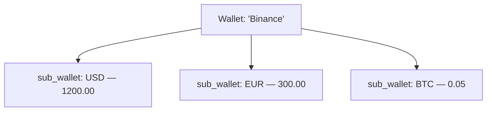
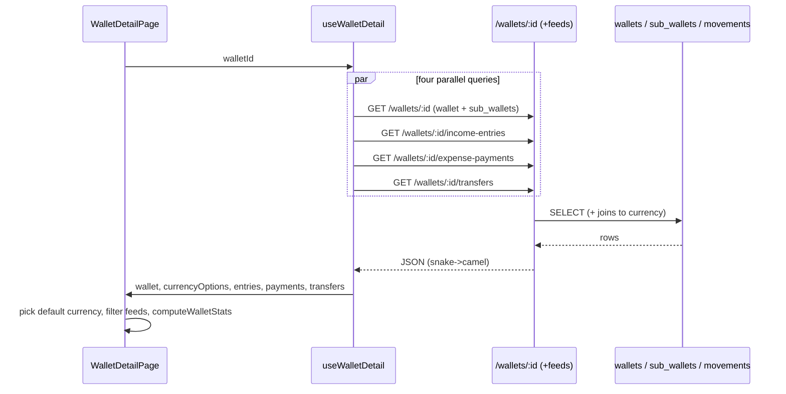
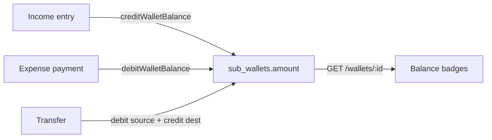

# 06 — Wallets & Sub-wallets

Wallets are the **balance containers** at the center of eBoom's money model. Every income entry credits a wallet, every expense payment debits one, and every transfer moves value between two. Understand wallets — and especially the **sub-wallet** balance mechanism and the **ledger service** — before reading Incomes, Expenses, or Transfers, because all three are just different ways of moving a wallet's balance.

**Prerequisites:** [Backend Core](./02-backend-core.md) (ledger invariant, `requireCanvasAccess`), [Canvas & Collaboration](./05-canvas-collaboration.md) (wallets are canvas-scoped), [Frontend Core](./03-frontend-core.md) (list template, data layer).

---

## 1. The core idea: a wallet is multi-currency

A **wallet** is a logical account — "Checking", "Cash", "Binance", "Company Safe". It has a name, a category, a description, and an icon, but **it does not hold a balance itself**. Balances live in **sub-wallets**: one row per currency held in that wallet.



This is why the doc is titled "Wallets **& Sub-wallets**". The design lets a single wallet hold arbitrary currencies simultaneously, and it makes every balance mutation a currency-specific operation.

The two tables ([`schema.ts`](../eboom-backend/src/db/schema/schema.ts)):

- **`wallets`** — `canvasId`, `name`, `walletCategoryId`, `photoUrl`, `description` (JSON), `isArchived`, audit columns.
- **`sub_wallets`** — `walletId`, `currencyId`, `amount` (`numeric(20,8)`), optional `address`. **Unique on `(walletId, currencyId)`** — you can never have two USD balances in the same wallet.

Sub-wallet rows are **created on demand** the first time money in a given currency touches the wallet (see §3). A brand-new wallet has zero sub-wallets and shows "no balances yet" in the UI.

---

## 2. API surface

Wallet routes are canvas-scoped, mounted at `/api/canvases/:canvasId/wallets` ([`routes/wallets.ts`](../eboom-backend/src/routes/wallets.ts)). Categories are a separate, non-canvas-scoped router.

| Method & path | Permission | Purpose |
|---------------|-----------|---------|
| `GET /wallets` | `view` | Paginated/filtered/searchable wallet list (with category). |
| `POST /wallets` | `edit` | Create a wallet (also registers a whiteboard node). |
| `GET /wallets/:walletId` | `view` | Wallet details **+ all its sub-wallet balances**. |
| `PUT /wallets/:walletId` | `edit` | Partial update. |
| `DELETE /wallets/:walletId` | `edit` | **Soft delete** (archive) + unregister whiteboard node. |
| `GET /wallets/:walletId/sub-wallets` | `view` | Just the balances. |
| `GET /wallets/:walletId/income-entries` | `view` | Income entries credited to this wallet. |
| `GET /wallets/:walletId/expense-payments` | `view` | Expense payments debited from this wallet. |
| `GET /wallets/:walletId/transfers` | `view` | Transfers in/out of this wallet. |
| `GET /wallets/:walletId/transactions` | `view` | **Unified** feed: entries + payments + transfers combined. |
| `GET /wallet/categories` | auth | List categories (also POST/PUT/DELETE). |

Every handler that takes a `:walletId` runs the **same ownership check**: parse the id, load the wallet, and confirm `wallet.canvasId === req.canvasId`. This double-guard (canvas permission *and* record ownership) is the standard eBoom pattern for entity routes:

```37:41:eboom-backend/src/routes/wallets.ts
      const [wallet] = await db.select().from(wallets).where(eq(wallets.id, walletId));
      if (!wallet || wallet.canvasId !== canvasId) {
        return sendError(res, ErrorKeys.wallet.notFound, 404);
      }
```

> Note the two levels: `requireCanvasAccess("view")` proves you may read *this canvas*; the `canvasId` comparison proves *this wallet* belongs to it. A wallet id from another canvas returns 404, not 403 — so cross-canvas ids are indistinguishable from non-existent ones.

---

## 3. The ledger service — the only place balances change

**This is the single most important rule in the whole app**: route handlers must never `UPDATE sub_wallets.amount` directly. All balance mutations go through [`services/ledgerService.ts`](../eboom-backend/src/services/ledgerService.ts). Wallet routes themselves don't move money (that's Incomes/Expenses/Transfers), but the ledger is documented here because it operates on this module's tables.

### `getOrCreateSubWalletRow` — lazy balance creation

Before any credit/debit, the ledger ensures the `(walletId, currencyId)` sub-wallet exists, creating it at `0` if not. This is why you never pre-create balances — they materialize on first use:

```15:37:eboom-backend/src/services/ledgerService.ts
export async function getOrCreateSubWalletRow(
  tx: BalanceTx,
  walletId: number,
  currencyId: number
) {
  const [existing] = await tx
    .select()
    .from(subWallets)
    .where(and(eq(subWallets.walletId, walletId), eq(subWallets.currencyId, currencyId)));

  if (existing) return existing;

  const [created] = await tx
    .insert(subWallets)
    .values({
      walletId,
      currencyId,
      amount: "0",
    })
    .returning();

  return created;
}
```

### `creditWalletBalance` / `debitWalletBalance`

- **Credit** adds to the sub-wallet amount (used by income entries and transfer destinations).
- **Debit** subtracts, and by default **refuses to go negative** — throwing `"Insufficient wallet balance"` unless `allowNegative` is passed:

```74:81:eboom-backend/src/services/ledgerService.ts
  const run = async (transaction: BalanceTx) => {
    const row = await getOrCreateSubWalletRow(transaction, input.walletId, input.currencyId);
    const current = Number(row.amount);
    const debit = Number(input.amount);

    if (!input.allowNegative && current < debit) {
      throw new Error("Insufficient wallet balance");
    }
```

### Composability & atomicity

Every ledger function accepts an **optional transaction handle** (`tx`). If one is passed, it runs inside that transaction; otherwise it opens its own. This is what lets higher-level operations compose multiple balance changes atomically. `transferWalletBalance` is the clearest example — it debits the source and credits the destination inside one transaction, so a transfer can never half-apply:

```111:130:eboom-backend/src/services/ledgerService.ts
  const run = async (transaction: BalanceTx) => {
    await debitWalletBalance(
      {
        walletId: input.sourceWalletId,
        currencyId: input.sourceCurrencyId,
        amount: input.sourceAmount,
        allowNegative: input.allowNegative,
      },
      transaction
    );

    await creditWalletBalance(
      {
        walletId: input.destinationWalletId,
        currencyId: input.destinationCurrencyId,
        amount: input.destinationAmount,
      },
      transaction
    );
  };
```

`reverseTransferBalance` does the inverse (credit source, debit destination) — used when a transfer is edited or deleted to roll back its effect before re-applying. The Transfers module doc covers that flow.

> **Amounts are strings.** Because `sub_wallets.amount` is `numeric(20,8)`, the ledger passes amounts around as strings and does arithmetic via `Number(...)`. Be aware this is float math under the hood — fine for the app's scale, but not arbitrary-precision decimal.

---

## 4. Reading wallet data (backend)

### List — `GET /wallets`

Uses the shared `parseListQueryParams` helper for `page`/`limit`/`search`/`categoryId`, filters to the canvas and non-archived wallets, left-joins the category, and returns a paginated envelope. The response includes both `wallets` and `items` keys (the generic `items` is what the frontend list infra consumes):

```445:450:eboom-backend/src/routes/wallets.ts
    const formattedWallets = walletsList.map((w) => ({
      ...w.wallet,
      category: w.category,
    }));

    res.json({ wallets: formattedWallets, items: formattedWallets, total, page, limit });
```

### Detail — `GET /wallets/:walletId`

Returns the wallet, its category, and **its sub-wallets each joined to their currency** — this is the single call that powers the detail page's balance badges and currency filter.

### The wallet's own sub-feeds

The detail page needs to show what flowed through a wallet. Three endpoints return that, and they share a consistent shape:

- **`/income-entries`** — income entries whose `destinationWalletId` is this wallet (joined to income, category, currency).
- **`/expense-payments`** — payments whose `sourceWalletId` is this wallet.
- **`/transfers`** — transfers touching this wallet (delegated to `transferService`).

Each supports **two modes**: without pagination params it returns the full list; with them it returns a paginated envelope **plus aggregates** (e.g. `totalReceived`, `totalPaid`, `totalIn`/`totalOut`) computed in SQL. Ordering uses a `COALESCE` so records sort by the most meaningful available date:

```47:50:eboom-backend/src/routes/wallets.ts
      const orderByDate = desc(
        sql`COALESCE(${incomeEntries.receivedDate}, ${incomeEntries.expectedDate}, ${incomeEntries.createdAt})`
      );
```

### Unified feed — `GET /wallets/:walletId/transactions`

Fetches income entries, expense payments, and transfers for the wallet, tags each with a discriminant `type` (`"income_entry"`, `"expense_payment"`, `"transfer"`), merges them, and sorts by `createdAt` descending. This is the "everything that happened to this wallet" view used by the transaction chart.

---

## 5. Wallet lifecycle & whiteboard integration

Create/update/delete follow the canvas conventions (partial updates on `PUT`, soft delete via `isArchived` on `DELETE`). The one wallet-specific twist: **wallets are nodes on the whiteboard**, so create and delete keep the graph in sync:

```485:489:eboom-backend/src/routes/wallets.ts
    await registerWhiteboardNode(canvasId, "wallet", newWallet.id);

    res.status(201).json({ wallet: newWallet });
```

On delete, `unregisterWhiteboardNode(canvasId, "wallet", walletId)` removes the corresponding node. (The Whiteboard module doc covers node persistence.)

### Categories

[`wallet-categories.ts`](../eboom-backend/src/routes/wallet-categories.ts) is a simple global CRUD list (not canvas-scoped) — `walletCategories` has only a `name`. Categories are shared across all canvases and seeded with a starter catalog. Income, expense, and asset categories follow the identical pattern.

---

## 6. Frontend: the list page

[`WalletsListPage`](../eboom-frontend/src/views/wallets/WalletsListPage.tsx) is the reference implementation of eBoom's **list page template** — study it and you understand every list page (incomes, expenses, assets look the same). It combines:

- **`useEntityList`** — the generic paginated/infinite list hook, keyed `["wallets", canvasId]`, driven by search + filters.
- **Redux for view + modal state** — `searchSlice` provides `viewMode` (table vs cards), search query, and active filters; `walletSlice` holds the create/edit modal state.
- **Two render modes** — `EntityListTable` (paged) or a `GridCard` grid with an infinite-scroll sentinel.
- **Permission gating** — `canEdit` from `useCanvasPermissions` controls whether add/edit/delete and the `FloatingAddButton` appear at all.
- **Empty states** — distinct illustrations for "no wallets yet" vs "no results for these filters".
- **`ConfirmDeleteDialog`** wired to the soft-delete mutation.

```69:78:eboom-frontend/src/views/wallets/WalletsListPage.tsx
  } = useEntityList<WalletItem>(
    canvas ? API_ROUTES.CANVASES_WALLETS_LIST(canvas) : "",
    {
      queryKey: ["wallets", canvas],
      enabled: !!canvas,
      search: debouncedSearch,
      filters: listFilters,
    }
  );
```

Note the pattern repeated everywhere: the URL is `""` (disabled) until `canvas` is truthy, and `enabled: !!canvas` prevents firing a request before a canvas is selected.

### The create/edit modal — `NewWalletModal`

[`NewWalletModal`](../eboom-frontend/src/views/wallets/components/NewWalletModal.tsx) is a single component handling both modes via `walletSlice` state. Highlights of the eBoom form pattern:

- **`react-hook-form`** with shadcn `Field`/`FieldError` and per-field i18n validation messages.
- **Category** loaded lazily (`enabled: open`) into a `Combobox`.
- **Image upload** via `ImageUploadField` → converted to a data URL with `fileToDataUrl` and sent as `photoUrl` (images are stored as data URLs / strings, not uploaded to object storage in this flow).
- On **edit**, it calls `useWalletDetail` to hydrate the freshest values before resetting the form.
- Success/error snackbars come from `useMutationApi`'s `successKey` + centralized error handling.

---

## 7. Frontend: the detail page

[`WalletDetailPage`](../eboom-frontend/src/views/wallets/WalletDetailPage.tsx) is where the multi-currency model becomes visible. Its data comes from [`useWalletDetail`](../eboom-frontend/src/views/wallets/hooks/useWalletDetail.ts), which fires four parallel queries — the wallet (with sub-wallets), its income entries, its expense payments, and its transfers — each keyed by `[..., canvas, walletId]`:

```36:44:eboom-frontend/src/views/wallets/hooks/useWalletDetail.ts
  const { data: walletRes, isLoading: isLoadingWallet, isError: isWalletError } =
    useQueryApi<{
      wallet: Wallet & {
        subWallets?: WalletSubWallet[];
      };
    }>(canvas ? API_ROUTES.WALLETS_GET(canvas, walletId) : "", {
      queryKey: ["wallet", canvas, walletId],
      enabled,
    });
```

### The currency filter

Because a wallet can span currencies, the detail page can't show "the balance" — it shows a badge per sub-wallet and a **currency selector** that scopes the rest of the page. The helpers in [`currencyFilter.ts`](../eboom-frontend/src/views/wallets/utils/currencyFilter.ts) drive this:

- `getWalletCurrencyOptions(subWallets)` → the list of `{ code, symbol, balance }` badges.
- `getDefaultWalletCurrencyCode(options)` → the initially-selected currency is the one with the **largest absolute balance**, not alphabetical:

```64:74:eboom-frontend/src/views/wallets/utils/currencyFilter.ts
export function getDefaultWalletCurrencyCode(
  options: WalletCurrencyOption[]
): string {
  if (!options.length) return "";
  return options.reduce((best, option) =>
    Math.abs(parseFloat(option.balance) || 0) >
    Math.abs(parseFloat(best.balance) || 0)
      ? option
      : best
  ).code;
}
```

- `filterEntriesByCurrency` / `filterPaymentsByCurrency` / `filterTransfersByCurrency` — narrow each feed to the selected currency. Transfers are special: a transfer counts if it's **in** to this wallet in the selected currency (`destinationWalletId` + `destinationCurrencyCode`) **or out** (`sourceWalletId` + `sourceCurrencyCode`).

Everything below the selector — summary cards, chart, and the entries/transfers/payments tables — receives the filtered data and the resolved currency symbol.

### Summary stats & charts

[`computeWalletStats`](../eboom-frontend/src/views/wallets/utils/utils.ts) derives the summary-card numbers **entirely on the client** from the fetched feeds: received vs pending income, paid vs due expenses, and — importantly — it **folds transfers into the received/paid totals** (transfer-in counts as received, transfer-out as paid) and computes month-over-month change percentages. The multi-currency chart data is built by `buildMultiCurrencyWalletChartData` in `currencyFilter.ts`, bucketing entries/payments/transfers into per-day, per-currency series.

> This reflects an eBoom convention: authoritative *balances* come from the backend (`sub_wallets`), but *derived display stats* (counts, averages, MoM %) are computed in the frontend from the movement feeds. The backend also returns some aggregates on the paginated endpoints for cases where the full feed isn't loaded.

---

## 8. Data flow summary



And the write side (performed by other modules, shown here for context):



---

## 9. Gotchas & conventions

- **Never mutate `sub_wallets` outside the ledger.** Credit/debit/transfer/reverse are the only sanctioned operations.
- **Sub-wallets are lazy** — a wallet with no activity in a currency has no row for it; the ledger creates it on first touch.
- **Debits block overdraft** by default (`allowNegative` must be explicit).
- **Delete is soft** (`isArchived = true`); archived wallets vanish from lists but their historical movements remain valid.
- **Cross-canvas wallet ids 404** thanks to the `canvasId` ownership re-check.
- **Category CRUD is global**, not canvas-scoped — a renamed category affects every canvas.
- **Money is float-backed strings** — high precision but not decimal-exact.

---

Next: **Incomes & Income Entries** — defining income sources and recording receipts that credit wallets through the ledger you just met.
