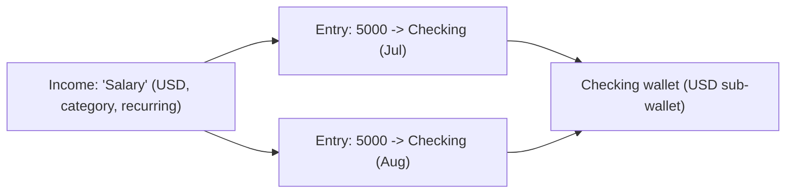
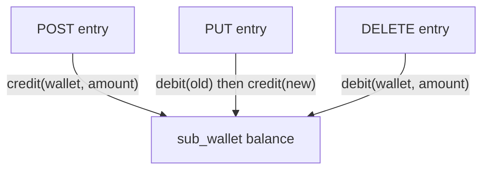
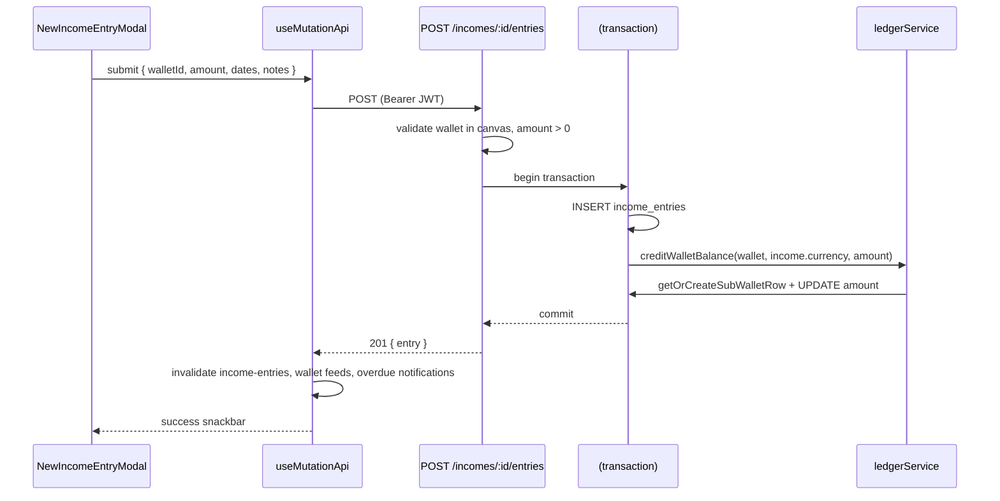

# 07 — Incomes & Income Entries

Incomes are the first **money-in** module. It introduces the pattern every financial module follows: a **definition** (the income source) separate from its **movements** (the actual receipts, called *entries*). Entries are where money is actually created in the system — each one **credits a wallet through the ledger service** you met in [Wallets](./06-wallets.md).

**Prerequisites:** [Wallets & Sub-wallets](./06-wallets.md) (the ledger + sub-wallet balances), [Canvas & Collaboration](./05-canvas-collaboration.md), [Frontend Core](./03-frontend-core.md).

---

## 1. The two-level model: source vs entry

This distinction is the heart of the module (and of Expenses, which mirror it exactly):

| Concept | Table | Meaning | Example |
|---------|-------|---------|---------|
| **Income** (source/definition) | `incomes` | A *kind* of income you expect — recurring or one-off. Holds no balance. | "Monthly Salary", "Freelance Project X" |
| **Income Entry** (movement) | `income_entries` | An *actual receipt* into a specific wallet. **Credits that wallet.** | "Received $5,000 into Checking on Jul 1" |



- An **income** never moves money by itself. It's a template describing what/where/how much you expect.
- An **income entry** is the ledger event. Creating one **credits** the destination wallet's sub-wallet for the income's currency.

### The tables ([`schema.ts`](../eboom-backend/src/db/schema/schema.ts))

- **`incomes`** — `canvasId`, `name`, `currencyId`, `incomeCategoryId`, `defaultWalletId` (nullable convenience default), `amount` (an **integer** nominal/expected figure), `isRecurring` + `recurrencePattern` (JSON), `status` (`transactionStatusEnum`: pending/completed/failed/cancelled), `description`, `photoUrl`, `isArchived`, audit columns.
- **`income_entries`** — `incomeId`, `destinationWalletId`, `amount` (`numeric(20,8)` — the real, precise money), `expectedDate`, `receivedDate`, `notes`, audit columns. A DB `check` enforces `amount >= 0`.

> Note the amount-type asymmetry: the **income's** `amount` is a coarse `integer` (a planning estimate), while an **entry's** `amount` is high-precision `numeric(20,8)` because it's what actually hits the ledger.

---

## 2. API surface

Canvas-scoped, mounted at `/api/canvases/:canvasId/incomes` ([`routes/income.ts`](../eboom-backend/src/routes/income.ts)). Note the nested entry routes.

| Method & path | Permission | Purpose |
|---------------|-----------|---------|
| `GET /incomes` | `view` | Paginated/filtered income list (category, currency, isRecurring, search). |
| `POST /incomes` | `edit` | Create an income source (+ whiteboard node). |
| `GET /incomes/:incomeId` | `view` | One income with category + default wallet. |
| `PUT /incomes/:incomeId` | `edit` | Partial update. |
| `DELETE /incomes/:incomeId` | `edit` | Soft delete (archive) + unregister whiteboard node. |
| `GET /incomes/:incomeId/entries` | `view` | Entries for an income (full or paginated + `totalReceived`). |
| `POST /incomes/:incomeId/entries` | `edit` | **Create an entry → credits the wallet.** |
| `PUT /incomes/entries/:entryId` | `edit` | **Edit an entry → reverses old credit, applies new.** |
| `DELETE /incomes/entries/:entryId` | `edit` | **Delete an entry → debits the wallet back.** |
| `GET /income/categories` | auth | Global category CRUD (list/create/update/delete). |

The route order matters: `PUT/DELETE /entries/:entryId` are declared **before** `/:incomeId` so Express doesn't mistake the literal `entries` segment for an income id.

Every handler runs the standard **canvas + ownership double-guard**, and for entries it walks up to the parent income to verify canvas ownership (entries have no `canvasId` of their own):

```52:56:eboom-backend/src/routes/income.ts
    const [income] = await db.select().from(incomes).where(eq(incomes.id, existing.incomeId));
    if (!income || income.canvasId !== canvasId) {
      return sendError(res, ErrorKeys.income.entryNotFound, 404);
    }
```

---

## 3. The critical part: entries and the ledger

This is where Incomes differ from a plain CRUD module. Every entry mutation must keep wallet balances correct, and it does so through the ledger inside a **database transaction** so the entry row and the balance change commit together (or not at all).

### Create entry → credit

The handler validates the wallet belongs to the canvas, then inserts the entry and credits the wallet **in one transaction**:

```260:286:eboom-backend/src/routes/income.ts
    const created = await db.transaction(async (tx) => {
      const [entry] = await tx
        .insert(incomeEntries)
        .values({
          incomeId,
          destinationWalletId: parsedWalletId,
          amount: amountStr,
          expectedDate: parsedExpectedDate,
          receivedDate: parsedReceivedDate,
          notes: notes || null,
          createdBy: user.id,
          lastModifiedBy: user.id,
        })
        .returning();

      await creditWalletBalance(
        {
          walletId: parsedWalletId,
          currencyId: income.currencyId,
          amount: amountStr,
        },
        tx
      );
      // Creates sub_wallet row on first entry for this wallet+currency via getOrCreateSubWalletRow

      return entry;
    });
```

Two important behaviors:

1. **The entry uses the income's `currencyId`.** Entries don't carry their own currency — they inherit it from the parent income. So an entry always credits the sub-wallet matching the income's currency (lazily creating it via `getOrCreateSubWalletRow`).
2. **The credit happens unconditionally — regardless of `receivedDate`.** Creating an entry immediately moves the balance even if it's only "expected" (no received date yet). The `expected`/`received` dates are used for *reporting/status* on the frontend (received vs pending), **not** to gate the ledger. ⚠️ This is a subtle but important quirk: recording an expected-but-not-yet-received entry still increases the wallet balance.

### Edit entry → reverse then re-apply

Editing can't just overwrite the row — it must undo the old balance effect and apply the new one. The handler does both inside a transaction: **debit the old** (old wallet, old amount), update the row, then **credit the new** (new wallet, new amount):

```67:100:eboom-backend/src/routes/income.ts
    const updated = await db.transaction(async (tx) => {
      await debitWalletBalance(
        {
          walletId: existing.destinationWalletId,
          currencyId: income.currencyId,
          amount: String(existing.amount),
          allowNegative: false,
        },
        tx
      );

      const [entry] = await tx
        .update(incomeEntries)
        .set({
          destinationWalletId: parsedWalletId,
          amount: amountStr,
          expectedDate: parsedExpectedDate,
          receivedDate: parsedReceivedDate,
          notes: notes || null,
          lastModifiedBy: user.id,
          lastModifiedAt: new Date(),
        })
        .where(eq(incomeEntries.id, entryId))
        .returning();

      await creditWalletBalance(
        {
          walletId: parsedWalletId,
          currencyId: income.currencyId,
          amount: amountStr,
        },
        tx
      );

      return entry;
    });
```

This "reverse the old, apply the new" pattern correctly handles the case where the edit **changes the destination wallet** (money leaves the old wallet, lands in the new one).

### Delete entry → debit back

Deleting reverses the original credit by debiting the wallet, then removes the row. (This particular handler debits *outside* an explicit transaction wrapper, then deletes — a minor inconsistency with create/update, which use `db.transaction`.)

```130:138:eboom-backend/src/routes/income.ts
    await debitWalletBalance({
      walletId: existing.destinationWalletId,
      currencyId: income.currencyId,
      amount: String(existing.amount),
      allowNegative: false,
    });

    await db.delete(incomeEntries).where(eq(incomeEntries.id, entryId));
```



> ⚠️ Because debits refuse to go negative (`allowNegative: false`), editing or deleting an entry can **fail with "Insufficient wallet balance"** if the money has since been spent or transferred out. The error surfaces as a generic `errors.common.internal` on the update path.

---

## 4. Income source lifecycle

The source-level CRUD (`POST/GET/PUT/DELETE /incomes`) is conventional and mirrors Wallets:

- **Create** validates required fields (`name`, `incomeCategoryId`, `currencyId`), optionally validates the `defaultWalletId` belongs to the canvas, inserts, and **registers a whiteboard node** (`registerWhiteboardNode(canvasId, "income", id)`).
- **List** supports search + filters by category, currency, and `isRecurring`, joining category/currency/default-wallet for display.
- **Update** is partial (spread-conditional `set`).
- **Delete** is a soft archive + `unregisterWhiteboardNode`. Existing entries (and their ledger effects) are untouched.

Creating or editing an income **does not touch any balance** — only entries do.

---

## 5. Frontend

### List page

`IncomesListPage` is the same list template as Wallets ([see §6](./06-wallets.md#6-frontend-the-list-page)): `useEntityList` keyed `["incomes", canvasId]`, `searchSlice` for view/search/filters, [`incomeSlice`](../eboom-frontend/src/redux/incomeSlice.ts) for create/edit modal state, `GridCard`/table modes, and `canEdit`-gated actions. `NewIncomeModal` is the source create/edit form (name, category, currency, default wallet, amount, recurrence, status).

### Detail page

[`IncomeDetailPage`](../eboom-frontend/src/views/incomes/IncomeDetailPage.tsx) is deliberately thin — a chart, summary cards, and the entries table, all fed by [`useIncomeDetail`](../eboom-frontend/src/views/incomes/hooks/useIncomeDetail.ts):

```13:31:eboom-frontend/src/views/incomes/IncomeDetailPage.tsx
export default function IncomeDetailPage({ id }: Props) {
  const { entries, currencySymbol, isLoading } = useIncomeDetail(id);

  return (
    <>
      <Container>
        <IncomeEntriesChart
          entries={entries}
          currencySymbol={currencySymbol}
          isLoading={isLoading}
        />
      </Container>
      <IncomeSummaryCards
        entries={entries}
        currencySymbol={currencySymbol}
        isLoading={isLoading}
      />
      <IncomeEntriesTable incomeId={id} />
    </>
  );
}
```

`useIncomeDetail` fetches the income (keyed `["income", canvas, id]`), its entries (`["income-entries", canvas, id]`), and resolves the display **currency symbol** by matching the income's `currencyId` against the shared currencies query. It exposes `skipEntries` so the same hook can hydrate the edit modal without redundantly loading entries.

### The entry modal — a study in reuse

[`NewIncomeEntryModal`](../eboom-frontend/src/views/incomes/component/NewIncomeEntryModal.tsx) is the most flexible form in the module because the **same component** creates and edits entries from three different contexts:

- From an **income detail page** (`incomeId` fixed, user picks the wallet).
- From a **wallet detail page** (`fixedDestinationWalletId` set, user picks the income).
- As a **standalone add** (both pickers shown).

It adapts via props: `showIncomePicker = incomeId === undefined` and `showWalletPicker = fixedDestinationWalletId === undefined`. The method and URL are chosen dynamically from whether `entryId` is present:

```185:204:eboom-frontend/src/views/incomes/component/NewIncomeEntryModal.tsx
  const { mutateAsync: saveEntry, isPending } = useMutationApi(
    (formData: EntryFormData) => {
      const resolvedIncomeId = incomeId ?? formData.incomeId;
      if (isEditMode && entryId) {
        return API_ROUTES.INCOME_ENTRIES_UPDATE(canvas!, entryId);
      }
      return API_ROUTES.INCOME_ENTRIES_CREATE(canvas!, resolvedIncomeId!);
    },
    {
      method: () => (isEditMode && entryId ? "put" : "post"),
      successKey: isEditMode
        ? "success.income.entryUpdated"
        : "success.income.entryCreated",
      mapPayload: (formData: EntryFormData) => ({
        destinationWalletId: fixedDestinationWalletId ?? formData.destinationWalletId,
        amount: Number(formData.amount),
        expectedDate: formData.expectedDate || null,
        receivedDate: formData.receivedDate || null,
        notes: formData.notes.trim() || null,
      }),
```

Because an entry mutation changes wallet balances, the modal manually invalidates the affected caches on success — the income's entries, any `extraInvalidateKeys` passed by the caller (e.g. wallet feeds), and the **overdue notifications** query:

```206:216:eboom-frontend/src/views/incomes/component/NewIncomeEntryModal.tsx
      onSuccess: async (_data, formData) => {
        const resolvedIncomeId = incomeId ?? (formData as EntryFormData).incomeId;
        if (resolvedIncomeId) {
          await queryClient.invalidateQueries({ queryKey: ["income-entries", canvas, resolvedIncomeId] });
        }
        for (const key of extraInvalidateKeys) {
          await queryClient.invalidateQueries({ queryKey: key });
        }
        await queryClient.invalidateQueries({ queryKey: ["notifications", "overdue"] });
      },
```

Other niceties: income/wallet pickers are searchable comboboxes whose options embed `– #id` so the label can be parsed back to an id; `receivedDate` defaults to today and is validated to not precede `expectedDate`; and in edit mode it reuses `useIncomeDetail` to find the entry being edited.

### Summary stats

`IncomeSummaryCards` derives its numbers client-side from the entries via `incomeEntriesStats.ts` — total received (entries with a `receivedDate`), pending (no received date / future expected), counts, averages, and month-over-month change — the same client-derives-display-stats convention used across the app.

---

## 6. End-to-end: recording a receipt



---

## 7. Gotchas & conventions

- **Source ≠ movement.** Editing an income never moves money; only entries hit the ledger.
- **Entries inherit the income's currency** — there's no per-entry currency.
- **Entries credit on creation regardless of `receivedDate`** — recording an expected receipt still increases the balance. Dates drive reporting, not the ledger.
- **Edit = reverse old + apply new**, all in a transaction, so changing wallet/amount stays consistent.
- **Debits can fail** on edit/delete if the balance was since spent (`allowNegative: false`).
- **Delete-entry** debits outside an explicit transaction wrapper (minor inconsistency vs create/update).
- **Route order**: `/entries/:entryId` routes are registered before `/:incomeId` so the literal segment isn't parsed as an id.
- **Income `amount` is integer** (planning figure); **entry `amount` is `numeric(20,8)`** (real ledger money).
- **Categories are global** (not canvas-scoped), same as wallet categories.

---

Next: **Expenses & Expense Payments** — the mirror image of this module (money-out, debiting wallets), sharing the same source/movement structure and ledger discipline.
