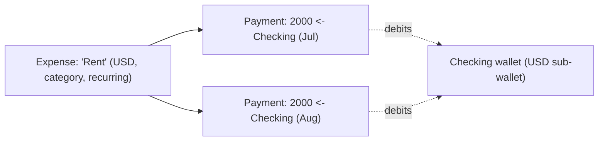
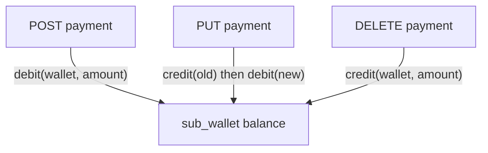
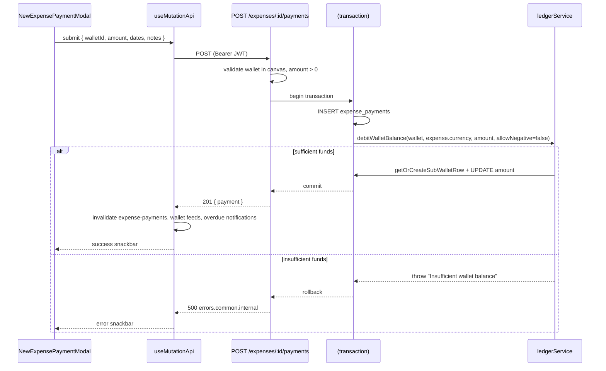

# 08 — Expenses & Expense Payments

Expenses are the **money-out** module. It is the near-exact mirror of [Incomes](./07-incomes.md): the same **source-vs-movement** structure, the same route/UI shapes, and the same ledger discipline — except every movement **debits** a wallet instead of crediting it. If you've read the Incomes doc, this one will feel familiar; the differences are the interesting parts, and they're highlighted below.

**Prerequisites:** [Incomes & Income Entries](./07-incomes.md) (the mirror), [Wallets & Sub-wallets](./06-wallets.md) (the ledger), [Canvas & Collaboration](./05-canvas-collaboration.md).

---

## 1. The two-level model (mirror of Incomes)

| Concept | Table | Meaning | Example |
|---------|-------|---------|---------|
| **Expense** (source/definition) | `expenses` | A *kind* of obligation — recurring or one-off. Holds no balance. | "Rent", "Netflix", "Q3 Taxes" |
| **Expense Payment** (movement) | `expense_payments` | An *actual payment* out of a wallet. **Debits that wallet.** | "Paid $2,000 rent from Checking on Jul 1" |



### The tables ([`schema.ts`](../eboom-backend/src/db/schema/schema.ts))

- **`expenses`** — `canvasId`, `name`, `currencyId`, `expenseCategoryId`, `defaultWalletId` (nullable), `isRecurring` + `recurrencePattern` (JSON), `status` (`transactionStatusEnum`), `description`, `photoUrl`, `isArchived`, audit columns.
- **`expense_payments`** — `expenseId`, `sourceWalletId`, `amount` (`numeric(20,8)`), `dueDate`, `paidDate`, `notes`, audit columns; DB `check` enforces `amount >= 0`.

> **Key difference from Incomes:** an expense source has **no `amount` column at all** (incomes carry an integer nominal amount; expenses don't). The amount lives only on each payment. The date fields also differ semantically: `dueDate`/`paidDate` (obligation) vs incomes' `expectedDate`/`receivedDate` (receipt).

---

## 2. API surface

Canvas-scoped at `/api/canvases/:canvasId/expenses` ([`routes/expenses.ts`](../eboom-backend/src/routes/expenses.ts)). Structurally identical to incomes, with `payments` where incomes have `entries`.

| Method & path | Permission | Purpose |
|---------------|-----------|---------|
| `GET /expenses` | `view` | Paginated/filtered list (category, currency, isRecurring, search). |
| `POST /expenses` | `edit` | Create an expense source (+ whiteboard node). |
| `GET /expenses/:expenseId` | `view` | One expense with category, currency, default wallet. |
| `PUT /expenses/:expenseId` | `edit` | Partial update. |
| `DELETE /expenses/:expenseId` | `edit` | Soft delete + unregister whiteboard node. |
| `GET /expenses/:expenseId/payments` | `view` | Payments (full or paginated + `totalPaid`). |
| `POST /expenses/:expenseId/payments` | `edit` | **Create a payment → debits the wallet.** |
| `PUT /expenses/payments/:paymentId` | `edit` | **Edit a payment → reverses old debit, applies new.** |
| `DELETE /expenses/payments/:paymentId` | `edit` | **Delete a payment → credits the wallet back.** |
| `GET /expense/categories` | auth | Global category CRUD. |

As with incomes, `payments/:paymentId` routes are declared **before** `/:expenseId` so `payments` isn't parsed as an id, and every handler does the **canvas + ownership double-guard** (walking payment → parent expense to check `canvasId`).

---

## 3. Payments and the ledger — debit instead of credit

This is the whole point of the module. Where an income entry **credits** the destination wallet, an expense payment **debits** the source wallet. The transactional structure is identical to incomes, just with the ledger calls swapped.

### Create payment → debit

Insert the payment and debit the source wallet in one transaction. Because debiting can overdraw, `allowNegative: false` means **creating a payment can fail** with "Insufficient wallet balance":

```289:317:eboom-backend/src/routes/expenses.ts
      const created = await db.transaction(async (tx) => {
        const [payment] = await tx
          .insert(expensePayments)
          .values({
            expenseId,
            sourceWalletId: parsedWalletId,
            amount: amountStr,
            dueDate: parsedDueDate,
            paidDate: parsedPaidDate,
            notes: notes || null,
            createdBy: user.id,
            lastModifiedBy: user.id,
          })
          .returning();

        await debitWalletBalance(
          {
            walletId: parsedWalletId,
            currencyId: expense.currencyId,
            amount: amountStr,
            allowNegative: false,
          },
          tx
        );
        // Creates sub_wallet row on first payment for this wallet+currency via getOrCreateSubWalletRow

        return payment;
      });
```

Same two behaviors as incomes, inverted:

1. **Payments inherit the expense's `currencyId`** — no per-payment currency.
2. **The debit happens unconditionally — regardless of `paidDate`.** Recording a payment moves the balance even if it's only "due" (not yet paid). `dueDate`/`paidDate` drive reporting (due vs paid), **not** the ledger. ⚠️ So logging an unpaid-but-due payment still decreases the wallet balance.

### Edit payment → reverse then re-apply

Editing **credits back the old** (restoring the pre-payment balance), updates the row, then **debits the new** — all in one transaction, correctly handling a changed source wallet or amount:

```73:108:eboom-backend/src/routes/expenses.ts
    const updated = await db.transaction(async (tx) => {
      await creditWalletBalance(
        {
          walletId: existing.sourceWalletId,
          currencyId: expense.currencyId,
          amount: String(existing.amount),
        },
        tx
      );

      const [payment] = await tx
        .update(expensePayments)
        .set({
          sourceWalletId: parsedWalletId,
          amount: amountStr,
          dueDate: parsedDueDate,
          paidDate: parsedPaidDate,
          notes: notes || null,
          lastModifiedBy: user.id,
          lastModifiedAt: new Date(),
        })
        .where(eq(expensePayments.id, paymentId))
        .returning();

      await debitWalletBalance(
        {
          walletId: parsedWalletId,
          currencyId: expense.currencyId,
          amount: amountStr,
          allowNegative: false,
        },
        tx
      );

      return payment;
    });
```

### Delete payment → credit back

Deleting refunds the wallet (credit the source) then removes the row. **Unlike the income delete-entry handler** (which ran the debit outside an explicit transaction), the expense delete correctly wraps both the credit and the delete in `db.transaction` — the more robust pattern:

```146:157:eboom-backend/src/routes/expenses.ts
      await db.transaction(async (tx) => {
        await creditWalletBalance(
          {
            walletId: existing.sourceWalletId,
            currencyId: expense.currencyId,
            amount: String(existing.amount),
          },
          tx
        );

        await tx.delete(expensePayments).where(eq(expensePayments.id, paymentId));
      });
```



### Incomes vs Expenses at the ledger — side by side

| Operation | Income entry | Expense payment |
|-----------|--------------|-----------------|
| Create | **credit** destination | **debit** source (can fail on insufficient funds) |
| Edit | debit old + credit new | credit old + debit new |
| Delete | debit back | credit back |
| Can fail on insufficient funds? | on edit/delete | on **create**, edit, delete |
| Currency source | parent income | parent expense |
| Gated by paid/received date? | No — always applies | No — always applies |

---

## 4. Source lifecycle

Identical to incomes and wallets: create validates `name`/`expenseCategoryId`/`currencyId` (+ optional default wallet ownership) and **registers a whiteboard node** (`registerWhiteboardNode(canvasId, "expense", id)`); list supports search + category/currency/isRecurring filters; update is partial; delete is a soft archive + `unregisterWhiteboardNode`. Editing an expense source never touches a balance — only payments do.

---

## 5. Frontend

Everything mirrors Incomes with `payment` terminology.

### Detail page

[`ExpenseDetailPage`](../eboom-frontend/src/views/expenses/ExpenseDetailPage.tsx) is the same thin composition — chart, summary cards, payments table — fed by [`useExpenseDetail`](../eboom-frontend/src/views/expenses/hooks/useExpenseDetail.ts), which fetches the expense (`["expense", canvas, id]`) and its payments (`["expense-payments", canvas, id]`), resolves the currency symbol (preferring the joined `currency.symbol`, falling back to the shared currencies query), and supports `skipPayments` for modal hydration.

### List page & modal

`ExpensesListPage` uses the standard list template with [`expenseSlice`](../eboom-frontend/src/redux/expenseSlice.ts) for modal state. `NewExpenseModal` creates/edits the source.

[`NewExpensePaymentModal`](../eboom-frontend/src/views/expenses/components/NewExpensePaymentModal.tsx) is the payment equivalent of `NewIncomeEntryModal` — the same **reusable, three-context** form (from an expense detail with `expenseId` fixed, from a wallet detail with `fixedSourceWalletId`, or standalone showing both pickers), with dynamic method/URL and manual cache invalidation of the expense's payments, any `extraInvalidateKeys`, and the overdue-notifications query:

```185:216:eboom-frontend/src/views/expenses/components/NewExpensePaymentModal.tsx
  const { mutateAsync: savePayment, isPending } = useMutationApi(
    (formData: PaymentFormData) => {
      const resolvedExpenseId = expenseId ?? formData.expenseId;
      if (isEditMode && paymentId) {
        return API_ROUTES.EXPENSE_PAYMENTS_UPDATE(canvas!, paymentId);
      }
      return API_ROUTES.EXPENSE_PAYMENTS_CREATE(canvas!, resolvedExpenseId!);
    },
    {
      method: () => (isEditMode && paymentId ? "put" : "post"),
      successKey: isEditMode
        ? "success.expense.paymentUpdated"
        : "success.expense.paymentCreated",
      mapPayload: (formData: PaymentFormData) => ({
        sourceWalletId: fixedSourceWalletId ?? formData.sourceWalletId,
        amount: Number(formData.amount),
        dueDate: formData.dueDate || null,
        paidDate: formData.paidDate || null,
        notes: formData.notes.trim() || null,
      }),
      invalidateQueries: false,
      onSuccess: async (_data, formData) => {
        const resolvedExpenseId = expenseId ?? (formData as PaymentFormData).expenseId;
        if (resolvedExpenseId) {
          await queryClient.invalidateQueries({ queryKey: ["expense-payments", canvas, resolvedExpenseId] });
        }
        for (const key of extraInvalidateKeys) {
          await queryClient.invalidateQueries({ queryKey: key });
        }
        await queryClient.invalidateQueries({ queryKey: ["notifications", "overdue"] });
      },
    }
  );
```

`paidDate` defaults to today and is validated to not precede `dueDate` (via `validateDateNotBefore`). `ExpenseSummaryCards` derives paid vs due totals, counts, averages, and month-over-month change client-side from the payments feed.

---

## 6. End-to-end: recording a payment



---

## 7. Gotchas & conventions

- **Debit can fail on create** (unlike income credit) — `allowNegative: false` blocks overdraft, surfaced as `errors.common.internal`.
- **Payments debit on creation regardless of `paidDate`** — recording a due-but-unpaid payment still lowers the balance. Dates are for reporting.
- **Expense sources have no amount column** — the amount lives only on payments (differs from incomes).
- **Edit = credit old + debit new**; **delete = credit back**, all transactional. The expense delete is wrapped in a transaction (more robust than the income delete-entry equivalent).
- **Payments inherit the expense's currency**; no per-payment currency.
- **Route order**: `/payments/:paymentId` before `/:expenseId`.
- **Categories are global** (not canvas-scoped).

---

Together, Wallets + Incomes + Expenses form the ledger triangle: **income entries credit, expense payments debit**, and both flow through the same `ledgerService` into `sub_wallets`. The third movement type — **Transfers** (wallet-to-wallet, debit source + credit destination, possibly cross-currency) — is next.
