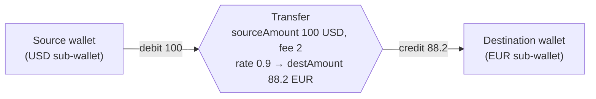
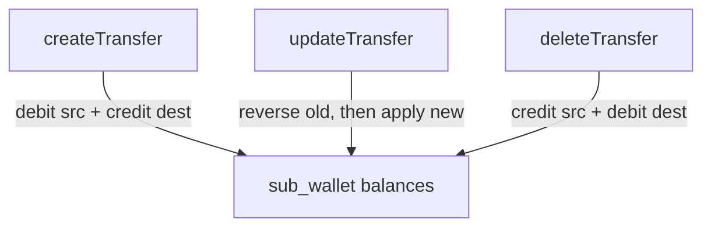

# 09 — Transfers

A **transfer** moves money **between two wallets** in the same canvas. It is the third and most complex movement type: where an [income entry](./07-incomes.md) is a single credit and an [expense payment](./08-expenses.md) is a single debit, a transfer is **both at once** — debit the source, credit the destination — optionally **across currencies** with an exchange rate and a transaction fee.

Unlike incomes and expenses, transfers have **no "source" definition table**. There is no `transfer` parent the way there's an `income` or `expense`; a transfer *is* the movement. All the logic therefore lives in one place: [`transferService.ts`](../eboom-backend/src/services/transferService.ts), which the routes are a thin shell over.

**Prerequisites:** [Wallets & Sub-wallets](./06-wallets.md) (the ledger + sub-wallet model — essential here), [Incomes](./07-incomes.md) and [Expenses](./08-expenses.md) (the credit/debit primitives).

---

## 1. The model



A transfer captures both sides of the movement plus the FX metadata connecting them:

| Field | Meaning |
|-------|---------|
| `sourceAmount` | Amount **debited** from the source sub-wallet (in source currency). |
| `destinationAmount` | Amount **credited** to the destination sub-wallet (in destination currency). |
| `transactionFee` | Fee subtracted from the source **before** conversion. Defaults to `0`. |
| `exchangeRate` | Rate applied to `(sourceAmount − fee)` to get `destinationAmount`. `1` for same-currency. |
| `transferDate`, `notes` | Metadata. |

The core invariant, enforced on every write:

```
destinationAmount ≈ (sourceAmount − transactionFee) × exchangeRate
```

### ⚠️ The `transfers` table stores **sub-wallet** ids

This is the single most important gotcha in the module. In [`schema.ts`](../eboom-backend/src/db/schema/schema.ts), despite the column names, the FKs point at `sub_wallets`, **not** `wallets`:

```371:376:eboom-backend/src/db/schema/schema.ts
    sourceWalletId: integer("source_wallet_id").notNull().references(() => subWallets.id),
    destinationWalletId: integer("destination_wallet_id").notNull().references(() => subWallets.id),
    sourceAmount: numeric("source_amount", { precision: 20, scale: 8 }).notNull(),
    destinationAmount: numeric("destination_amount", { precision: 20, scale: 8 }).notNull(),
    exchangeRate: numeric("exchange_rate", { precision: 20, scale: 8 }),
    transactionFee: numeric("transaction_fee", { precision: 20, scale: 8 }).default("0"),
```

So `transfers.sourceWalletId` is really a **`sub_wallets.id`** (a wallet+currency pair), which is why joins throughout the service go `transfers.sourceWalletId → subWallets.id → wallets.id`. Contrast this with `income_entries.destinationWalletId` and `expense_payments.sourceWalletId`, which reference `wallets.id` directly. Keep this distinction in mind whenever you read transfer queries — the "wallet id" on a transfer row is not the same kind of id as on an entry/payment row.

---

## 2. API surface

Canvas-scoped at `/api/canvases/:canvasId/transfers` ([`routes/transfers.ts`](../eboom-backend/src/routes/transfers.ts)). The routes are unusually thin — they parse params, check the canvas, and delegate everything to `transferService`:

| Method & path | Permission | Purpose |
|---------------|-----------|---------|
| `GET /transfers?walletId=` | `view` | List all canvas transfers (optionally filtered to one wallet, source **or** destination). |
| `POST /transfers` | `edit` | Validate + create → debit source, credit destination. |
| `GET /transfers/:transferId` | `view` | One enriched transfer. |
| `PUT /transfers/:transferId` | `edit` | Reverse the old movement, apply the new one. |
| `DELETE /transfers/:transferId` | `edit` | Reverse the movement, delete the row. |

Ownership is checked via `getTransferCanvasId(transferId)` (which joins transfer → source sub-wallet → wallet → `canvasId`) and comparing to the route's canvas; a mismatch is a `404`.

### Error mapping

Because all validation lives in the service and throws plain `Error`s, the route uses `mapTransferError` to translate messages into HTTP statuses — `"Insufficient wallet balance"` and any message containing `required` / `must` / `Invalid` / `not found` / `differ` / `match` become `400`, everything else `500`. (Note: the mapped `message` is computed but the response body always uses `ErrorKeys.common.internal`; only the **status** varies.)

---

## 3. Validation — `validateTransferInput`

Before any balance moves, the raw body is validated and normalized into a `TransferInput`. This is where the business rules live:

- **All four ids required** — source/destination wallet and currency.
- **Amounts must be > 0** (`parseAmount`); **fee ≥ 0** (`parseOptionalAmount`, defaults to `"0"`).
- **Fee must be strictly less than the source amount.**
- **Same-currency transfers**: source and destination wallet must differ; `destinationAmount` must equal `sourceAmount − fee` (within tolerance); `exchangeRate` defaults to `"1"`.
- **Cross-currency transfers**: `exchangeRate` is **required** and must be `> 0`; `destinationAmount` must equal `(sourceAmount − fee) × exchangeRate` within tolerance.

The tolerance is deliberately lenient to absorb floating-point/rounding drift from the client:

```106:135:eboom-backend/src/services/transferService.ts
  const sameCurrency = sourceCurrencyId === destinationCurrencyId;
  let exchangeRate: string | null = body.exchangeRate != null ? String(body.exchangeRate) : null;

  const feeNum = Number(transactionFee);
  const sourceNum = Number(sourceAmount);
  if (feeNum >= sourceNum) {
    throw new Error("Transaction fee must be less than the source amount");
  }

  if (sameCurrency) {
    if (sourceWalletId === destinationWalletId) {
      throw new Error("Source and destination must differ");
    }
    const expectedDest = sourceNum - feeNum;
    const actualDest = Number(destinationAmount);
    const tolerance = Math.max(0.01, expectedDest * 0.001);
    if (Math.abs(expectedDest - actualDest) > tolerance) {
      throw new Error("Destination amount must equal source amount minus fee");
    }
    exchangeRate = exchangeRate ?? "1";
  } else {
    if (!exchangeRate || Number.isNaN(Number(exchangeRate)) || Number(exchangeRate) <= 0) {
      throw new Error("Exchange rate is required for cross-currency transfers");
    }
    const expectedDest = (sourceNum - feeNum) * Number(exchangeRate);
    const actualDest = Number(destinationAmount);
    const tolerance = Math.max(0.01, expectedDest * 0.001);
    if (Math.abs(expectedDest - actualDest) > tolerance) {
      throw new Error("Destination amount does not match the exchange rate after fee");
    }
  }
```

> Note: same-currency transfers between **different sub-wallets of the same wallet** are still blocked later, because `resolveSubWalletIds` throws if the resolved source and destination sub-wallet rows are identical — and a same-currency same-wallet transfer would resolve to the same sub-wallet.

---

## 4. Writes and the ledger

Every write goes through `ledgerService`'s transfer primitives ([`ledgerService.ts`](../eboom-backend/src/services/ledgerService.ts)), which are just a debit + credit composed inside a transaction:

```98:133:eboom-backend/src/services/ledgerService.ts
export async function transferWalletBalance(
  input: {
    sourceWalletId: number;
    sourceCurrencyId: number;
    destinationWalletId: number;
    destinationCurrencyId: number;
    sourceAmount: string;
    destinationAmount: string;
    transactionFee?: string;
    allowNegative?: boolean;
  },
  tx?: BalanceTx
) {
  const run = async (transaction: BalanceTx) => {
    await debitWalletBalance(
      {
        walletId: input.sourceWalletId,
        currencyId: input.sourceCurrencyId,
        amount: input.sourceAmount,
        allowNegative: input.allowNegative,
      },
      transaction
    );

    await creditWalletBalance(
      {
        walletId: input.destinationWalletId,
        currencyId: input.destinationCurrencyId,
        amount: input.destinationAmount,
        allowNegative: input.allowNegative,
      },
      transaction
    );
  };
```

`reverseTransferBalance` is the mirror: **credit** the source back and **debit** the destination. Two subtleties worth internalizing:

- **The fee simply disappears.** `sourceAmount` is debited in full; only `destinationAmount` (= source − fee, converted) is credited. The difference is the fee, which is not credited anywhere — it leaves the system. (`transactionFee` is stored for reporting but not separately ledgered.)
- **`allowNegative` defaults to `false`**, so a transfer's source debit can fail with `"Insufficient wallet balance"`, rolling back the whole transaction.

### Create

`createTransfer` runs one transaction: resolve (and lazily create) both sub-wallet rows, move the balance, then insert the transfer row **storing the resolved sub-wallet ids**. It re-reads via `enrichTransferById` so the API always returns a fully joined shape:

```287:325:eboom-backend/src/services/transferService.ts
  const created = await db.transaction(async (tx) => {
    const { sourceSubWalletId, destinationSubWalletId } = await resolveSubWalletIds(tx, input);

    await transferWalletBalance(
      {
        sourceWalletId: input.sourceWalletId,
        sourceCurrencyId: input.sourceCurrencyId,
        destinationWalletId: input.destinationWalletId,
        destinationCurrencyId: input.destinationCurrencyId,
        sourceAmount: input.sourceAmount,
        destinationAmount: input.destinationAmount,
        transactionFee: input.transactionFee ?? "0",
      },
      tx
    );

    const [transfer] = await tx
      .insert(transfers)
      .values({
        sourceWalletId: sourceSubWalletId,
        destinationWalletId: destinationSubWalletId,
        sourceAmount: input.sourceAmount,
        destinationAmount: input.destinationAmount,
        exchangeRate: input.exchangeRate,
        transactionFee: input.transactionFee ?? "0",
        transferDate: input.transferDate,
        notes: input.notes,
        createdBy: userId,
        lastModifiedBy: userId,
      })
      .returning();

    return transfer;
  });
```

`resolveSubWalletIds` first calls `validateWalletsSameCanvas` (both wallets must exist and share a `canvasId`) then `getOrCreateSubWalletRow` for each side, and rejects if both resolve to the same sub-wallet.

### Update — reverse then re-apply

`updateTransfer` is the most involved handler. In one transaction it: loads the existing row, reads the **old** source/dest sub-wallet contexts (to recover their currencies), **reverses** the old balance movement, resolves the **new** sub-wallets, **applies** the new movement, and updates the row. This cleanly handles changing wallets, currencies, amounts, rate, or fee in a single edit:

```339:384:eboom-backend/src/services/transferService.ts
    await reverseTransferBalance(
      {
        sourceWalletId: oldSource.wallet.id,
        sourceCurrencyId: oldSource.subWallet.currencyId,
        destinationWalletId: oldDest.wallet.id,
        destinationCurrencyId: oldDest.subWallet.currencyId,
        sourceAmount: String(existing.sourceAmount),
        destinationAmount: String(existing.destinationAmount),
        transactionFee: String(existing.transactionFee ?? "0"),
      },
      tx
    );

    const { sourceSubWalletId, destinationSubWalletId } = await resolveSubWalletIds(tx, input);

    await transferWalletBalance(
      {
        sourceWalletId: input.sourceWalletId,
        sourceCurrencyId: input.sourceCurrencyId,
        destinationWalletId: input.destinationWalletId,
        destinationCurrencyId: input.destinationCurrencyId,
        sourceAmount: input.sourceAmount,
        destinationAmount: input.destinationAmount,
        transactionFee: input.transactionFee ?? "0",
      },
      tx
    );

    const [transfer] = await tx
      .update(transfers)
      .set({
        sourceWalletId: sourceSubWalletId,
        destinationWalletId: destinationSubWalletId,
        ...
```

### Delete — reverse then remove

`deleteTransfer` reverses the movement (credit source, debit destination) and deletes the row, all transactional. ⚠️ Reversal debits the destination with `allowNegative` defaulting to `false`, so deleting a transfer can fail with `"Insufficient wallet balance"` if the destination funds were already spent onward.



---

## 5. Reading transfers

Transfers are always returned **enriched** (`EnrichedTransfer`) — flattened with both wallets' names and both currencies' codes/symbols — via `enrichTransferById`, which self-joins `sub_wallets`, `wallets`, and `currencies` twice (once per side) using table aliases:

```196:201:eboom-backend/src/services/transferService.ts
const sourceSubWallet = alias(subWallets, "source_sub_wallet");
const destSubWallet = alias(subWallets, "dest_sub_wallet");
const sourceWallet = alias(wallets, "source_wallet");
const destWallet = alias(wallets, "dest_wallet");
const sourceCurrency = alias(currencies, "source_currency");
const destCurrency = alias(currencies, "dest_currency");
```

List/read helpers:

- **`listTransfersForCanvas(canvasId, walletId?)`** — collects transfer ids where both wallets are in the canvas (and, if `walletId` given, where that wallet is the source **or** destination), then enriches each. ⚠️ This is an **N+1** pattern (one enrich query per transfer) — fine at current scale, a candidate for optimization later.
- **`listTransfersForCanvasPaginated(...)`** — enriches everything, then filters (by `currencyCode`), paginates, and computes `totalIn`/`totalOut` **in application code** (not SQL). When scoped to a wallet, `totalOut` sums source amounts where the wallet is the source; `totalIn` sums destination amounts where it's the destination.
- **`listTransfersForWallet(walletId)`** — resolves the wallet's canvas and defers to `listTransfersForCanvas`.

---

## 6. Frontend

There is no dedicated "transfers list page"; transfers surface inside the **Wallets** and **Transactions** views:

- **`WalletTransfersTable`** (wallet detail) and **`TransactionsTransfersTable`** (unified transactions view) render the enriched rows, showing direction relative to the current wallet where relevant.
- **[`NewTransferModal`](../eboom-frontend/src/views/wallets/components/NewTransferModal.tsx)** is the single create/edit form, and it carries most of the module's frontend intelligence.

### `NewTransferModal` highlights

- **Reusable across contexts** like the entry/payment modals: standalone (both wallet pickers shown), or pinned via `fixedSourceWalletId` / `fixedDestinationWalletId` (from a wallet detail page).
- **Currency options are per-wallet.** When a wallet is selected, its `subWallets` become the currency choices (falling back to all currencies if none exist yet), so you transfer *from the currencies a wallet actually holds*. Changing a wallet resets that side's currency.
- **Live destination-amount computation** mirrors the backend invariant. For same-currency, `destinationAmount = sourceAmount − fee` and the field is **read-only**. For cross-currency, an exchange-rate field appears and `destinationAmount = (sourceAmount − fee) × rate`, editable:

```261:283:eboom-frontend/src/views/wallets/components/NewTransferModal.tsx
  useEffect(() => {
    const fee = Number(transactionFee) || 0;
    const sourceParsed = Number(sourceAmount);
    const hasSource =
      sourceAmount != null && !Number.isNaN(sourceParsed) && sourceParsed > 0;

    if (!hasSource) {
      if (!isCrossCurrency) {
        setValue("destinationAmount", undefined);
        setValue("exchangeRate", 1);
      }
      return;
    }

    const netSource = Math.max(0, sourceParsed - fee);

    if (!isCrossCurrency) {
      setValue("destinationAmount", netSource);
      setValue("exchangeRate", 1);
    } else if (netSource > 0 && exchangeRate) {
      setValue("destinationAmount", Number((netSource * exchangeRate).toFixed(8)));
    }
  }, [isCrossCurrency, sourceAmount, exchangeRate, transactionFee, setValue]);
```

- **Client-side validation** mirrors the server: fee non-negative and `< sourceAmount`, exchange rate required for cross-currency, transfer date required.
- **Cache invalidation on success** touches `wallet-transfers`, `canvas-transfers`, and `wallet` (plus any `extraInvalidateKeys`), so balances and feeds refresh everywhere the transfer is visible.
- **Edit hydration** pulls the transfer either from the wallet-detail feed (`useWalletDetail`) when opened from a wallet, or from a direct `TRANSFERS_GET` query otherwise.

---

## 7. End-to-end: a cross-currency transfer

```mermaid
sequenceDiagram
  participant UI as NewTransferModal
  participant M as useMutationApi
  participant BE as POST /transfers
  participant SVC as transferService
  participant L as ledgerService

  UI->>UI: compute destAmount = (source-fee)*rate
  UI->>M: submit
  M->>BE: POST (Bearer JWT)
  BE->>SVC: validateTransferInput (rules + tolerance)
  SVC->>SVC: begin tx; resolve+create sub-wallets; same-canvas check
  SVC->>L: transferWalletBalance (debit source, credit dest)
  alt sufficient funds
    L-->>SVC: ok
    SVC->>SVC: INSERT transfer (sub-wallet ids); commit
    SVC->>SVC: enrichTransferById
    BE-->>M: 201 { transfer }
    M->>M: invalidate wallet/transfer caches
    M-->>UI: success snackbar
  else insufficient funds
    L-->>SVC: throw "Insufficient wallet balance"
    SVC-->>BE: rollback
    BE-->>M: 400 (mapTransferError)
    M-->>UI: error snackbar
  end
```

---

## 8. Gotchas & conventions

- **`transfers.sourceWalletId` / `destinationWalletId` are `sub_wallets.id`**, not `wallets.id` — the defining quirk of this module.
- **Fees leave the system** — debited from source, never credited; stored only for reporting.
- **Both create and delete can fail** on insufficient funds (`allowNegative` false on the source debit / destination reversal debit).
- **Validation lives in the service, not the route**, and throws plain `Error`s that `mapTransferError` turns into 400s; the response body is always `errors.common.internal` with a varying status.
- **Amount consistency is tolerance-checked** (`max(0.01, expected × 0.001)`) to absorb client rounding.
- **No transfer "source" table** — a transfer is the movement itself; all logic is centralized in `transferService`.
- **Enrichment is N+1** (`listTransfersForCanvas` enriches per id) and totals are computed in app code — acceptable now, optimization candidates later.

---

With Wallets, Incomes, Expenses, and Transfers documented, the entire **money-movement core** is covered: every balance change in eBoom is one of credit (income), debit (expense), or debit+credit (transfer), all funneled through `ledgerService` into `sub_wallets`. The remaining docs cover **read/aggregation** surfaces (Dashboard, Calendar) and **auxiliary** features (Whiteboard, Budgets & Goals, AI Insights, Notifications) built on top of this core.
