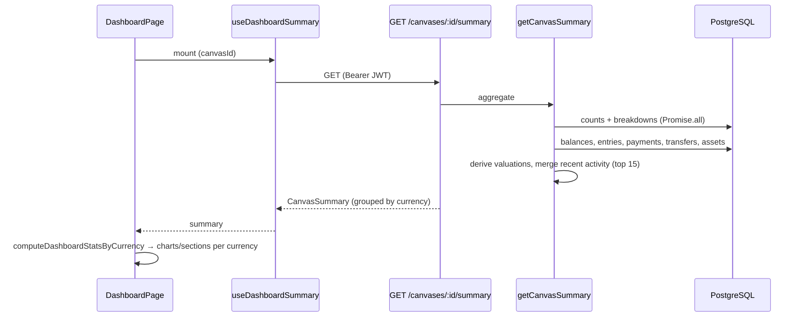

# 10 — Dashboard & Canvas Transactions

The Dashboard is the first **read/aggregation** surface in these docs. Everything before it *wrote* to the ledger; the dashboard *reads across the whole canvas* — wallets, incomes, expenses, transfers, and assets — and rolls it up into one screen. It is backed by two endpoints on the canvas router and one big aggregation function, plus a sibling **transactions** endpoint that powers the unified Transactions page.

The single most important idea to internalize: **eBoom never converts between currencies.** There is no FX normalization to a "base currency" anywhere on the dashboard. Instead, every total, chart, and stat is **partitioned by currency** and presented per-currency. The backend groups by currency; the frontend computes per-currency stats and renders one series/column per currency.

**Prerequisites:** [Wallets](./06-wallets.md), [Incomes](./07-incomes.md), [Expenses](./08-expenses.md), [Transfers](./09-transfers.md) (the dashboard aggregates all of them), and [Frontend Core](./03-frontend-core.md) (TanStack Query).

---

## 1. Where it lives

Unlike other modules, the dashboard has **no dedicated route file**. Its two endpoints hang off the **canvas router** ([`routes/canvas.ts`](../eboom-backend/src/routes/canvas.ts)), and all the logic is in [`dashboardService.ts`](../eboom-backend/src/services/dashboardService.ts):

| Method & path | Permission | Service fn | Purpose |
|---------------|-----------|-----------|---------|
| `GET /canvases/:canvasId/summary` | `view` | `getCanvasSummary` | The whole dashboard payload. |
| `GET /canvases/:canvasId/transactions` | `view` | `getCanvasTransactions` / `getPaginatedCanvasTransactions` | All canvas movements — unified, or paginated by type. |

```125:157:eboom-backend/src/routes/canvas.ts
router.get("/:canvasId/summary", requireCanvasAccess("view"), async (req: Request, res: Response) => {
  const canvasId = req.canvasId!;

  try {
    const summary = await getCanvasSummary(canvasId);
    res.json(summary);
  } catch (err) {
    console.error("Error fetching canvas summary:", err);
    sendError(res, ErrorKeys.canvas.fetchFailed, 500);
  }
});

router.get("/:canvasId/transactions", requireCanvasAccess("view"), async (req: Request, res: Response) => {
  const canvasId = req.canvasId!;

  try {
    if (hasPaginationParams(req)) {
      const type = req.query.type as CanvasTransactionType | undefined;
      if (!type || !["incomeEntries", "expensePayments", "transfers"].includes(type)) {
        return sendError(res, ErrorKeys.validation.failed, 400);
      }
      const { page, limit } = parsePaginationParams(req);
      const result = await getPaginatedCanvasTransactions(canvasId, type, page, limit);
      return res.json(result);
    }

    const transactions = await getCanvasTransactions(canvasId);
    res.json(transactions);
  } catch (err) {
    console.error("Error fetching canvas transactions:", err);
    sendError(res, ErrorKeys.canvas.fetchFailed, 500);
  }
});
```

The transactions endpoint has **two modes** (same pattern as wallet sub-feeds): with pagination params it returns one paginated `type` (`incomeEntries` | `expensePayments` | `transfers`); without them it returns everything at once.

---

## 2. The summary payload — `CanvasSummary`

`getCanvasSummary` returns a single denormalized object with eight sections:

| Field | Shape | What it is |
|-------|-------|-----------|
| `counts` | `{ wallets, incomes, expenses, assets }` | Non-archived entity counts. |
| `currencyBreakdown` | per currency: `{ walletCount, incomeCount, expenseCount, assetCount }` | How many of each entity touch each currency. |
| `walletBalances` | **one row per sub-wallet** | `{ walletId, walletName, currencyCode, currencySymbol, balance }`. |
| `incomeEntries` | all non-archived entries | With income name, category, currency. |
| `expensePayments` | all non-archived payments | With expense name, category, currency. |
| `recentActivity` | merged + sorted, **max 15** | Unified feed of entries, payments, transfers. |
| `assetSummaries` | **top 6** by recent activity | With derived valuation (holding value, unrealized P&L). |
| `assetsByCurrency` | per currency | Total holding value + count across **all** assets. |

A few things worth calling out:

- **`walletBalances` is one row per `sub_wallet`, not per wallet.** A wallet holding USD and EUR yields two rows. Totaling "the balance of a wallet" only makes sense within a currency — which is exactly why the frontend groups by currency.
- **`currencyBreakdown`'s `walletCount` counts distinct parent wallets** that have a sub-wallet in that currency (`countDistinct(wallets.id)`), so it's "how many wallets hold this currency," not a sub-wallet count.
- **Counts and lists exclude archived rows** (`isArchived = false`) throughout.

### How it's assembled

The function fires the cheap aggregates in parallel first (four `count()` queries + four grouped `countDistinct`/`count` breakdown queries via `Promise.all`), then runs the heavier list queries (wallet balances, income entries, expense payments, transfers, assets) and stitches everything together. The currency breakdown is merged from four independent grouped queries into one map keyed by currency code (`mergeCurrencyBreakdown`), sorted alphabetically.

Transfers here reuse the **sub-wallet-id join** pattern from the [Transfers doc](./09-transfers.md#-the-transfers-table-stores-sub-wallet-ids) — `transfers.sourceWalletId → sub_wallet → wallet → currency`, double-aliased for both sides.

---

## 3. Recent activity — one feed, three sources

`recentActivity` unifies the three movement types into a single typed list. Each source is mapped to a common `CanvasSummaryRecentActivity` shape, with a **derived status**:

- **Income entry** → `received` (has `receivedDate`) or `pending`.
- **Expense payment** → `paid` (has `paidDate`), `due` (past `dueDate`, unpaid), or `pending`.
- **Transfer** → always `paid`; carries a `secondaryAmount`/currency for the destination side, and an entity name like `"Checking → Savings"`.

```126:135:eboom-backend/src/services/dashboardService.ts
function getEntryStatus(receivedDate: string | null): RecentActivityStatus {
  return receivedDate ? "received" : "pending";
}

function getPaymentStatus(paidDate: string | null, dueDate: string | null): RecentActivityStatus {
  if (paidDate) return "paid";
  if (dueDate && new Date(dueDate) < new Date()) return "due";
  return "pending";
}
```

The merged list is sorted by effective date (`received/paid` date, falling back to `expected/due`, then `createdAt`) descending and **sliced to 15**. ⚠️ The sort comparator re-`find`s each item's source row inside the comparator, making it effectively O(n²) — harmless at dashboard scale but a refactor candidate.

---

## 4. Asset valuation

Assets are the one place the dashboard computes *derived value* rather than just reading stored numbers. For the assets in scope (the top 6 for `assetSummaries` plus all assets for `assetsByCurrency`), it bulk-loads their `assetVolumes` (buy/sell lots) and `pricePoints` (price history), groups them by asset, and runs `deriveAssetValuation` (from [`utils/assetValuation`](../eboom-backend/src/utils/assetValuation.ts)) to compute `currentHoldingValue` and `unrealizedPnL`. Results are memoized in a `Map` keyed by asset id so the two consumers share one computation. Monetary outputs are stringified via `formatMoneyNumber`. (Assets get their own doc later; here they're just an input to the dashboard.)

---

## 5. The transactions endpoint

`getCanvasTransactions` is the read model behind the **Transactions page**. It fetches income entries, expense payments, and transfers in parallel — each enriched with wallet names — and returns them with per-type totals:

```381:400:eboom-backend/src/services/dashboardService.ts
export async function getCanvasTransactions(canvasId: number): Promise<CanvasTransactions> {
  const { listTransfersForCanvas } = await import("./transferService");

  const [incomeEntries, expensePayments, transfers] = await Promise.all([
    fetchCanvasIncomeEntriesWithWalletNames(canvasId),
    fetchCanvasExpensePaymentsWithWalletNames(canvasId),
    listTransfersForCanvas(canvasId),
  ]);

  return {
    incomeEntries,
    expensePayments,
    transfers,
    total: {
      entries: incomeEntries.length,
      payments: expensePayments.length,
      transfers: transfers.length,
    },
  };
}
```

`getPaginatedCanvasTransactions(canvasId, type, page, limit)` serves one type at a time, each ordered by its natural effective-date `COALESCE` (e.g. `paidDate → dueDate → createdAt` for payments) — the **same ordering convention** used by the per-entity payment/entry feeds. `transferService` is imported dynamically (`await import(...)`) in both, breaking a potential circular dependency between `dashboardService` and `transferService`.

---

## 6. Frontend

### Thin page, fat sections

[`DashboardPage`](../eboom-frontend/src/views/dashboard/DashboardPage.tsx) is a thin composition: fetch once via `useDashboardSummary`, then hand `summary` to each section (cash-flow chart, yearly heatmap, assets, holdings, budgets, goals, recent activity). Budgets and Goals fetch their own data by `canvasId`; the rest are pure views over `summary`.

[`useDashboardSummary`](../eboom-frontend/src/views/dashboard/hooks/useDashboardSummary.ts) is a one-liner query keyed `["canvas-summary", canvasId]` — the key that write-side modals across the app invalidate to refresh the dashboard.

### Per-currency stats — `computeDashboardStatsByCurrency`

This is where the "no FX conversion" principle becomes concrete. [`dashboardStats.ts`](../eboom-frontend/src/views/dashboard/utils/dashboardStats.ts) discovers every currency code present anywhere in the summary, then for **each currency** computes a full `CurrencyDashboardStats` bundle — total balance, top wallets, net cash flow this month, and income/expense/wallet stats:

```165:195:eboom-frontend/src/views/dashboard/utils/dashboardStats.ts
export function computeDashboardStatsByCurrency(
  summary: CanvasSummary
): CurrencyDashboardStats[] {
  const currencyCodes = getCurrencyCodes(summary);

  return currencyCodes.map((currencyCode) => {
    const entries = summary.incomeEntries.filter((e) => e.currencyCode === currencyCode);
    const payments = summary.expensePayments.filter((p) => p.currencyCode === currencyCode);
    const balances = summary.walletBalances.filter((b) => b.currencyCode === currencyCode);
    const assetRow = summary.assetsByCurrency?.find((a) => a.currencyCode === currencyCode);

    const walletEntries = entries.map(toWalletEntry);
    const walletPayments = payments.map(toWalletPayment);

    const entityCounts = getEntityCounts(summary, currencyCode);

    return {
      currencyCode,
      currencySymbol: getCurrencySymbol(summary, currencyCode),
      totalBalance: balances.reduce((sum, b) => sum + (parseFloat(b.balance) || 0), 0),
      walletCountWithCurrency: entityCounts.wallets,
      entityCounts,
      incomeStats: computeIncomeStats(entries.map(toIncomeEntry)),
      expenseStats: computeExpenseStats(payments.map(toExpensePayment)),
      walletStats: computeWalletStats(walletEntries, walletPayments),
      topWallets: getTopWallets(summary.walletBalances, currencyCode),
      netCashFlowThisMonth: computeNetCashFlowThisMonth(entries, payments),
      assetCount: assetRow?.count ?? 0,
      totalAssetValue: parseFloat(assetRow?.totalHoldingValue ?? "0") || 0,
    };
  });
}
```

Note the **reuse of per-module stat functions** — `computeIncomeStats`, `computeExpenseStats`, `computeWalletStats` are the exact same helpers the Incomes/Expenses/Wallets detail pages use, fed here with adapter mappers (`toIncomeEntry`, `toExpensePayment`, …). One source of truth for "what a stat means," reused wherever data is displayed.

### Multi-currency cash-flow chart

[`DashboardCashFlowChart`](../eboom-frontend/src/views/dashboard/components/DashboardCashFlowChart.tsx) turns the per-currency stats into a Recharts line chart with **two series per currency** (received vs paid, paid drawn dashed), a stable color assigned per currency, selectable **time range** (7/30/90d) and **scale mode** (linear vs "loglike" — a compression that keeps small and large currencies legible on one axis via `transformSeriesForScaleMode`). The tooltip regroups points **by currency** so each currency's received/paid show together with the right symbol. Other sections (`DashboardYearlyHeatmap`, `DashboardAssetsSection`, `DashboardHoldingsSection`, `DashboardRecentActivity`) follow the same shape: derive from `summary`, render per-currency where money is involved.

---

## 7. End-to-end



---

## 8. Gotchas & conventions

- **No cross-currency conversion, ever.** Everything is partitioned by currency, end to end. There is no base-currency total.
- **`walletBalances` is per sub-wallet**, not per wallet — group by currency before summing.
- **`currencyBreakdown.walletCount`** = distinct wallets holding that currency, not sub-wallet count.
- **Archived rows are excluded** everywhere in the summary.
- **`recentActivity` is capped at 15** with an O(n²) comparator (fine at scale, refactorable). **`assetSummaries` is capped at 6.**
- **Stat logic is shared** with per-module pages via `compute*Stats` helpers + adapter mappers — don't duplicate stat math.
- **`transferService` is imported dynamically** inside the transactions/summary paths to avoid a circular dependency.
- **Dashboard freshness** relies on write-side modals invalidating `["canvas-summary", canvasId]`.

---

Next up: **Calendar** — another read surface over the same movements, but organized by *date* (upcoming/overdue dues and expected receipts) rather than by currency.
