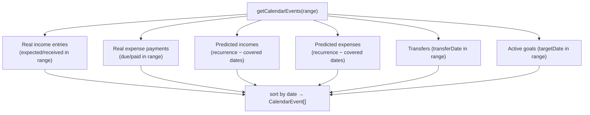

# 11 — Calendar

The Calendar is a **read-only, date-organized** view of everything happening in a canvas. Where the [Dashboard](./10-dashboard.md) groups money *by currency*, the calendar arranges it *by day*: income entries, expense payments, transfers, and savings-goal deadlines all land on a month/week/day grid. It is the second aggregation surface, and it has one genuinely novel idea: **predicted events** — future occurrences of recurring incomes/expenses that don't exist as records yet, projected onto the calendar so you can see (and materialize) what's coming.

Crucially, the calendar **writes nothing of its own**. Its backend is a single pure aggregation function; every create/edit action on the calendar reuses the exact movement modals from the Incomes/Expenses/Transfers/Goals modules.

**Prerequisites:** [Incomes](./07-incomes.md), [Expenses](./08-expenses.md), [Transfers](./09-transfers.md), and the recurrence concept (`isRecurring` + `recurrencePattern`) introduced there.

---

## 1. The endpoint

One route, one query param pair ([`routes/calendar.ts`](../eboom-backend/src/routes/calendar.ts)):

| Method & path | Permission | Purpose |
|---------------|-----------|---------|
| `GET /calendar/:canvasId?startDate=&endDate=` | `view` | All calendar events in `[startDate, endDate]` (defaults to the next month). |

It delegates entirely to `getCalendarEvents(canvasId, startDate?, endDate?)` in [`calendarService.ts`](../eboom-backend/src/services/calendarService.ts) and returns `{ events }`.

---

## 2. The `CalendarEvent` shape

Every source is normalized into one type ([`types/calendar.ts`](../eboom-backend/src/types/calendar.ts)):

```1:16:eboom-backend/src/types/calendar.ts
export interface CalendarEvent {
  id: number;
  type: "income" | "expense" | "transfer" | "goal";
  entityId: number;
  entryId?: number;
  date: string;
  amount: string;
  currency: string;
  status: "pending" | "completed" | "overdue";
  isPredicted: boolean;
  info?: string;
  secondaryAmount?: string;
  secondaryCurrency?: string;
  goalPercent?: number;
  daysRemaining?: number | null;
}
```

Key fields:

- **`entityId`** — the parent (income/expense/transfer/goal) id; **`entryId`** — the concrete movement row id (entry/payment/transfer), absent for predicted events.
- **`isPredicted`** — `true` for projected recurrences with no backing record.
- **`status`** — `completed` (received/paid/transferred), `overdue` (past date, not completed), or `pending`.
- **`secondaryAmount`/`secondaryCurrency`** — the source side of a transfer (destination is the primary `amount`).
- **`goalPercent`/`daysRemaining`** — only for goal events.

### ID namespacing

All four event types coexist in one flat array, but their underlying ids come from different tables and could collide. The service offsets each type into its own numeric band so ids stay unique across the array:

| Type | id formula |
|------|-----------|
| Real income entry | `entry.id` |
| Real expense payment | `payment.id + 1_000_000_000` |
| Transfer | `transfer.id + 2_000_000_000` |
| Goal | `goal.id + 3_000_000_000` |
| **Predicted** (income/expense) | a **negative** hash of `type-entityId-dateKey` |

Predicted events get a deterministic negative id from a small string hash (`predictedEventId`), so the same projected occurrence keeps a stable key across refetches without ever clashing with a real (positive) row id.

---

## 3. Assembling events

`getCalendarEvents` resolves a date range (defaulting to `[today, today+1 month]`), then builds the event list from five sources. All date math is in **UTC** (`startOfDay`, `addDays/Months/Years`, `toDateKey`) to keep day boundaries stable regardless of server locale.

### Real income entries & expense payments

It loads non-archived incomes/expenses for the canvas, then their entries/payments falling in range **by either date** — for income, `expectedDate` OR `receivedDate`; for expense, `dueDate` OR `paidDate`. Each becomes a non-predicted event whose display date is the primary date (`expectedDate ?? receivedDate`, `dueDate ?? paidDate`) and whose status comes from `resolveStatus`:

```213:223:eboom-backend/src/services/calendarService.ts
function resolveStatus(
  eventDate: Date,
  isCompleted: boolean,
  now: Date
): CalendarEvent["status"] {
  if (isCompleted) return "completed";
  const today = startOfDay(now);
  const due = startOfDay(eventDate);
  if (due < today) return "overdue";
  return "pending";
}
```

As it emits each real event, it records that entity's covered date keys (`coveredIncomeDates` / `coveredExpenseDates`) — this is what prevents a predicted occurrence from doubling up on a day that already has a real record.

### Predicted recurrences

For each **recurring** income/expense, it parses the `recurrencePattern`, picks an **anchor** (the first real entry's date, else the entity's `createdAt`, else now), expands the pattern across the range, and emits a predicted event for every occurrence date **not already covered** by a real record:

```363:384:eboom-backend/src/services/calendarService.ts
      for (const dateKey of occurrenceDates) {
        if (coveredIncomeDates.get(income.id)?.has(dateKey)) continue;

        const matchingEntry = incomeEntriesForEntity.find(
          (e) => entryDateKey(e.expectedDate) === dateKey
        );

        if (matchingEntry) continue;

        events.push({
          id: predictedEventId("income", income.id, dateKey),
          type: "income",
          entityId: income.id,
          date: new Date(`${dateKey}T00:00:00.000Z`).toISOString(),
          amount: String(income.amount),
          currency,
          status: resolveStatus(new Date(`${dateKey}T00:00:00.000Z`), false, now),
          isPredicted: true,
          info: income.name,
        });
      }
```

Predicted **income** amount falls back to `income.amount` (the integer planning amount on the source); predicted **expense** amount uses the entity's **most recent payment amount** (or `"0"` if none), since expense sources carry no nominal amount.

### The recurrence engine — `expandRecurrences`

This is the algorithmic heart of the module. Given a `RecurrencePatternInput` (`frequency`, `interval`, optional `daysOfWeek`, `dayOfMonth`, `startDate`, `endDate`) and a range, it returns the sorted list of occurrence date-keys, clamped to the intersection of the pattern's own window and the requested range:

- **daily** — step by `interval` days from the pattern start.
- **weekly** — walk week-by-week (`7 × interval`), emitting each configured `daysOfWeek` (defaulting to the start day's weekday).
- **monthly** — step by `interval` months on `dayOfMonth`, **clamped to the month's last day** (`clampDayOfMonth`) so "the 31st" degrades gracefully in short months.
- **yearly** — step by `interval` years on the anchor's month/day.

It fast-forwards the cursor to the effective start before collecting, and dedupes via a `Set`. Patterns with an out-of-range or malformed shape are rejected by `parsePattern` (returns `null` → no predictions).

### Transfers & goals

Transfers in range are joined via the familiar **sub-wallet-id** pattern (see [Transfers](./09-transfers.md#-the-transfers-table-stores-sub-wallet-ids)), double-aliased for both sides, and emitted as always-`completed` events carrying both amounts. Active savings goals with a `targetDate` in range become `goal` events; for each, the service dynamically imports `planningService.getSavingsGoalProgress` to attach `goalPercent` and `daysRemaining` (status is `overdue` if the target date has passed, else `pending`).

Finally the combined list is sorted by date ascending.



---

## 4. Frontend

### Data hook

[`useCalendarData`](../eboom-frontend/src/hooks/useCalendarData.ts) fetches events for a `[start, end]` window, keyed `["calendar", canvasId, startISO, endISO]` — so navigating months refetches, and any write that invalidates `["calendar"]` refreshes the current view.

### The view

[`CalendarView`](../eboom-frontend/src/views/calendar/CalendarView.tsx) wraps **FullCalendar** (`dayGrid` + `interaction` plugins) pinned to **UTC** (matching the backend). It maps each `CalendarEvent` to a FullCalendar event, color/style-coded by type with `overdue` and `predicted` modifiers (via CSS module classes), supports month/week/day views, a custom toolbar, a hover tooltip with per-type details, and a "+N more" popover. It also carefully re-measures on sidebar/resize changes (`ResizeObserver` + `updateSize`).

### Events are edited/created through the movement modals

The calendar owns **no forms**. Two entry points both delegate to the reusable modals from earlier modules:

1. **Clicking an event** opens [`EventModal`](../eboom-frontend/src/components/EventModal.tsx), a pure router that picks the right modal by `type` and — importantly — distinguishes real from predicted:

```16:47:eboom-frontend/src/components/EventModal.tsx
export function EventModal({ event, open, onOpenChange }: EventModalProps) {
  const { canvas } = useCanvas();
  const dateKey = event.date.slice(0, 10);
  const amount = Number(event.amount) || undefined;
  const isExistingRecord = !event.isPredicted && event.entryId != null;

  if (event.type === "goal" && canvas) {
    return (
      <GoalFormModal ... goalId={event.entityId} .../>
    );
  }

  if (event.type === "income") {
    return (
      <NewIncomeEntryModal
        incomeId={event.entityId}
        entryId={isExistingRecord ? event.entryId : undefined}
        ...
        defaultExpectedDate={isExistingRecord ? undefined : dateKey}
        defaultAmount={isExistingRecord ? undefined : amount}
        extraInvalidateKeys={[["calendar"]]}
      />
    );
  }
```

The elegant part: a **predicted** event opens the *create* modal **prefilled** with the projected date and amount — clicking a projection and saving **materializes it into a real record**. A real event opens the *edit* modal via its `entryId`. Either way, `extraInvalidateKeys={[["calendar"]]}` refreshes the grid on success.

2. **Clicking an empty date** opens `CalendarCreateChoiceModal` (income entry / expense payment / transfer / goal), which then opens the corresponding create modal with that day's date prefilled.

Both entry points are gated on `canEdit` from `useCanvasPermissions` — viewers get a read-only calendar.

---

## 5. Gotchas & conventions

- **The backend is read-only** — no calendar writes exist; all mutations reuse the movement/goal modals.
- **Predicted events are ephemeral projections**, not rows. They have negative ids, `isPredicted: true`, and no `entryId`; they vanish once a real record covers their date.
- **De-dup is by (entity, date key)** — a predicted occurrence is suppressed if the entity already has a real entry/payment on that day.
- **ID namespacing** keeps four id spaces (entries, payments +1e9, transfers +2e9, goals +3e9, predicted = negative hash) collision-free in one array.
- **All date math is UTC**, front and back, to keep day placement stable.
- **Predicted amounts are best-effort** — income uses the source's nominal `amount`; expense uses the last payment's amount (or 0).
- **`recurrencePattern` is validated defensively** (`parsePattern`); bad patterns simply produce no predictions.
- **`planningService` and `transferService` are imported dynamically** inside the service (avoiding circular deps), mirroring the dashboard.

---

Next: **Whiteboard** — the spatial/graph view of a canvas, where the `registerWhiteboardNode` calls sprinkled through the wallet/income/expense lifecycles finally pay off.
