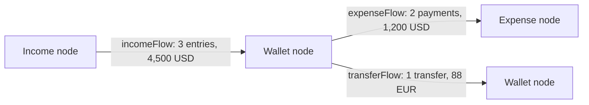
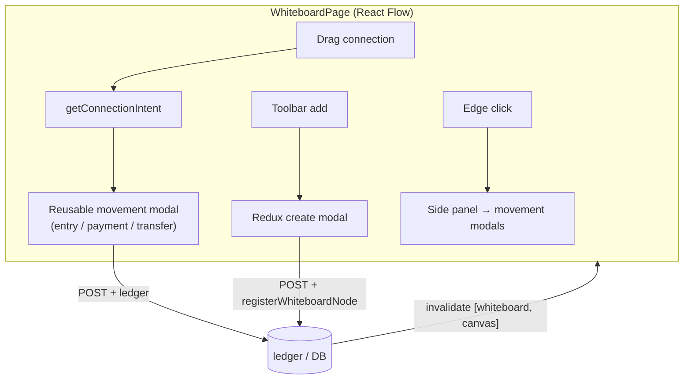

# 12 — Whiteboard

The Whiteboard is the **spatial / graph** view of a canvas: an infinite, pannable board where **incomes, wallets, and expenses are nodes** and the **money flows between them are edges**. It's where the `registerWhiteboardNode` / `unregisterWhiteboardNode` calls sprinkled through the wallet/income/expense lifecycles (docs [06](./06-wallets.md)–[08](./08-expenses.md)) finally pay off — every entity you created earlier already has a node waiting here.

The mental model is a **left-to-right flow**: `income → wallet → expense`, with wallet↔wallet transfers in the middle. Dragging a connection between nodes doesn't just draw a line — it *opens the corresponding movement modal*, so the board is both a diagram **and** a control surface.

**Prerequisites:** [Wallets](./06-wallets.md), [Incomes](./07-incomes.md), [Expenses](./08-expenses.md), [Transfers](./09-transfers.md) (the nodes and edges are these entities), [Canvas](./05-canvas-collaboration.md) (permissions).

---

## 1. Two kinds of persisted state

The whiteboard stores only **layout**, never money. Two tables back it ([`schema.ts`](../eboom-backend/src/db/schema/schema.ts)):

| Table | Grain | Holds |
|-------|-------|-------|
| `whiteboard_node_positions` | one per (canvas, entityType, entityId) | `x`, `y` of each node. |
| `whiteboard_viewports` | one per canvas | the saved pan/zoom (`x`, `y`, `zoom`). |

`WhiteboardEntityType` is exactly `"wallet" | "income" | "expense"` — transfers and entries/payments are **edges**, not nodes, so they have no position rows. Everything else on the board (balances, flow totals, edges) is **derived live** from the ledger data; only positions are stored.

---

## 2. Node registration & the self-healing sync

Nodes come into existence two ways, and the system tolerates both:

1. **Eagerly**, when an entity is created — the wallet/income/expense `POST` handlers call `registerWhiteboardNode(canvasId, type, id)`, which inserts a position row (auto-placed in that type's column) unless one already exists. Deletion calls `unregisterWhiteboardNode` to remove it.
2. **Lazily / self-healing**, every time the board is loaded — `getWhiteboardData` first calls `syncWhiteboardNodePositions`, which reconciles the position table against the *actual* set of non-archived entities:

```144:180:eboom-backend/src/services/whiteboardService.ts
export async function syncWhiteboardNodePositions(canvasId: number) {
  const [{ walletIds, incomeIds, expenseIds }, existingRows] = await Promise.all([
    fetchActiveCanvasEntityIds(canvasId),
    fetchNodePositions(canvasId),
  ]);

  const existingKeys = new Set(
    existingRows.map((row) => entityKey(row.entityType, row.entityId))
  );

  const activeKeys = new Set<string>([
    ...incomeIds.map((id) => entityKey("income", id)),
    ...walletIds.map((id) => entityKey("wallet", id)),
    ...expenseIds.map((id) => entityKey("expense", id)),
  ]);

  const staleRows = existingRows.filter(
    (row) => !activeKeys.has(entityKey(row.entityType, row.entityId))
  );

  if (staleRows.length > 0) {
    await db.delete(whiteboardNodePositions).where(
      inArray(
        whiteboardNodePositions.id,
        staleRows.map((row) => row.id)
      )
    );
  }

  const missingNodes = [
    ...buildMissingPositions("income", incomeIds, existingKeys),
    ...buildMissingPositions("wallet", walletIds, existingKeys),
    ...buildMissingPositions("expense", expenseIds, existingKeys),
  ];

  await insertWhiteboardNodePositionsIfMissing(canvasId, missingNodes);
}
```

This means the board is robust even if a registration call was ever missed: **missing nodes are back-filled and stale nodes pruned on every load.** New nodes get a **default column layout** — incomes at `x=0`, wallets at `x=320`, expenses at `x=640`, stacked in `ROW_HEIGHT` steps — reinforcing the left-to-right flow. Inserts use `onConflictDoNothing` on the `(canvas, type, id)` unique key so concurrent loads can't create duplicates.

---

## 3. The whiteboard payload — `getWhiteboardData`

One `GET` returns everything the board needs. Beyond node positions and the viewport, it computes three **flow aggregates** (the edges) and the full node detail:

| Section | What it is |
|---------|-----------|
| `viewport` | Saved pan/zoom (defaults to `{0,0,1}`). |
| `nodePositions` | `{ entityType, entityId, x, y }` per node. |
| `incomeFlows` | Per (income → destination wallet): `entryCount`, `totalAmount`, currency. |
| `expenseFlows` | Per (expense ← source wallet): `paymentCount`, `totalAmount`, currency. |
| `transferFlows` | Per (source wallet → dest wallet, per currency pair): counts + both totals. |
| `wallets` | Full wallet rows with category + sub-wallets (balances). |
| `incomes` / `expenses` | Full rows with category + currency. |

The flows are `GROUP BY` aggregates — e.g. income entries grouped by `(incomeId, destinationWalletId, currency)` — so an edge represents the **summed relationship** between two nodes, not individual movements. Transfer flows reuse the [sub-wallet-id join](./09-transfers.md#-the-transfers-table-stores-sub-wallet-ids) pattern, grouped per source/dest wallet and currency pair.



### Layout write endpoints

Layout changes are saved through the whiteboard route ([`routes/whiteboard.ts`](../eboom-backend/src/routes/whiteboard.ts)), all `edit`-gated:

| Method & path | Purpose |
|---------------|---------|
| `GET /whiteboard` | The full payload above (`view`). |
| `PUT /whiteboard/viewport` | Upsert pan/zoom (validates all three are numbers). |
| `PUT /whiteboard/nodes` | Batch upsert node positions (validates entity type + numeric coords). |
| `DELETE /whiteboard/nodes/:entityType/:entityId` | Remove a node's position. |

Both upserts use `onConflictDoUpdate` keyed on the natural unique constraints, so saving is idempotent.

---

## 4. Frontend — React Flow

The board is built on **[@xyflow/react](https://reactflow.dev)** (React Flow). [`WhiteboardCanvas`](../eboom-frontend/src/views/whiteboard/WhiteboardCanvas.tsx) is the thin presentational wrapper — registers the three node types (`wallet`/`income`/`expense`) and the single `flow` edge type, wires the Background/Controls/MiniMap, and gates all interactivity on `canEdit` (viewers get a read-only, non-draggable, non-connectable board). [`WhiteboardPage`](../eboom-frontend/src/views/whiteboard/WhiteboardPage.tsx) is the brain that holds state and orchestrates everything.

### Data → graph

[`useWhiteboard`](../eboom-frontend/src/views/whiteboard/hooks/useWhiteboard.ts) fetches the payload (keyed `["whiteboard", canvas]`, 30s `staleTime`). `buildWhiteboardGraph(data)` turns it into React Flow `nodes` + `edges` (node ids are `"{type}-{id}"`, parsed back via `parseEntityNodeId`). On first load the saved viewport is applied once (guarded by `viewportInitializedRef`).

### Persisting layout — debounced

[`useWhiteboardLayout`](../eboom-frontend/src/views/whiteboard/hooks/useWhiteboardLayout.ts) provides the save mutations with **debouncing** so dragging/panning doesn't spam the API:

- `onNodeDragStop` → `saveNodesDebounced` (400ms).
- `onMoveEnd` (pan/zoom) → `saveViewportDebounced` (500ms).
- `saveNodeImmediate` — used right after creating an entity, to pin the new node at its spawn point.

### Connecting nodes = creating movements

This is the signature interaction. `isValidWhiteboardConnection` allows only the three meaningful directions, and `getConnectionIntent` maps each to a movement:

```18:42:eboom-frontend/src/views/whiteboard/utils/connectionValidator.ts
export function getConnectionIntent(connection: Connection):
  | { kind: "income-entry"; incomeId: number; walletId: number }
  | { kind: "expense-payment"; expenseId: number; walletId: number }
  | { kind: "transfer"; sourceWalletId: number; destinationWalletId: number }
  | null {
  if (!isValidWhiteboardConnection(connection)) return null;

  const source = parseEntityNodeId(connection.source!);
  const target = parseEntityNodeId(connection.target!);
  if (!source || !target) return null;

  if (source.type === "income" && target.type === "wallet") {
    return { kind: "income-entry", incomeId: source.id, walletId: target.id };
  }

  if (source.type === "wallet" && target.type === "expense") {
    return { kind: "expense-payment", expenseId: target.id, walletId: source.id };
  }

  if (source.type === "wallet" && target.type === "wallet") {
    return { kind: "transfer", sourceWalletId: source.id, destinationWalletId: target.id };
  }

  return null;
}
```

`onConnect` reads the intent and opens the **same reusable modal** from the relevant module — `NewIncomeEntryModal` (with `fixedDestinationWalletId`), `NewExpensePaymentModal` (with `fixedSourceWalletId`), or `NewTransferModal` (with both wallets fixed) — each prewired to the endpoints from the connection. Dragging income→wallet literally means "record income into this wallet." No new write path: the whiteboard is a launcher for the movement modals you've already seen, all passing `extraInvalidateKeys={[["whiteboard", canvas]]}` so the board refreshes on save.

### Everything else routes back to existing modules

- **Toolbar / pane context-menu → add entity** dispatches the Redux create-modal action (`openWalletCreateModal`, etc.). On success, `handleEntityCreated` immediately pins the node at the stored **spawn position** (`screenToFlowPosition` of the click/center) and refetches.
- **Double-click / node context-menu → edit** dispatches the Redux edit-modal action for that entity.
- **"Open detail"** navigates to `/wallets/:id`, `/incomes/:id`, or `/expenses/:id`.
- **Delete node** calls the entity's own `DELETE` endpoint (soft archive) — which also unregisters the node server-side — then invalidates queries.
- **Clicking an edge** opens `WhiteboardSidePanel`, which lists that flow's underlying movements and offers add/edit for entries/payments/transfers (again via the reusable modals).
- **Auto-layout** (`layoutWhiteboardGraph`) re-flows the graph and persists the new positions; **fit view** reframes.



---

## 5. Gotchas & conventions

- **Only layout is persisted** — positions + viewport. Balances, flow totals, and edges are always derived live from ledger data.
- **Nodes = wallet/income/expense only.** Transfers, entries, and payments are **edges**, never node rows.
- **The position table self-heals** on every load (`syncWhiteboardNodePositions`) — missing nodes back-filled, stale ones pruned — so a missed `registerWhiteboardNode` is not fatal.
- **Default layout is columnar** (income 0 / wallet 320 / expense 640) to visualize the money-flow direction.
- **Connections are commands, not lines** — a valid drag opens the matching movement modal; only `income→wallet`, `wallet→expense`, `wallet→wallet` are allowed.
- **All writes reuse existing module modals/endpoints** — the whiteboard adds no new mutation logic, only new *entry points*, all invalidating `["whiteboard", canvas]`.
- **Saves are debounced** (nodes 400ms, viewport 500ms); entity-create pins use an immediate save.
- **Everything is `canEdit`-gated** — viewers get a read-only board.

---

Next: **Budgets & Goals** (a.k.a. planning) — the forward-looking layer (`planningService`, `savingsGoals`) that the Dashboard and Calendar already lean on, closing the loop between what you *have* and what you're *aiming for*.
