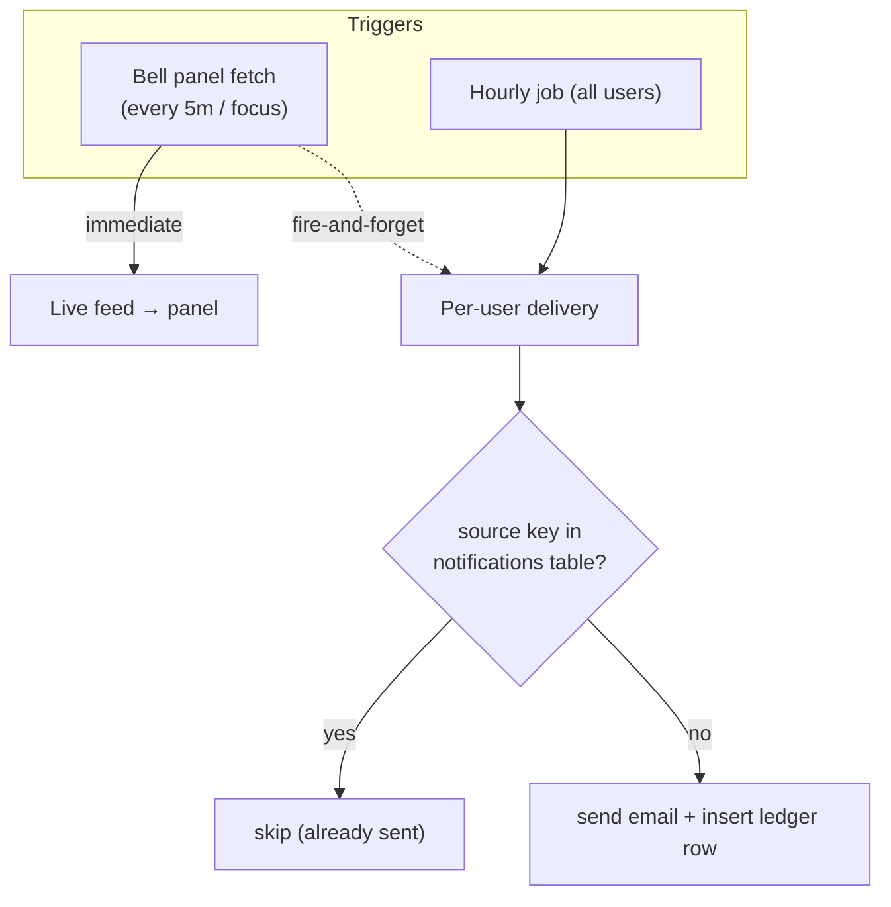

# 14 — Notifications

Notifications are how eBoom **proactively surfaces** things that need attention: overdue payments, income you expected but haven't received, budgets nearing their limit, and savings goals you can now afford. They appear in two channels — the **in-app bell panel** and **email digests** — and the interesting engineering is in keeping the two consistent without nagging.

The key architectural insight: there are actually **two parallel systems** here that share the same source data but serve different purposes.

1. **Live-computed feed** — what the bell panel shows. Computed fresh on every request; never stored.
2. **Persisted dedup ledger** (`notifications` table) — a record of what's *already been delivered*, used so emails and budget-alert rows fire **once**, not on every poll.

**Prerequisites:** [Budgets & Goals](./13-budgets-goals.md) (budget alerts + `budgetAlertSourceKey`), [Expenses](./08-expenses.md) / [Incomes](./07-incomes.md) (overdue items), [Authentication](./04-authentication.md) (email delivery).

---

## 1. Two channels, one endpoint

There's a single authenticated route ([`routes/notifications.ts`](../eboom-backend/src/routes/notifications.ts)):

| Method & path | Purpose |
|---------------|---------|
| `GET /notifications/overdue` | Returns the **live** overdue items + budget alerts, and **fire-and-forget triggers email delivery**. |

```11:30:eboom-backend/src/routes/notifications.ts
router.get("/overdue", async (req: Request, res: Response) => {
  const user = req.appUser;
  if (!user) return res.status(401).json({ error: "Unauthorized" });

  try {
    const notifications = await getOverdueNotifications(user.id);
    const budgetAlerts = await getBudgetAlertNotifications(user.id);
    res.json({ notifications, budgetAlerts });

    void deliverOverdueNotificationEmailsForUser(user.id).catch((err) => {
      console.error(`Failed to deliver overdue notification email for user ${user.id}:`, err);
    });
    void deliverBudgetAlertNotificationsForUser(user.id).catch((err) => {
      console.error(`Failed to deliver budget alerts for user ${user.id}:`, err);
    });
  } catch (err) {
    console.error("Error fetching overdue notifications:", err);
    res.status(500).json({ error: "Failed to fetch notifications" });
  }
});
```

Two things worth noting:

- The response is computed and returned **immediately**; the two `void deliver…` calls run **after** the response is sent (fire-and-forget), so email delivery never blocks the panel.
- This means **opening the bell can trigger emails** — delivery is not solely a background job. The background job (below) is the safety net for users who never open the app.

> ⚠️ This is **not** canvas-scoped — it's **user-scoped**. It fans out across *all* canvases the user belongs to, because notifications are personal ("what needs *my* attention across everything").

---

## 2. Overdue notifications (live)

`getOverdueNotifications(userId)` finds, across all the user's non-archived canvases, the two kinds of overdue items:

- **Overdue expense payments** — `dueDate < today` AND `paidDate IS NULL` (due but not paid).
- **Overdue income entries** — `expectedDate < today` AND `receivedDate IS NULL` (expected but not received).

Each is enriched with entity/canvas names, amount, currency, and a computed `daysOverdue`, then merged and sorted by due date. This is a **pure read** — nothing is stored, so the panel always reflects current reality (pay an overdue bill and it disappears on next fetch).

```99:132:eboom-backend/src/services/notificationService.ts
  const notifications: OverdueNotification[] = [
    ...overdueExpensePayments.map((row) => ({
      id: row.id,
      type: "expense_payment" as const,
      canvasId: row.canvasId,
      canvasName: row.canvasName,
      entityId: row.entityId,
      entityName: row.entityName,
      amount: String(row.amount),
      currencyCode: row.currencyCode,
      currencySymbol: row.currencySymbol,
      dueDate: new Date(row.dueDate!).toISOString(),
      daysOverdue: daysBetween(new Date(row.dueDate!), today),
    })),
    ...overdueIncomeEntries.map((row) => ({
      ...
    })),
  ];

  return notifications.sort((a, b) => {
    const dateDiff = new Date(a.dueDate).getTime() - new Date(b.dueDate).getTime();
    if (dateDiff !== 0) return dateDiff;
    return a.entityName.localeCompare(b.entityName);
  });
```

Budget alerts come straight from `getBudgetAlertNotifications` → `getBudgetAlertsForUser` (documented in [Budgets & Goals](./13-budgets-goals.md#7-budget-alerts)) — also live, also user-wide.

---

## 3. The dedup ledger — delivering "once"

The problem: the panel refetches every 5 minutes and on window focus. If every fetch emailed the user (or created a persistent row), it'd be spam. The solution is the `notifications` table used as a **delivery ledger**, keyed by a **stable source key stored in `title`**:

```440:447:eboom-backend/src/db/schema/schema.ts
export const notifications = pgTable("notifications", {
  id: serial("id").primaryKey(),
  userId: integer("user_id").notNull().references(() => users.id),
  title: varchar("title", { length: 255 }).notNull(),
  message: text("message"),
  isRead: boolean("is_read").default(false),
  createdAt: timestamp("created_at", { withTimezone: true }).defaultNow(),
});
```

The `title` column doesn't hold a human title — it holds the **source key**:

- Overdue: `notificationSourceKey` → `"overdue:{type}:{id}"`.
- Budget/goal: `budgetAlertSourceKey` → `"budget:total:{id}:{periodKey}:{threshold}"`, `"budget:line:{lineId}:…"`, or `"budget:goal:{goalId}:{threshold}"`.

Delivery reads back existing keys with a `LIKE 'overdue:%'` / `LIKE 'budget:%'` prefix query, filters to only **new** items, sends the email, and inserts a ledger row per new item:

```236:255:eboom-backend/src/services/notificationService.ts
  const existingKeys = await getExistingOverdueNotificationKeys(userId);
  const newItems = overdueItems.filter(
    (item) => !existingKeys.has(notificationSourceKey(item))
  );

  if (newItems.length === 0) return 0;

  await sendOverdueNotificationsEmail(user.email, user.firstName, newItems);

  await db.insert(notifications).values(
    newItems.map((item) => ({
      userId,
      title: notificationSourceKey(item),
      message: formatNotificationMessage(item),
      isRead: false,
    }))
  );
```

Because the budget/goal key embeds `periodKey` and `threshold`, a budget that crosses 80% raises **one** alert this month; if you raise the limit and it re-crosses next month, the new `periodKey` yields a fresh key and a new alert. This is the whole point of the dedup design.

> Note the asymmetry: **overdue** delivery is gated on `emailVerified` + the user's `notificationEnabled` setting and only inserts a ledger row *after* sending an email. **Budget-alert** delivery inserts ledger rows **regardless** of email (email is best-effort on top), so budget alerts are deduped even for users who never verified email.

---

## 4. Email preferences & gating

Email delivery respects two gates:

1. `users.emailVerified` must be true (no emails to unverified addresses).
2. `user_settings.notificationEnabled` must not be `false` (`userWantsNotificationEmails`), defaulting to on.

Emails are rendered by `emailService` (`sendOverdueNotificationsEmail`, `sendBudgetAlertsEmail`) using the templates in `emailTemplates/notifications.ts`, sharing the Nodemailer setup from [Authentication](./04-authentication.md#email-delivery).

---

## 5. The background job

Opening the app triggers delivery for *that* user, but users who never log in still need reminders. [`notificationEmailJob.ts`](../eboom-backend/src/jobs/notificationEmailJob.ts) is a simple in-process scheduler (started at boot) that runs hourly:

```56:73:eboom-backend/src/jobs/notificationEmailJob.ts
export function startNotificationEmailJob(): void {
  if (!isEnabled()) {
    console.log("Overdue notification emails are disabled");
    return;
  }

  const intervalMs = getIntervalMs();
  console.log(
    `Overdue notification email job scheduled every ${Math.round(intervalMs / 60000)} minute(s)`
  );

  setTimeout(() => {
    void runJob();
    setInterval(() => {
      void runJob();
    }, intervalMs);
  }, STARTUP_DELAY_MS);
}
```

`runJob` calls `deliverOverdueNotificationEmailsForAllUsers` and `deliverBudgetAlertsForAllUsers`, each iterating **distinct canvas members** and delegating to the same per-user delivery functions the route uses — so the dedup ledger keeps the job and the on-demand path from double-sending. It's controlled by env: `NOTIFICATION_EMAIL_ENABLED` (default on) and `NOTIFICATION_EMAIL_INTERVAL_MS` (default 1h), with a 30s startup delay.

> This is a **single-process** scheduler (`setInterval`), not a distributed queue — fine for one backend instance, but running multiple instances would send duplicate emails (each has its own timer, and there's a race window in the check-then-insert dedup). Worth knowing before horizontal scaling.



---

## 6. Frontend

[`useNotifications`](../eboom-frontend/src/hooks/useNotifications.ts) fetches the endpoint (keyed `["notifications", "overdue"]`) with `refetchInterval: 5min` + `refetchOnWindowFocus`, and exposes `notifications`, `budgetAlerts`, and a combined `notificationCount` for the bell badge. This is the **exact query key** that the entry/payment modals invalidate on save (you saw `["notifications", "overdue"]` in docs 07–08), so paying an overdue bill updates the badge promptly.

[`NotificationsPanel`](../eboom-frontend/src/components/layout/NotificationsPanel.tsx) renders the bell dropdown, splitting items into three visually distinct sections:

- **Overdue** — expense (red, down-arrow) / income (amber, up-arrow), with amount, due date, and days-overdue; clicking navigates to `/expenses` or `/incomes`.
- **Budget warnings** — `type !== "savings_goal"` (piggy-bank, amber), showing `spent / limit` and percent.
- **Goal achievable** — `type === "savings_goal"` (party-popper, green) — the celebratory "you can now afford this goal" alert; navigates to `/budget-planning`.

Section headers only appear when more than one section is populated. The panel is a sibling of the **canvas invitations** panel in the site header — related but a separate feed (invitations live in the [Canvas](./05-canvas-collaboration.md) module).

---

## 7. Gotchas & conventions

- **Two systems**: the panel is a **live computed feed** (never stored); the `notifications` table is a **dedup ledger** for delivery, not the panel's data source.
- **`notifications.title` stores a source key**, not a title — that's the dedup mechanism (prefix-matched with `LIKE`).
- **User-scoped, not canvas-scoped** — fans out across all the user's canvases.
- **Opening the bell can send emails** (fire-and-forget after the response); the hourly job covers logged-out users.
- **Overdue = due/expected date passed AND not paid/received** — resolves itself once you record the payment/receipt.
- **Budget/goal dedup keys embed `periodKey` + `threshold`**, so alerts recur across months / re-trigger if the threshold changes, but not within a period.
- **Overdue delivery requires verified email + `notificationEnabled`; budget alerts persist regardless of email.**
- **Single-process scheduler** — not safe for multiple backend instances without a shared lock/queue.
- **This route returns `{ error }`, not `errorKey`s** — like Budgets, an inconsistency with the core API.

---

Next (and last of the feature modules): **AI Insights** — the conversational/financial-profiling layer, the one part of eBoom that reaches outside the ledger for LLM-driven guidance.
