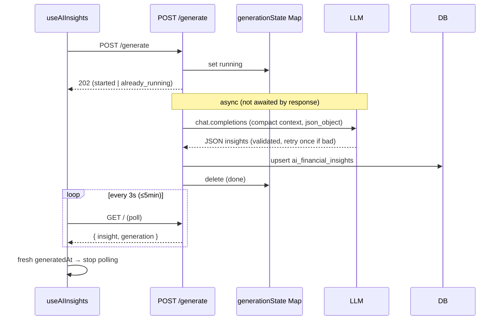

# 15 — AI Insights

AI Insights is the one part of eBoom that reaches **outside the ledger** — to an LLM — for guidance. It has three faces:

1. **A profile wizard** — a 5-step questionnaire capturing the user's risk tolerance, goals, ESG preferences, financial knowledge, and financial picture.
2. **Generated insights** — a batch of 3–6 prioritized, actionable finance tips produced by feeding the canvas's real financial data + the wizard answers to an LLM.
3. **A chat assistant** — a conversational Q&A over the same context.

The engineering interest here is **not** the LLM call itself (that's a few lines) — it's everything *around* it: assembling a rich financial context, **compacting it aggressively** to fit a token budget, running generation as a **background job with polling**, and **validating** the model's JSON output.

**Prerequisites:** [Dashboard](./10-dashboard.md) and [Budgets & Goals](./13-budgets-goals.md) (the context is built from their read models), [Canvas](./05-canvas-collaboration.md) (everything is canvas-scoped).

---

## 1. The LLM client — provider-agnostic

[`llmClient.ts`](../eboom-backend/src/services/llmClient.ts) wraps the official `openai` SDK but is deliberately provider-agnostic. It reads the key/model/base-URL from a **cascade of env vars** (`LLM_*` → `OPENAI_*` → `OPENROUTER_*`) and auto-detects **OpenRouter** (keys starting `sk-or-`), defaulting to a free Gemini model and adding OpenRouter's required headers. So the same code runs against OpenAI, OpenRouter, or any OpenAI-compatible endpoint by config alone.

`isLlmConfigured()` gates the whole feature — if no key is set, the routes return `503` and the UI degrades gracefully. `getOpenAIClient()` throws `LLM_API_KEY_NOT_CONFIGURED` if called without a key.

---

## 2. Three sub-modules, three route files

All canvas-scoped and permission-gated (`view` to read, `edit` to write/generate):

| Route file | Endpoints | Purpose |
|-----------|-----------|---------|
| [`ai-insight-profiles.ts`](../eboom-backend/src/routes/ai-insight-profiles.ts) | `GET /`, `PUT /` | Load / upsert the wizard profile. |
| [`ai-insights.ts`](../eboom-backend/src/routes/ai-insights.ts) | `GET /`, `POST /generate` | Read insights + completeness; kick off generation. |
| [`ai-chat.ts`](../eboom-backend/src/routes/ai-chat.ts) | `GET /`, `POST /messages`, `DELETE /` | Chat history, send message, clear. |

Like the Budgets and Notifications modules, these return plain `{ error }` JSON, not `errorKey`s.

---

## 3. The profile wizard

The profile ([`aiInsightProfileService.ts`](../eboom-backend/src/services/aiInsightProfileService.ts), one row per canvas) is a `draft`/`completed` record with `currentStep` (1–5) and five JSON blobs, one per wizard step (typed in [`types/aiInsight.ts`](../eboom-backend/src/types/aiInsight.ts)):

| Step | Blob | Captures |
|------|------|----------|
| 1 | `riskProfile` | tolerance, time horizon, loss reaction |
| 2 | `investmentGoals` | primary/secondary goals, target amount + timeframe |
| 3 | `esgPreferences` | ESG importance, sectors to avoid |
| 4 | `financialKnowledge` | a 5-question quiz |
| 5 | `financialPicture` | liabilities, cashflow, emergency fund, dependents |

`PUT /` upserts partially — each blob only overwrites when present, so the wizard can save step-by-step. The **financial-knowledge quiz is auto-scored server-side**: `scoreFinancialKnowledge` compares answers to `QUIZ_CORRECT_ANSWERS` and derives a `score` + `level` (beginner/intermediate/advanced), so the client can't fake the level.

---

## 4. Completeness score

Before spending an LLM call, the system quantifies **how much it actually knows** via a 0–100 completeness score (`computeCompletenessScoreFromSignals`):

```125:151:eboom-backend/src/types/aiInsight.ts
export function computeCompletenessScoreFromSignals(
  profile: { status: AiInsightProfileStatus; currentStep: number; } | null,
  signals: CompletenessSignals
): CompletenessResult {
  let wizard = 0;
  if (profile?.status === "completed") {
    wizard = 35;
  } else if (profile) {
    wizard = Math.min(25, Math.max(5, profile.currentStep * 5));
  }

  const breakdown: CompletenessBreakdown = {
    wizard,
    wallets: signals.hasWalletsWithBalance ? 15 : 0,
    incomes: signals.hasIncomes ? 10 : 0,
    expenses: signals.hasExpenses ? 10 : 0,
    assets: signals.hasAssets ? 10 : 0,
    budget: signals.hasBudget ? 10 : 0,
    savingsGoal: signals.hasSavingsGoal ? 10 : 0,
  };

  const score = Object.values(breakdown).reduce((sum, v) => sum + v, 0);
  return { score: Math.min(100, score), breakdown };
}
```

The wizard is worth up to 35 points (completed) and each data signal (wallets with balance, incomes, expenses, assets, budget, active goal) adds 10–15. The breakdown is shown in the UI ("add a budget to improve your insights") and also **sent to the LLM** so it can hedge when data is thin — reinforced by the system prompt's "when data is incomplete, say so."

---

## 5. Building & compacting the context

This is the heart of the module. [`aiInsightContextService.ts`](../eboom-backend/src/services/aiInsightContextService.ts) assembles a rich `AiInsightFinancialContext` by **reusing existing read models** — `getCanvasSummary` (dashboard), `getBudgetSummaryForCanvas` + `getBudgetProgress` + `getCashFlowForecast` + `getSavingsGoalProgress` (planning). It derives 90-day category spend, picks the top wallets/budgets/goals, and computes a 14-day forecast in the canvas's **primary currency** (most-used). A first-pass `trimContextToSize` caps the raw JSON at ~6KB.

But the LLM payload goes through a **second, much more aggressive** compaction ([`compactLlmContext.ts`](../eboom-backend/src/services/compactLlmContext.ts)) targeting **3.5KB**. It rewrites everything into **terse single-letter keys** and rounds all amounts, then **progressively drops detail** if still over budget:

```195:223:eboom-backend/src/services/compactLlmContext.ts
export function serializeCompactLlmContext(
  context: AiInsightFinancialContext,
  completeness: CompletenessResult,
  options?: { includeBreakdown?: boolean }
): string {
  let payload = buildCompactLlmContext(context, completeness, options);
  let serialized = JSON.stringify(payload);

  if (serialized.length <= LLM_CONTEXT_MAX_BYTES) {
    return serialized;
  }

  payload = shrinkCompactContext(payload);
  serialized = JSON.stringify(payload);
  if (serialized.length <= LLM_CONTEXT_MAX_BYTES) {
    return serialized;
  }

  return JSON.stringify({
    cs: payload.cs, p: payload.p, n: payload.n,
    w: payload.w.slice(0, 3), s: payload.s.slice(0, 3),
    b: payload.b.slice(0, 1), g: payload.g.slice(0, 1), cf: payload.cf,
  });
}
```

The single-letter key legend is spelled out in the **chat system prompt** so the model can decode it: `cs`=completeness, `p`=profile, `n`=counts, `w`=wallets, `a`=assets, `s`=spend90d, `r`=recent, `bs`=budgetSummary, `b`=budgets, `cf`=cashflow, `g`=goals. This token frugality is what keeps the feature cheap enough to run on a free model.

---

## 6. Generating insights — background + poll

Generation could take many seconds, so it's **fire-and-forget with client polling** rather than a blocking request.

**Backend** ([`aiInsightGenerationService.ts`](../eboom-backend/src/services/aiInsightGenerationService.ts)): `POST /generate` calls `startAiFinancialInsightsGeneration`, which records a `running` state in an **in-memory `Map<canvasId, state>`**, launches the async work, and returns `202 Accepted` immediately. A second request while running returns `already_running` (a lightweight in-memory lock). On completion the state entry is deleted; on error it's set to `failed` with the message.

The actual call asks for **strict JSON** (`response_format: json_object`), and the response is **rigorously validated** — must be an `insights` array of 3–6 items, each with a valid `category`, `priority`, non-empty `title`/`body` (`parseInsightsResponse` + `validateInsightItem`). If the first call produces invalid JSON, it **retries once** with a stricter prompt:

```166:171:eboom-backend/src/services/aiInsightGenerationService.ts
  let insights: AiInsightItem[];
  try {
    insights = await callOpenAI(context, completeness);
  } catch {
    insights = await callOpenAI(context, completeness, true);
  }
```

The validated result is upserted into `ai_financial_insights` (one row per canvas) along with the completeness score/breakdown, the full context snapshot, and the model name — so the UI can show *when* and *on what data* the insights were generated.

**Frontend** ([`useAIInsights`](../eboom-frontend/src/views/ai-insights/hooks/useAIInsights.ts)): after `POST /generate`, it **polls `GET /` every 3s (up to 5min)**, watching `generation.status` and comparing `insight.generatedAt` to the pre-generation value (`hasFreshInsights`) to detect completion. It surfaces `failed`/timeout as typed errors. It also **resumes polling on mount** if it finds a `running` state — so a refresh mid-generation doesn't lose track.



---

## 7. Chat

[`aiChatService.ts`](../eboom-backend/src/services/aiChatService.ts) is simpler: `sendChatMessage` builds the same compact context into a **system prompt** (with the key legend), appends the full stored history plus the new user message, calls the LLM, and **persists both** the user and assistant turns to `ai_chat_messages` (canvas-scoped). `GET /` returns history chronologically; `DELETE /` clears it.

> Note: several guardrails are currently **commented out** — message-length limits, an 8-message history window, a 100-message store cap, and a 5s cooldown. As written, chat sends the **entire** history each turn and stores unbounded messages. The route still maps `EMPTY_MESSAGE`/`MESSAGE_TOO_LONG`/`RATE_LIMITED` errors, but only `EMPTY_MESSAGE` can currently fire. Worth re-enabling before heavy use.

Both insight generation and chat share the **same system-prompt guardrails**: act as a household finance assistant, use specific numbers, **refuse** legal/tax/licensed-investment advice, and redirect off-topic questions.

---

## 8. Frontend page

[`AIInsightsPage`](../eboom-frontend/src/views/ai-insights/AIInsightsPage.tsx) has two top-level tabs (URL-synced via `?tab=`):

- **Insights tab** → `InsightLanding` (shows the completeness meter, the generated insight cards, and a refresh button) or the `WizardShell` (the 5-step form). `handleRefreshInsights` maps HTTP statuses to friendly errors (503 → no API key, 429 → rate limited, etc.).
- **Chat tab** → `AIChatPanel`.

The wizard saves step-by-step through `useAIInsightProfile`, then refetches insights so the completeness meter updates live. Everything is `canEdit`-gated (viewers can read insights but not generate or edit the profile).

---

## 9. Gotchas & conventions

- **Provider-agnostic by env** — OpenAI / OpenRouter / any compatible endpoint; auto-detects `sk-or-` keys. No key ⇒ `503` and graceful degradation.
- **Two-stage compaction** — ~6KB context trim, then ~3.5KB single-letter-key rewrite with progressive dropping. The key legend lives in the prompt.
- **Generation is background + poll** — `202` + in-memory running-state map (per-canvas lock); client polls `GET /` (3s, 5min cap) and resumes on mount.
- **Model output is validated** (3–6 items, valid category/priority) with a **one-shot stricter retry** on bad JSON.
- **Completeness score** gates expectations and is fed to the LLM so it can hedge on thin data.
- **The knowledge quiz is scored server-side** — the client can't set its own level.
- **Chat guardrails are commented out** — currently unbounded history/length; re-enable before scale.
- **Context reuses existing read models** (dashboard + planning) — no bespoke queries, so insights stay consistent with the rest of the app.
- **Prompts forbid legal/tax/licensed-investment advice** and off-topic answers.
- **These routes return `{ error }`, not `errorKey`s.**

---

## Series complete

This is the last feature module. Together the docs cover eBoom end to end:

- **Core** — [Architecture](./01-architecture.md), [Backend Core](./02-backend-core.md), [Frontend Core](./03-frontend-core.md), [Authentication](./04-authentication.md), [Canvas](./05-canvas-collaboration.md).
- **Money movement** — [Wallets](./06-wallets.md), [Incomes](./07-incomes.md), [Expenses](./08-expenses.md), [Transfers](./09-transfers.md) (all through `ledgerService`).
- **Read/aggregation** — [Dashboard](./10-dashboard.md), [Calendar](./11-calendar.md), [Whiteboard](./12-whiteboard.md).
- **Planning & proactivity** — [Budgets & Goals](./13-budgets-goals.md), [Notifications](./14-notifications.md), and this **AI Insights** layer on top.

A new engineer can now read straight down the [index](./README.md) and understand how a movement flows from a modal, through a canvas-guarded route, into the ledger, and back out into every dashboard, chart, forecast, and AI tip in the app.
