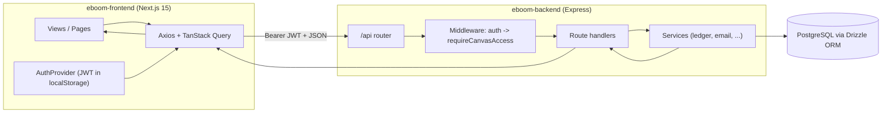

# eBoom Engineering Docs

Module-by-module onboarding documentation for the eBoom codebase. Read these in order if you are new. Each doc explains **why** something exists, **where** the code lives, and **how** the frontend and backend cooperate — with precise file references you can jump to.

> These docs describe the code as it exists today. For product-level feature status and money-flow rules, see the root [`DOC.md`](../DOC.md). For contribution patterns, see [`CONVENTIONS.md`](../CONVENTIONS.md). For install/run, see [`README.md`](../README.md) and [`Setup.md`](../Setup.md).

## What is eBoom?

eBoom is a multi-tenant **Personal Finance Management (PFM)** platform. Users organize all financial activity inside **Canvases** (shared workspaces), and track income, wallets, expenses, transfers, budgets, and goals across multiple currencies.

The system is a two-service monorepo:

- **`eboom-backend/`** — an Express + TypeScript REST API backed by PostgreSQL through Drizzle ORM.
- **`eboom-frontend/`** — a Next.js 15 (App Router) React 19 app.

## How the docs are organized

Docs are split into **core infrastructure** (the plumbing every feature depends on) and **feature modules** (built on top of that plumbing). Start at the top.

### Core (read first)

| # | Doc | What it covers |
|---|-----|----------------|
| 01 | [Architecture & Dependencies](./01-architecture.md) | The big picture: services, request lifecycle, data flow, tech stack, and the key dependencies and why they were chosen. |
| 02 | [Backend Core](./02-backend-core.md) | App bootstrap, routing tree, middleware (auth, canvas access, errors), the error-key system, database layer, and service conventions. |
| 03 | [Frontend Core](./03-frontend-core.md) | Next.js App Router structure, provider stack, the Axios + TanStack Query data layer, Redux, i18n, and notifications. |

### Feature modules

| # | Doc | What it covers |
|---|-----|----------------|
| 04 | [Authentication](./04-authentication.md) | End-to-end auth: signup, login, JWT access/refresh, email verification, password reset, route protection, and dev bypass modes. |
| 05 | [Canvas & Collaboration](./05-canvas-collaboration.md) | The tenancy model: canvases, members, roles/permissions, invitations, the active-canvas switcher, and the members page. |
| 06 | [Wallets & Sub-wallets](./06-wallets.md) | Balance containers: the multi-currency sub-wallet model, the ledger service (credit/debit/transfer), wallet CRUD, and the list/detail UI. |
| 07 | [Incomes & Income Entries](./07-incomes.md) | Money-in: the source-vs-entry model, entries crediting wallets through the ledger (create/edit/delete), and the reusable entry modal. |
| 08 | [Expenses & Expense Payments](./08-expenses.md) | Money-out: the mirror of incomes — payments debiting wallets through the ledger (with insufficient-funds guards) and the reusable payment modal. |
| 09 | [Transfers](./09-transfers.md) | Money-between: wallet-to-wallet debit+credit, cross-currency exchange rates and fees, the transfer service, and the live-computing transfer modal. |
| 10 | [Dashboard & Canvas Transactions](./10-dashboard.md) | The first read/aggregation surface: the canvas summary payload, per-currency stats (no FX conversion), recent activity, asset valuation, and the transactions endpoint. |
| 11 | [Calendar](./11-calendar.md) | Date-organized read view: unified events from entries/payments/transfers/goals, the recurrence engine and predicted events, and editing via the reusable movement modals. |
| 12 | [Whiteboard](./12-whiteboard.md) | Spatial graph view: incomes/wallets/expenses as nodes, money flows as edges, the self-healing position sync, and connections that launch the movement modals. |
| 13 | [Budgets & Goals (Planning)](./13-budgets-goals.md) | The forward-looking layer: monthly per-currency budgets, savings goals tracked against liquid balance, cash-flow forecast, budget suggestions, and alert generation. |
| 14 | [Notifications](./14-notifications.md) | Proactive alerts: the live overdue/budget feed vs the persisted dedup ledger, source-key deduplication, email delivery, the background job, and the bell panel. |
| 15 | [AI Insights](./15-ai-insights.md) | The LLM layer: the profile wizard, completeness scoring, two-stage context compaction, background insight generation with polling, model-output validation, and the chat assistant. |

## Mental model in 60 seconds

Three ideas unlock most of the codebase:

1. **Everything is scoped to a Canvas.** A canvas is the tenant boundary. Almost every data route lives under `/api/canvases/:canvasId/...` and is guarded by membership + permission checks.
2. **The API speaks in error keys, not English.** Failures return a stable `errorKey` (an i18n path) so the frontend can translate them. See [Backend Core](./02-backend-core.md#error-handling).
3. **The frontend never trusts local math.** Server data flows through TanStack Query; Redux only holds UI chrome (modals, search, selected canvas). See [Frontend Core](./03-frontend-core.md).
