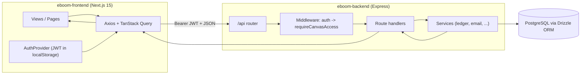

## Mental model in 60 seconds

Three ideas unlock most of the codebase:

1. **Everything is scoped to a Canvas.** A canvas is the tenant boundary. Almost every data route lives under `/api/canvases/:canvasId/...` and is guarded by membership + permission checks.
2. **The API speaks in error keys, not English.** Failures return a stable `errorKey` (an i18n path) so the frontend can translate them. See [Backend Core](/02-backend-core#error-handling).
3. **The frontend never trusts local math.** Server data flows through TanStack Query; Redux only holds UI chrome (modals, search, selected canvas). See [Frontend Core](/03-frontend-core).
